[toc]

#CPU

## CPU发展

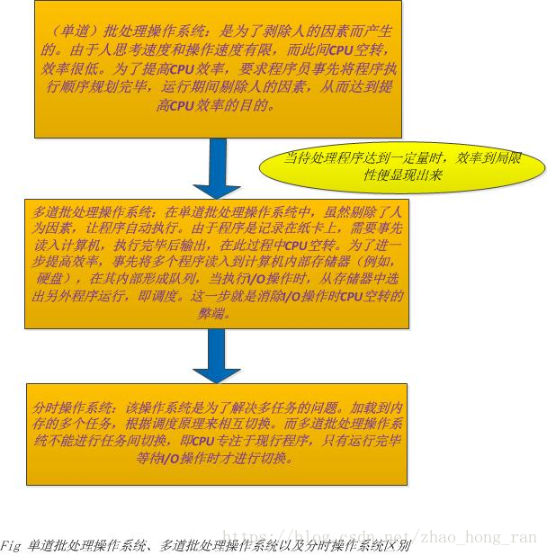

##CPU架构

随着硬件技术的发展，内存的访问已经跟不上CPU的执行速度，此时内存成了瓶颈。为了加速读写速度，每个CPU也都有自己内部才能访问的缓存：

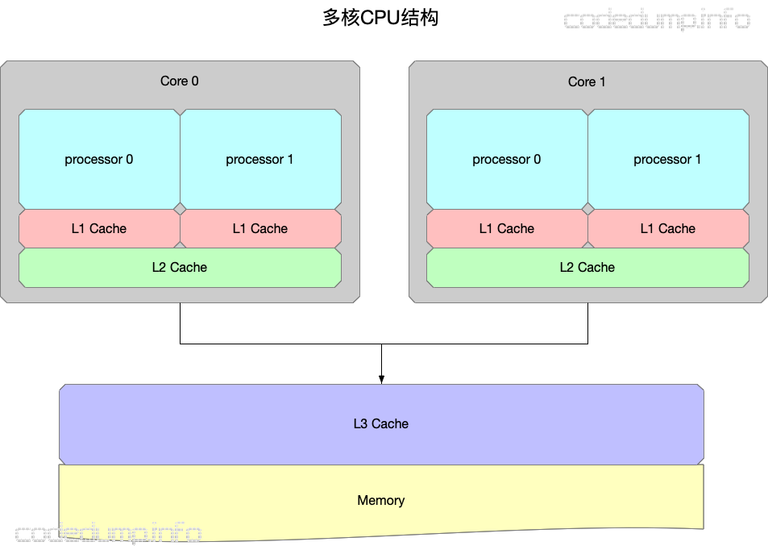

- 有多个CPU处理器，每个CPU处理器内部又有多个核心。
- 存在只能被一个CPU核心访问的L1 cache。
- 存在只能被一个CPU处理器的多个核心访问的L2 cache。
- 存在能被所有CPU处理器都能访问到的L3 cache以及内存。
- L1 cache、L2 cache、L3 cache的容量空间依次变大，但是访问速度依次变慢。

## 存储器层次结构

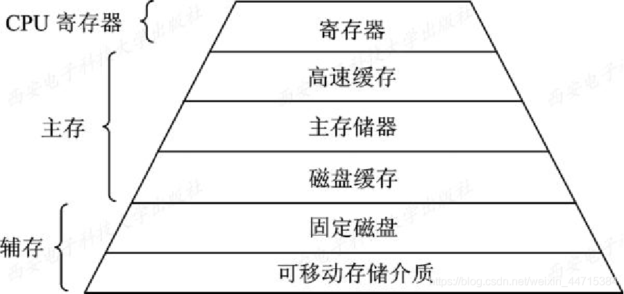

## 进程调度


## cache miss

Cache是用来对内存数据的缓存。

CPU要访问的数据在Cache中有缓存，称为“命中” (Hit)，反之则称为“缺失” (Miss)。

CPU访问它的速度介于寄存器与内存之间（数量级的差别）。实现Cache的花费介于寄存器与内存之间。

现在 CPU 的 Cache 又被细分了几层，常见的有 L1 Cache, L2 Cache, L3 Cache，其读写延迟依次增加，实现的成本依次降低。

现代系统采用从 Register ―> L1 Cache ―> L2 Cache ―> L3 Cache ―> Memory ―> Mass storage的层次结构，是为解决性能与价格矛盾所采用的折中设计。

下图描述的就是CPU、Cache、内存、以及DMA之间的关系。程序的指令部分和数据部分一般分别存放在两片不同的cache中，对应指令缓存（I-Cache）和数据缓存（D-Cache）。


引入 Cache 的理论基础是**程序局部性原理**，包括时间局部性和空间局部性。即最近被CPU访问的数据，短期内CPU 还要访问（时间）；被 CPU 访问的数据附近的数据，CPU 短期内还要访问（空间）。因此如果将刚刚访问过的数据缓存在Cache中，那下次访问时，可以直接从Cache中取，其速度可以得到数量级的提高。

**什么是cache line？**

Cache Line可以简单的理解为CPU Cache中的最小缓存单位。
内存和高速缓存之间或高速缓存之间的数据移动不是以单个字节或甚至word完成的。
相反，移动的最小数据单位称为缓存行，有时称为缓存块
目前主流的CPU Cache的Cache Line大小都是64Bytes。假设我们有一个512字节的一级缓存，那么按照64B的缓存单位大小来算，这个一级缓存所能存放的缓存个数就是512/64 = 8个。
查看cache line大小

```bash
cat /sys/devices/system/cpu/cpu1/cache/index0/coherency_line_size
```

cache line的影响：

```c
for (int i = 0; i < N; i+=k)
    arr[i] *= 3;
```


注意当步长在1到16范围内，循环运行时间几乎不变。但从16开始，每次步长加倍，运行时间减半。
由于16个整型数占用64字节（一个缓存行），for循环步长在1到16之间必定接触到相同数目的缓存行：即数组中所有的缓存行。当步长为32，我们只有大约每两个缓存行接触一次，当步长为64，只有每四个接触一次。

**什么是cache一致性？**

多个处理器对某个内存块**同时读写**，会引起**冲突**的问题，这也被称为Cache一致性问题。
Cache一致性问题出现的原因是在一个多处理器系统中，多个处理器核心都能够独立地执行计算机指令，从而有可能同时对某个内存块进行读写操作，并且由于我们之前提到的回写和直写的Cache策略，导致一个内存块同时可能有多个备份，有的已经写回到内存中，有的在不同的处理器核心的一级、二级Cache中。由于Cache缓存的原因，我们不知道数据写入的时序性，因而也不知道哪个备份是最新的。还有另外一个一种可能，假设有两个线程A和B共享一个变量，当线程A处理完一个数据之后，通过这个变量通知线程B，然后线程B对这个数据接着进行处理，如果两个线程运行在不同的处理器核心上，那么运行线程B的处理器就会不停地检查这个变量，而这个变量存储在本地的Cache中，因此就会发现这个值总也不会发生变化。

为了正确性，一旦一个核心更新了内存中的内容，硬件就必须要保证其他的核心能够读到更新后的数据。目前大多数硬件采用的策略或协议是MESI或基于MESI的变种：
M代表更改（modified），表示缓存中的数据已经更改，在未来的某个时刻将会写入内存；
E代表排除（exclusive），表示缓存的数据只被当前的核心所缓存；
S代表共享（shared），表示缓存的数据还被其他核心缓存；
I代表无效（invalid），表示缓存中的数据已经失效，即其他核心更改了数据。

# Linux基本命令

```
查看CPU信息：
	ps：显示按照按照消耗CPU前10排序的进程
	top：任务、CPU状态、内存状态、各进程的状态监控
查看内存信息：
	ps
	top
	pmap：查看进程的内存状态，以及内存映射
查看磁盘IO信息
	iotop
	iostat
查看端口信息
	netstat
查看大小端和cpu参数
	lscpu	
```

# 进程和线程、协程

## 进程状态转移

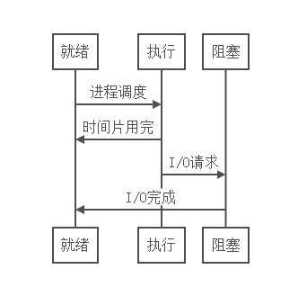

进程是对运行时程序的封装，是系统进行资源调度和分配的的基本单位，实现了操作系统的并发；

##基本概念

进程一般由程序、数据集合和进程控制块三部分组成。

- 程序用于描述进程要完成的功能，是控制进程执行的指令集；
- 数据集合是程序在执行时所需要的数据和工作区；
- 程序控制块(Program Control Block，简称PCB)，包含进程的描述信息和控制信息，是进程存在的唯一标志。

在早期的操作系统中并没有线程的概念，进程是能拥有资源和独立运行的最小单位，也是程序执行的最小单位。任务调度采用的是时间片轮转的抢占式调度方式，而进程是任务调度的最小单位，每个进程有各自独立的一块内存，使得各个进程之间内存地址相互隔离。

后来，随着计算机的发展，对CPU的要求越来越高，进程之间的切换开销较大，已经无法满足越来越复杂的程序的要求了。于是就发明了线程。

线程是进程的子任务，是CPU调度和分派的基本单位，用于保证程序的实时性，实现进程内部的并发；线程是操作系统可识别的最小执行和调度单位。每个线程都独自占用一个虚拟处理器：独自的寄存器组，指令计数器和处理器状态。每个线程完成不同的任务，但是共享同一地址空间（也就是同样的动态内存，映射文件，目标代码等等），打开的文件队列和其他内核资源。

```
任务调度
	在一个进程中，当一个线程任务执行几毫秒后，会由操作系统的内核（负责管理各个任务）进行调度，通过硬件的计数器中断处理器，让该线程强制暂停并将该线程的寄存器放入内存中，通过查看线程列表决定接下来执行哪一个线程，并从内存中恢复该线程的寄存器，最后恢复该线程的执行，从而去执行下一个任务。
	上述过程中，任务执行的那一小段时间叫做时间片，任务正在执行时的状态叫运行状态，被暂停的线程任务状态叫做就绪状态，意为等待下一个属于它的时间片的到来。

  这种方式保证了每个线程轮流执行，由于CPU的执行效率非常高，时间片非常短，在各个任务之间快速地切换，给人的感觉就是多个任务在“同时进行”，这也就是我们所说的并发(别觉得并发有多高深，它的实现很复杂，但它的概念很简单，就是一句话：多个任务同时执行)。多任务运行过程的示意图如下：
```


1.一个线程只能属于一个进程，而一个进程可以有多个线程，但至少有一个线程。线程依赖于进程而存在。

2.进程在执行过程中拥有独立的内存单元，而多个线程共享进程的内存。（资源分配给进程，同一进程的所有线程共享该进程的所有资源。同一进程中的多个线程共享代码段（代码和常量），数据段（全局变量和静态变量），扩展段（堆存储）。但是每个线程拥有自己的栈段，栈段又叫运行时段，用来存放所有局部变量和临时变量。）

3.进程是资源分配的最小单位，线程是CPU调度的最小单位；

4.系统开销： 由于在创建或撤消进程时，系统都要为之分配或回收资源，如内存空间、I／o设备等。因此，操作系统所付出的开销将显著地大于在创建或撤消线程时的开销。类似地，在进行进程切换时，涉及到整个当前进程CPU环境的保存以及新被调度运行的进程的CPU环境的设置。而线程切换只须保存和设置少量寄存器的内容，并不涉及存储器管理方面的操作。可见，进程切换的开销也远大于线程切换的开销。

5.通信：由于同一进程中的多个线程具有相同的地址空间，致使它们之间的同步和通信的实现，也变得比较容易。进程间通信IPC，线程间可以直接读写进程数据段（如全局变量）来进行通信——需要进程同步和互斥手段的辅助，以保证数据的一致性。在有的系统中，线程的切换、同步和通信都无须操作系统内核的干预

6.进程编程调试简单可靠性高，但是创建销毁开销大；线程正相反，开销小，切换速度快，但是编程调试相对复杂。

7.进程间不会相互影响 ；线程一个线程挂掉将导致整个进程挂掉

8.进程适应于多核、多机分布；线程适用于多核

## 守护进程

Linux Daemon（守护进程）是运行在后台的一种特殊进程。它独立于控制终端并且周期性地执行某种任务或等待处理某些发生的事件。它不需要用户输入就能运行而且提供某种服务，不是对整个系统就是对某个用户程序提供服务。Linux系统的大多数服务器就是通过守护进程实现的。常见的守护进程包括系统日志进程syslogd、 web服务器httpd、邮件服务器sendmail和数据库服务器mysqld等。

一个守护进程的父进程是init进程，因为它真正的父进程在fork出子进程后就先于子进程exit退出了，所以它是一个由init继承的孤儿进程。守护进程是非交互式程序，没有控制终端，所以任何输出，无论是向标准输出设备stdout还是标准出错设备stderr的输出都需要特殊处理。

## 线程池

一种线程的使用模式，线程过多会带来调度开销，进而影响缓存局部性和整体性能。而线程池维护着多个线程，等待着监督管理者分配可并发执行的任务。这避免了在处理短时间任务时创建与销毁线程的代价。线程池不仅能够保证内核的充分利用，还能防止过分调度。可用线程数量应该取决于可用的并发处理器、处理器内核、内存、网络sockets等的数量。

“管理一个任务队列，一个线程队列，然后每次取一个任务分配给一个线程去做，循环往复。

##手写线程池《待完善》

## 进程间通信

每个进程各自有不同的用户地址空间，任何一个进程的全局变量在另一个进程中都看不到，所以进程之间要交换数据必须通过内核，在内核中开辟一块缓冲区，进程1把数据从用户空间拷到内核缓冲区，进程2再从内核缓冲区把数据读走，内核提供的这种机制称为**进程间通信（IPC，InterProcess Communication）**

```
1.匿名管道通信
	半双工通信方式，数据单向流动，而且只能在具有亲缘关系的进程间使用，指父子进程
·父进程创建管道，得到两个⽂件描述符指向管道的两端
·父进程fork出子进程，⼦进程也有两个⽂件描述符指向同⼀管道。
·父进程关闭fd[0],子进程关闭fd[1]，即⽗进程关闭管道读端,⼦进程关闭管道写端（因为管道只支持单向通信）。
·⽗进程可以往管道⾥写,⼦进程可以从管道⾥读,管道是⽤环形队列实现的,数据从写端流⼊从读端流出,这样就实现了进程间通信。
2.高级管道通信
	将另一个程序当做一个新的进程在当前程序进程中启动，则它算是当前程序的子进程，这种方式我们成为高级管道方式。
3.有名管道通信
	有名管道也是半双工的通信方式，但是它允许无亲缘关系进程间的通信。
4.消息队列
 	消息队列是由消息的链表，存放在内核中并由消息队列标识符标识。消息队列克服了信号传递信息少、管道只能承载无格式字节流以及缓冲区大小受限等缺点。
5.信号量通信
	信号量是一个计数器，可以用来控制多个进程对共享资源的访问。它常作为一种锁机制，防止某进程正在访问共享资源时，其他进程也访问该资源。因此，主要作为进程间以及同一进程内不同线程之间的同步手段。
6.信号
	信号是一种比较复杂的通信方式，用于通知接收进程某个事件已经发生。
7.共享内存通信
	共享内存就是映射一段能被其他进程所访问的内存，这段共享内存由一个进程创建，但多个进程都可以访问。共享内存是最快的 IPC 方式，它是针对其他进程间通信方式运行效率低而专门设计的。它往往与其他通信机制，如信号量，配合使用，来实现进程间的同步和通信。
8.套接字通信
	套接口也是一种进程间通信机制，与其他通信机制不同的是，它可用于不同机器间的进程通信。
```

## 消息队列

用于将一些任务放置在同一个线程中执行。一来不会对主线程产生影响，二来针对有先后关系的任务可以更好的维护。

### 解耦

系统A是一个关键性的系统，产生数据后需要通知到系统B和系统C做响应的反应，三个系统都写好了，稳定运行；某一天，系统D也需要在系统A产生数据后作出反应，那就得系统A改代码，去调系统D的接口，好，改完了，上线了。假设过了某段时间，系统C因为某些原因，不需要作出反应了，不要系统A调它接口了，就让系统A把调接口的代码删了，系统A的负责人可定会很烦，改来改去，不停的改，不同的测，还得看会不会影响系统B，系统D。没办法，这种架构下，就是这样麻烦。

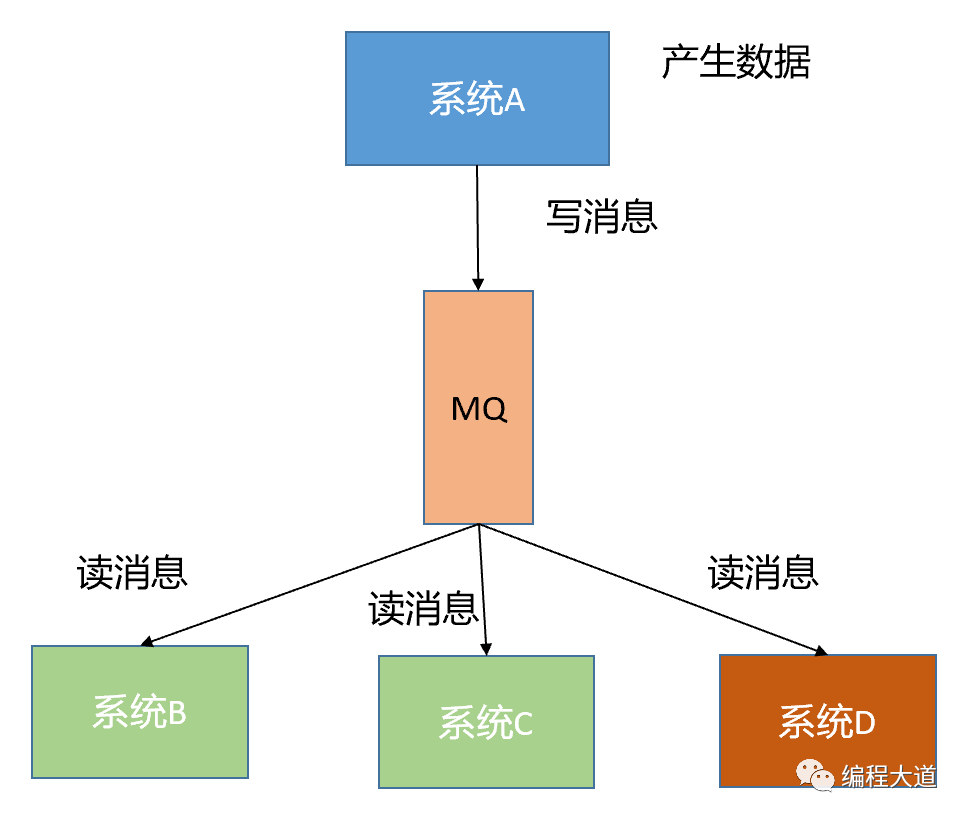

### 异步

```
Data newData = productData();//系统A经过一些逻辑处理后产生了数据，耗时200ms  
Response responseB = callSysB(newData);//系统A调系统B接口发送数据，耗时300ms 
Response responseC = callSysC(newData);//系统A调系统C接口发送数据，耗时300ms 
Response responseD = callSysD(newData);//系统A调系统D接口发送数据，耗时300ms
```

这样系统A的用户做完这个操作就需要等待：

200ms+300ms+300ms+300ms=1100ms=1.1s

点个按钮等一秒多，用户体验得多差啊，客户可能就会因此而流失掉。

假设使用了MQ呢？系统A就只需要把产生的数据放到MQ里就行了，就可以立马返回用户响应。伪代码如下：

```
//系统A中的代码 
Data newData = productData();//系统A经过一些逻辑处理后产生了数据，耗时200ms 
writeDataToMQ(newData);//往MQ里写消息，耗时50ms
```

### 削峰

将某一段时间的超高流量分摊到更长的一段时间内去消化，避免了流量洪峰击垮系统。MQ里会积压消息，慢慢消费就行

### 手写消息队列

# 锁机制

锁保证代码级的原子性和内存可见性，但消灭了并行，降低效率时肯定的

atomic效率比锁高得多

## 死锁

死锁是指多个进程循环等待它方占有的资源而无限期地僵持下去的局面。很显然，如果没有外力的作用，那么死锁涉及到的各个进程都将永远处于封锁状态。

如果此时有一个线程A，按照先锁a再获得锁b的的顺序获得锁，而在此同时又有另外一个线程B，按照先锁b再锁a的顺序获得锁。如下图所示：

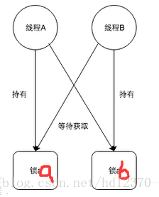

## 死锁发生的条件

互斥条件：进程要求对所分配的资源进行排它性控制，即在一段时间内某资源仅为一进程所占用。
请求和保持条件：当进程因请求资源而阻塞时，对已获得的资源保持不放。
不剥夺条件：进程已获得的资源在未使用完之前，不能剥夺，只能在使用完时由自己释放。
环路等待条件：在发生死锁时，必然存在一个进程--资源的环形链。

##预防死锁
资源一次性分配：一次性分配所有资源，这样就不会再有请求了：（破坏请求条件）
只要有一个资源得不到分配，也不给这个进程分配其他的资源：（破坏请保持条件）
可剥夺资源：即当某进程获得了部分资源，但得不到其它资源，则释放已占有的资源（破坏不可剥夺条件）
资源有序分配法：系统给每类资源赋予一个编号，每一个进程按编号递增的顺序请求资源，释放则相反（破坏环路等待条件）

##几种常见的锁

**互斥锁**：mutex，用于保证在任何时刻，都只能有一个线程访问该对象。当获取锁操作失败时，线程会进入睡眠，等待锁释放时被唤醒

**读写锁**：rwlock，分为读锁和写锁。处于**读操作时，可以允许多个线程同时获得读操作**。但是同一时刻**只能有一个线程可以获得写锁**。其它获取写锁失败的线程都会进入睡眠状态，直到写锁释放时被唤醒。 注意：写锁会阻塞其它读写锁。**当有一个线程获得写锁在写时，读锁也不能被其它线程获取**；写者优先于读者（一旦有写者，则后续读者必须等待，唤醒时优先考虑写者）。适用于读取数据的频率远远大于写数据的频率的场合。

**自旋锁**：spinlock，在任何时刻同样只能有一个线程访问对象。但是当获取锁操作失败时，**不会进入睡眠，而是会在原地自旋**，直到锁被释放。这样节省了线程从睡眠状态到被唤醒期间的消耗，在加锁时间短暂的环境下会极大的提高效率。但如果加锁时间过长，则会非常浪费CPU资源，适合加锁时间短的程序

自旋锁的性能问题：除了临界区内的线程，其他的线程都在空转，争抢锁的处理器越多，利用率越低

自旋锁的使用场景：操作系统内核的并发数据结构（短临界区）

RCU：即read-copy-update，在修改数据时，首先需要读取数据，然后生成一个副本，对副本进行修改。修改完成后，再将老数据update成新的数据。使用RCU时，读者几乎不需要同步开销，既不需要获得锁，也不使用原子指令，不会导致锁竞争，因此就不用考虑死锁问题了。而对于写者的同步开销较大，它需要复制被修改的数据，还必须使用锁机制同步并行其它写者的修改操作。在有大量读操作，少量写操作的情况下效率非常高。

1、互斥锁和读写锁区别：

互斥锁：mutex，用于保证在任何时刻，都只能有一个线程访问该对象。当获取锁操作失败时，线程会进入睡眠，等待锁释放时被唤醒。

读写锁：rwlock，分为读锁和写锁。处于读操作时，可以允许多个线程同时获得读操作。但是同一时刻只能有一个线程可以获得写锁。其它获取写锁失败的线程都会进入睡眠状态，直到写锁释放时被唤醒。 注意：写锁会阻塞其它读写锁。当有一个线程获得写锁在写时，读锁也不能被其它线程获取；写者优先于读者（一旦有写者，则后续读者必须等待，唤醒时优先考虑写者）。适用于读取数据的频率远远大于写数据的频率的场合。

互斥锁和读写锁的区别：

1）读写锁区分读者和写者，而互斥锁不区分

2）互斥锁同一时间只允许一个线程访问该对象，无论读写；读写锁同一时间内只允许一个写者，但是允许多个读者同时读对象。


**第一, 锁具有序列化的作用**

1.2 有了序列化保证并未完事.  在我们以锁的作比拟的例子中,  我们深埋一个假设,  一个拿锁进临界区的参与者, 它见到的"作案现场" 必定是上一个进入者离开时的现场. 这在现实中是必然的, 也是直观的. 但在系统中, 这并不是必然的. 主要有以下两种原因:

   \1) 由于出于性能的考量, 在超线程, 流水线等技术持续压榨CPU的同时, CPU还会在合适的情况下采取乱序执行,  也就是, 真实的指令**执行顺序**并不一定等同程序编写时的**程序顺序.**  

   \2) 此外, CPU的访问是存在层级的, 简言之, 即先cache, 再内存.   在多CPU的[体系架构](https://www.zhihu.com/search?q=体系架构&search_source=Entity&hybrid_search_source=Entity&hybrid_search_extra={"sourceType"%3A"answer"%2C"sourceId"%3A33326216})中,  每个CPU都有自己局部的内存,  当然它也可以访问别的CPU的[局部内存](https://www.zhihu.com/search?q=局部内存&search_source=Entity&hybrid_search_source=Entity&hybrid_search_extra={"sourceType"%3A"answer"%2C"sourceId"%3A33326216}). 这意味着,  CPU访问离它近的内存快, 访问远的内存慢. 所以, 这会由于cache的刷新延迟而导致访问内存一致性的问题. 也就是内存被修改了, cache还没来得及刷新, CPU就来访问了, 此时访问的是一个无效的旧值. 也就是, **执行顺序**并不一定等同于**观察顺序**

锁的实现还必须保证解决这两个问题, 所以,

**第二, 锁具有保持访存一致性的作用**

\2. 回到Mutex, 它作为一种互斥锁, 也必须有以上二个作用. 它是这样保证这二点要求的:

2.1 互斥机制.  拿到该锁者, 独占访问. 称之为**ACQUIRE**操作.  访问完毕, 释放锁,  称之为**RELEASE**

​      操作. 这种互斥保证了序列化.

  2.2 于**ACQUIRE**和**RELEASE** 上附加保持访存一致性的语义: 即题主所提到的:

\1)  **ACQUIRE:**  **对于所有其****它参与者来说,** 在此操作**后**的所有读写操作**必然发生在ACQUIRE这个动作之后****.** 前面半句[状语从句](https://www.zhihu.com/search?q=状语从句&search_source=Entity&hybrid_search_source=Entity&hybrid_search_extra={"sourceType"%3A"answer"%2C"sourceId"%3A33326216})很重要, 它保证**执行顺序**等同于**观察顺序 .**

\2)  **RELEASE:**  **对于所有其****它参与者来说,** 在此操作**前**的所有读写操作**必然发生在****RELEASE****这个动作之前****.** 前面半句状语从句很重要, 它保证**执行顺序**等同于**观察顺序 .**

 **注意,** 这其中任意一个操作, 都只保证了一半的顺序:

  对于**ACQUIRE**来说, 并没保证**ACQUIRE前**的读写操作不会发生在**ACQUIRE**动作之后.

  对于**RELEASE**来说, 并没保证**RELEASE后**的读写操作不会发生在**RELEASE**动作之前.

但是, **ACQUIRE 和** **RELEASE 配对起来使用后, 就有了完全顺序.  成为一个屏障性的保证, 术语叫[memory barrier]

作者：larmbr宇
链接：https://www.zhihu.com/question/26588157/answer/33326216
来源：知乎
著作权归作者所有。商业转载请联系作者获得授权，非商业转载请注明出处。

# 同步异步阻塞

- **同步**

  当一个request发送出去以后，会得到一个response，这整个过程就是一个同步调用的过程。哪怕response为空，或者response的返回特别快，但是针对这一次请求而言就是一个同步的调用。

  **异步**

  当一个request发送出去以后，没有得到想要的response，而是通过后面的callback、状态或者通知的方式获得结果。可以这么理解，对于异步请求分两步：

  1）调用方发送request没有返回对应的response（可能是一个空的response）；

  2）服务提供方将response处理完成以后通过callback的方式通知调用方。

  对于1）而言是同步操作（调用方请求服务方），对于2）而言也是同步操作（服务方回掉调用方）。从请求的目的（调用方发送一个request，希望获得对应的response）来看，这两个步骤拆分开来没有任何意义，需要结合起来看，而这整个过程就是一次异步请求。**异步请求有一个最典型的特点：需要callback、状态或者通知的方式来告知调用方结果。**


##**同步阻塞IO**

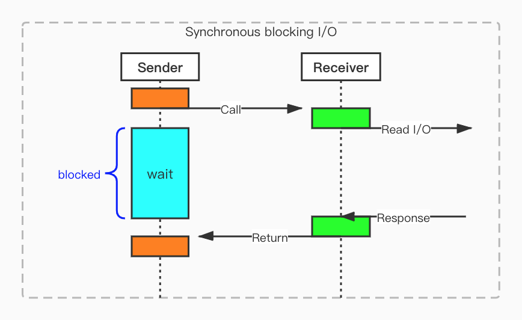

针对Sender而言，请求发送出去以后，一直等到Receiver有结果了才返回，这是同步。在Sender获取结果的期间一直被block住了，也就是在此期间Sender不能处理其它事情，这是阻塞。


##**异步阻塞IO**

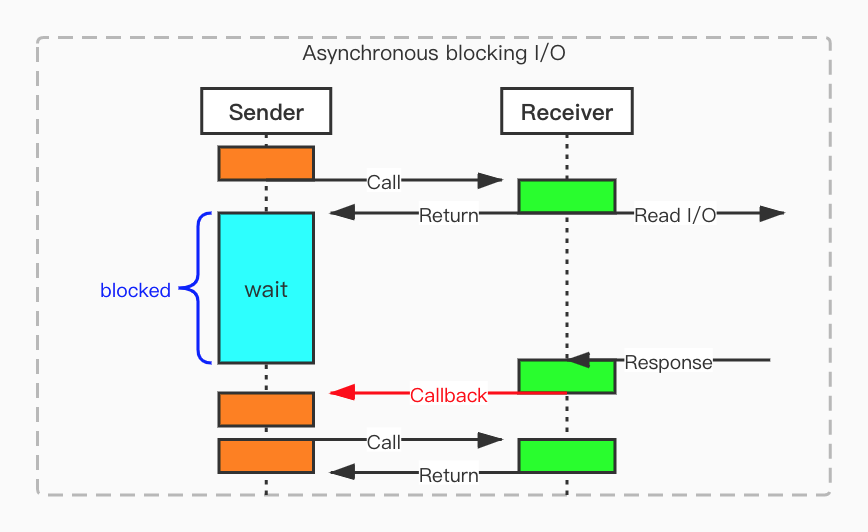

针对Sender而言，请求发送出去以后，立刻返回，然后再等待Receiver的callback，最后再次请求获取response，这整个过程是异步。在Sender等待Receiver的callback期间一直被block住了，也就是在此期间Sender不能处理其它事情，这是阻塞。

##同步非阻塞

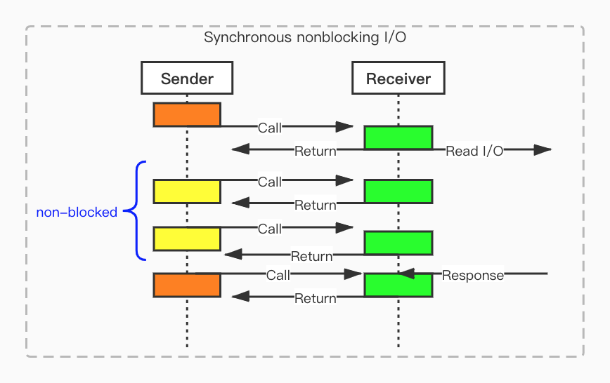

针对Sender而言，请求发送出去以后，立刻返回，然后再不停的发送请求，直到Receiver处理好结果后，最后一次发请求给Receiver才获得response。Sender一直在主动轮询，每一个请求都是同步的，整个过程也是同步的。在Sender等待Receiver的response期间一直在发请求，这是非阻塞。

##**异步非阻塞IO**

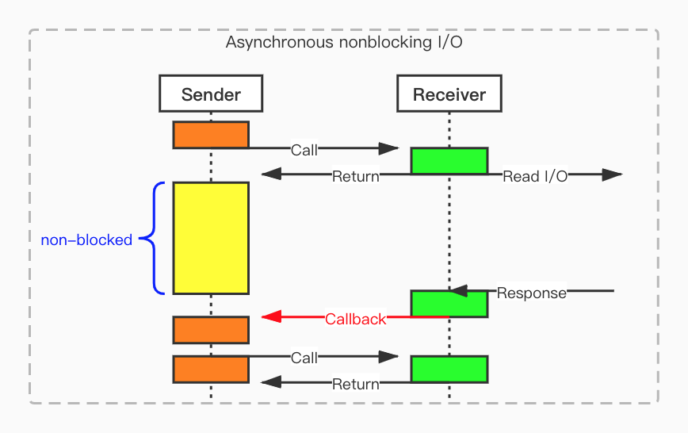

针对Sender而言，请求发送出去以后，立刻返回，然后再等待Receiver的callback，最后再次请求获取response，这整个过程是异步。在Sender等待Receiver的callback期间一直是可以处理其它事情的，这是非阻塞。

#多路复用

I/O多路复用就通过一种机制，可以监视多个描述符，一旦某个描述符就绪（一般是读就绪或者写就绪），能够通知程序进行相应的读写操作。

## select


用户首先将需要进行IO操作的socket添加到select中，然后阻塞等待select系统调用返回。当数据到达时，socket被激活，select函数返回。用户线程正式发起read请求，读取数据并继续执行。

从流程上来看，使用select函数进行IO请求和同步阻塞模型没有太大的区别，甚至还多了添加监视socket，以及调用select函数的额外操作，效率更差。但是，使用select以后最大的优势是用户可以在一个线程内同时处理多个socket的IO请求。用户可以注册多个socket，然后不断地调用select读取被激活的socket，即可达到在**同一个线程内同时处理多个IO请求的目的**。而在同步阻塞模型中，必须通过多线程的方式才能达到这个目的。这是reactor设计模式的体现


```
select缺点
（1）每次调用select，都需要把fd集合从用户态拷贝到内核态，这个开销在fd很多时会很大
（2）同时每次调用select都需要在内核遍历传递进来的所有fd，这个开销在fd很多时也很大
（3）select支持的文件描述符数量太小了，默认是1024复制代码
```

## poll

poll的实现和select非常相似，只是描述fd集合的方式不同，poll使用pollfd结构而不是select的fd_set结构

```c++
int poll(struct pollfd *fds, nfds_t nfds, int timeout);


struct pollfd{
	int fd;			//文件描述符
	short events;	//等待的事件
	short revents;	//实际发生的事件
}

```

fd：每一个 pollfd 结构体指定了一个被监视的文件描述符，可以传递多个结构体，指示 poll() 监视多个文件描述符。

events：指定监测fd的事件（输入、输出、错误），每一个事件有多个取值，如下：

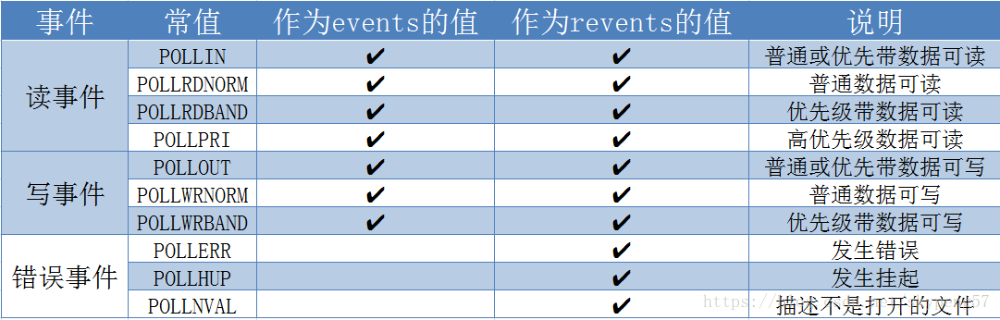

revents：revents 域是文件描述符的操作结果事件，内核在调用返回时设置这个域。events 域中请求的任何事件都可能在 revents 域中返回.
注意：每个结构体的 events 域是由用户来设置，告诉内核我们关注的是什么，而 revents 域是返回时内核设置的，以说明对该描述符发生了什么事件
nfds：用来指定第一个参数数组元素个数
timeout：指定等待的毫秒数，无论 I/O 是否准备好，poll() 都会返回.

返回值：

成功时，poll() 返回结构体中 revents 域不为 0 的文件描述符个数；如果在超时前没有任何事件发生，poll()返回 0；

失败时，poll() 返回 -1，并设置 errno 为下列值之一：

EBADF：一个或多个结构体中指定的文件描述符无效。
EFAULT：fds 指针指向的地址超出进程的地址空间。
EINTR：请求的事件之前产生一个信号，调用可以重新发起。
EINVAL：nfds 参数超出 PLIMIT_NOFILE 值。
ENOMEM：可用内存不足，无法完成请求。

##epoll

epoll是一种I/O事件通知机制，是linux 内核实现IO多路复用的一个实现

通知机制，就是当事件发生的时候，则主动通知。通知机制的反面，就是轮询机制。

- epoll的通俗解释是一种当文件描述符的内核缓冲区非空的时候，发出可读信号进行通知，当写缓冲区不满的时候，发出可写信号通知的机制


- epoll的核心是3个API，核心数据结构是：1个红黑树和1个链表

- 相对于select和poll来说，epoll更加灵活，没有描述符限制。epoll使用一个文件描述符管理多个描述符，将用户关系的文件描述符的事件存放到内核的一个事件表中，这样在用户空间和内核空间的copy只需一次。


###用法

<sys/epoll.h>

- **int epoll_create(int size)**

创建一个epoll的句柄，size用来告诉内核这个监听的数目一共有多大。这个参数不同于select()中的第一个参数，给出最大监听的fd+1的值。需要注意的是，当创建好epoll句柄后，它就是会占用一个fd值，在linux下如果查看/proc/进程id/fd/，是能够看到这个fd的，所以在使用完epoll后，必须调用close()关闭

- **int epoll_ctl(int epfd， int op， int fd， struct epoll_event \*event)**

epoll的事件注册函数，它不同与select()是在监听事件时告诉内核要监听什么类型的事件epoll的事件注册函数，它不同与select()是在监听事件时告诉内核要监听什么类型的事件，而是在这里先注册要监听的事件类型。第一个参数是epoll_create()的返回值，第二个参数表示动作，用三个宏来表示：

EPOLL_CTL_ADD：注册新的fd到epfd中；
EPOLL_CTL_MOD：修改已经注册的fd的监听事件；
EPOLL_CTL_DEL：从epfd中删除一个fd；
第三个参数是需要监听的fd，第四个参数是告诉内核需要监听什么事，struct epoll_event结构如下：

```c++
struct epoll_event {
  __uint32_t events;  /* Epoll events */
  epoll_data_t data;  /* User data variable */
};
```

events可以是以下几个宏的集合：
EPOLLIN ：表示对应的文件描述符可以读（包括对端SOCKET正常关闭）；
EPOLLOUT：表示对应的文件描述符可以写；
EPOLLPRI：表示对应的文件描述符有紧急的数据可读（这里应该表示有带外数据到来）；
EPOLLERR：表示对应的文件描述符发生错误；
EPOLLHUP：表示对应的文件描述符被挂断；
EPOLLET： 将EPOLL设为边缘触发(Edge Triggered)模式，这是相对于水平触发(Level Triggered)来说的。
EPOLLONESHOT：只监听一次事件，当监听完这次事件之后，如果还需要继续监听这个socket的话，需要再次把这个socket加入到EPOLL队列里

- **int epoll_wait(int epfd， struct epoll_event \*events， int maxevents， int timeout)**

等待事件的产生，类似于select()调用。参数events用来从内核得到事件的集合，maxevents告之内核这个events有多大，这个maxevents的值不能大于创建epoll_create()时的size，参数timeout是超时时间（毫秒，0会立即返回，-1将不确定，也有说法说是永久阻塞）。该函数返回需要处理的事件数目，如返回0表示已超时。

### 工作模式

epoll对文件描述符的操作有两种模式：LT（level trigger）和ET（edge trigger）。LT模式是默认模式，LT模式与ET模式的区别如下：

　　LT模式-muduo：当epoll_wait检测到描述符事件发生并将此事件通知应用程序，应用程序可以不立即处理该事件。下次调用epoll_wait时，会再次响应应用程序并通知此事件。

　　ET模式：当epoll_wait检测到描述符事件发生并将此事件通知应用程序，应用程序必须立即处理该事件。如果不处理，下次调用epoll_wait时，不会再次响应应用程序并通知此事件。

　　ET模式在很大程度上减少了epoll事件被重复触发的次数，因此效率要比LT模式高。epoll工作在ET模式的时候，必须使用非阻塞套接口，以避免由于一个文件句柄的阻塞读/阻塞写操作把处理多个文件描述符的任务饿死。

###惊群效应

```
惊群效应：惊群效应就是当一个fd的事件被触发时，所有等待这个fd的线程或进程都被唤醒。
1.Linux2.6在内核级别让accept成为原子操作，如果多个进程同时阻塞在accept上，每次仅唤醒等待队列的第一个进程从accept返回并拿到用户连接。
2.问题是，在实际生产环境中，通常是先用select/epoll来监听listen_fd是否有连接过来，再调用accept，也就是说惊群点从accept提前到epoll上了。
3.Nginx的解决方案是，设置一把全局accpet锁，每个进程先去竞争这把锁，拿到锁的进程才向epoll中注册listen_fd事件。
```

**1.不使用epoll/select的情况下多进程是如何共享端口监听的？**

不使用多路复用的情况下，进程要接受tcp连接必然要调用accept并且被阻塞，直到有一条连接到达，在这之前无法做别的事情，也即是说单个进程一次只能处理一条连接，业务处理完成之后调用close关闭连接，然后继续等待accept，循环往复，这种情况下是无法实现高并发的，所以一般会使用多进程再来同时处理更多的连接，多进程一般情况下有两种模式
第一种是由一个主进程进行accept监听，接受一个连接之后再fork出一个子进程，把连接丢给子进程去进行业务处理，然后主进程继续监听，这个是最简单的模式，由于只有一个进程在使用accept进行监听，不涉及多进程争抢的问题，当tcp连接事件到达后也只会唤醒这个监听进程，自然也不存在惊群效应

第二种形式是由主进程fork出一批子进程，子进程继承了父进程的这个监听端口，大家共享，然后一起监听。这里面就涉及到当多个进程在阻塞状态中等待同一个端口事件时内核的行为.而linux的内核对进程唤醒提供了两种模式，一种是prepare_to_wait，一种是prepare_to_wait_exclusive，exclusive即互斥，如果调用的是prepare_to_wait_exclusive，则在对一个等待队列进程唤醒的时候，只会唤醒一个进程，而prepare_to_wait没有设置互斥位，会将挂在这个等待队列上的所有进程全部唤醒，accept使用的使的是prepare_to_wait_exclusive，不会产生惊群。

**2.epoll下共享监听端口的行为**

因为使用多路复用，惊群效应的唤醒就从accept转移到了epoll中，与直接accept不同，epoll需要先调用epoll_create在内核中创建一个epoll文件，epoll会创建一个匿名的inode节点，这个节点指向的是一个epoll主结构，这个结构中有两个核心字段，一个是红黑树，用户态需要监听的文件都会挂在这个红黑树下面，实现lgn的查找、插入、更新的复杂度；另外一个是rdlist，即文件事件的就绪队列，指向的是一个链表，事件产生的时候，epoll会把对应的epitem（即红黑树上的节点）插入到这个链表中，当向用户态返回的时候，只需要遍历这个就绪链表即可

接下来看如何把要监听的socket fd挂在epoll上，这个过程调用的是epoll_ctl，将fd向内核传递，内核实际上会做两个事情

- 将fd挂在红黑树中

- 调用文件设备驱动的poll回调指针（这是重点）

epoll/select等这些模型要实现多路复用，实际上主要就是依赖于：将进程挂在对应的fd的等待队列上，这样当这个fd的事情产生的时候，设备驱动就会将这个队列上的进程唤醒

 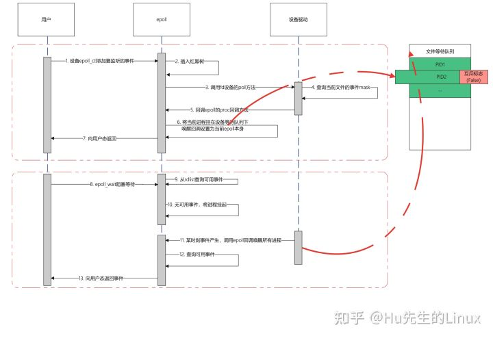

可想而知，在下面的epoll_wait调用中，如果多个进程将同一个fd添加到epoll中进行监听，当事件到达的时候，这些进程将被一起唤醒
但是唤醒并不一定会向用户态返回，因为唤醒之后epoll还要遍历一次就绪列表，确认有至少一个事件发生才会向用户态返回

epoll惊群体现如下

1. 当多个进程共享同一个监听端口并且都使用epoll进行多路复用的监听时，epoll将这些进程都挂在同一个等待队列下
2. 当事件产生时，socket的设备驱动都会尝试将等待队列的进行唤醒，但是由于挂载队列的时候使用的是epoll的挂载方式，没有设置互斥标志（取代了accept自己挂载队列的方式，如第一节所述），所以这个队列下的所有进程将全部被唤醒
3. 唤醒之后此时这些进程还处于内核态，他们都会立刻检查事件就绪列表，确认是否有事件发生，对accept而言，accept->poll方法将会检查在当前的socket的tcp全连接列表中是否有可用连接，如果是则返回可用事件标志
4. 当所有进程都被唤醒，但是还没有进行去真正做accept动作的时候，所有进行的事件检查都认为accept事件可用，所以这些进行都向用户态返回
5. 用户态检查到有accept事件可用，这时他们将会真正调用accept函数进行连接的获取
6. 此时只会有一个进行能真正获取连接，其他进行都会返回EAGAIN错误，使用strace -p PID命令可以跟踪到这种错误 （strcae跟踪系统调用）
7. 并不是所有进行都会返回用户态，关键点在于这些被唤醒的进行在检查事件的过程中，如果已经有进程成功accept到连接了，这时别的事情将不会检查到这个事情，从而他们会继续休眠，不会返回用户态
8. 虽然不一定会返回用户态，但也造成了内核上下文切换的发生，其实也是惊群效应的表现

**3.如何解决epoll的惊群效应**

根本原因在于epoll的默认行为是对于多进程监听同一文件不会设置互斥，进而将所有进程唤醒，后续的内核版本主要提供了两种解决方案

1. 既然默认不会设置互斥，那就加一个互斥功能好了:-)，linux4.5内核之后给epoll添加了一个EPOLLEXCLUSIVE的标志位，如果设置了这个标志位，那epoll将进程挂到等待队列时将会设置一下互斥标志位，这时实现跟内核原生accept一样的特性，只会唤醒队列中的一个进程
2. 第二种方法：linux 3.9内核之后给socket提供SO_REUSEPORT标志，这种方式解决得更彻底，他允许不同进程的socket绑定到同一个端口，取代以往需要子进程共享socket监听的方式，这时候，每个进程的监听socket将指向open_file_tables下的不同节点，也就是说不同进程是在自己的设备等待队列下被挂起的，不存在共享fd的问题，也就不存在被同时唤醒的可能时，而内核则在驱动中将设置了SO_REUSEPORT并且绑定同一端口的这些socket分到同一个group中，当有tcp连接事件到达的时候，内核将会对源IP+源端口取hash然后指定这个group中其中一个进程来接受连接，相当于在内核级别中实现了一个负载均衡

基于以上两种方法，其实epoll生态在目前来说不存在所谓的惊群效应了，除非：你溢用epoll，比如多进程之间共享了同一个epfd（父进程创建epoll由多个子进程来调用），那就不能怪epoll了，因为这时候多个进程都被挂到这个epoll下，这种情况下，已经不是仅仅是惊群效应的问题了，比如说，A进程在epoll挂了socket1的连接事件，B进程调用了epoll_wait，由于属于同一个epfd，当socket1产生事件的时候，进程B也会被唤醒，而更严重的事情在于，在B的空间下并不存在socket1这个fd，从而把问题搞得很复杂。总结：千万不要在多线程/多进程之间共享epfd

##select、poll、epoll


**1. 用户态将文件描述符传入内核的方式**

select：创建3个文件描述符集并拷贝到内核中，分别监听读、写、异常动作。这里受到单个进程可以打开的fd数量限制，默认是1024。

poll：将传入的struct pollfd结构体数组拷贝到内核中进行监听。

epoll：执行epoll_create会在内核的高速cache区中建立一颗红黑树以及就绪链表(该链表存储已经就绪的文件描述符)。接着用户执行的epoll_ctl函数添加文件描述符会在红黑树上增加相应的结点。

**2. 内核态检测文件描述符读写状态的方式**

select：采用轮询方式，遍历所有fd，最后返回一个描述符读写操作是否就绪的mask掩码，根据这个掩码给fd_set赋值。

poll：同样采用轮询方式，查询每个fd的状态，如果就绪则在等待队列中加入一项并继续遍历。

epoll：采用回调机制。在执行epoll_ctl的add操作时，不仅将文件描述符放到红黑树上，而且也注册了回调函数，内核在检测到某文件描述符可读/可写时会调用回调函数，该回调函数将文件描述符放在就绪链表中。

**3. 找到就绪的文件描述符并传递给用户态的方式**

select：将之前传入的fd_set拷贝传出到用户态并返回就绪的文件描述符总数。用户态并不知道是哪些文件描述符处于就绪态，需要遍历来判断。

poll：将之前传入的fd数组拷贝传出用户态并返回就绪的文件描述符总数。用户态并不知道是哪些文件描述符处于就绪态，需要遍历来判断。

epoll：epoll_wait只用观察就绪链表中有无数据即可，最后将链表的数据返回给数组并返回就绪的数量。内核将就绪的文件描述符放在传入的数组中，所以只用遍历依次处理即可。

**4. 重复监听的处理方式**

select：将新的监听文件描述符集合拷贝传入内核中，继续以上步骤。

poll：将新的struct pollfd结构体数组拷贝传入内核中，继续以上步骤。

epoll：无需重新构建红黑树，直接沿用已存在的即可。

# DMA

Direct Memory Access,直接存储器访问。DMA传输将数据从一个地址空间复制到另一个地址空间，提供在外设和存储器之间或者存储器和存储器之间的高速数据传输。当CPU初始化这个传输动作，传输动作本身是由DMA控制器来实现和完成的。DMA传输方式无需CPU直接控制传输，也没有中断处理方式那样保留现场和恢复现场过程，通过硬件为RAM和IO设备开辟一条直接传输数据的通道，使得CPU的效率大大提高。


## 主要特征

·每个通道都直接连接专用的硬件DMA请求，每个通道都同样支持软件触发，这些功能通过软件来配置。

# 内存

正文段：由CPU执行的机器指令部分，通常，正文段是可共享的，只读的，防止程序由于意外修改其指令

初始化数据段：简称为数据段，它包含了程序中需要明确赋初值的变量

未初始化数据段：也称为BSS段，在程序开始执行之前，内核将此段的数据初始化为0或空指针

栈：自动变量以及每次函数调用时所保存的信息。每次函数调用时，其返回地址以及调用者的环境信息都存放在栈中。最近被调用的函数在栈上自动为其分配存储空间。递归函数每次调用自身时，就会形成一个新的栈帧，因此一次函数调用实例中的变量集不会影响另一次函数调用实例中的变量

栈上边是命令行参数和进程的环境变量

堆：通常在堆中进行动态存储分配。历史惯例：堆位于未初始化数据段和栈之间


## 虚拟内存

计算机对内存分为物理内存与虚拟内存。物理内存就是计算机的实际内存大小，由 RAM 芯片组成的。虚拟内存则是虚拟出来的。

虚拟内存将用户逻辑内存与物理内存分开。这在现有物理内存有限的情况下，为程序员提供了巨大的虚拟内存。并由操作系统完成从[虚拟内存](https://so.csdn.net/so/search?q=虚拟内存&spm=1001.2101.3001.7020)的虚拟地址到真实内存地址或者磁盘空间之间的映射工作。除了将逻辑内存与物理内存分开外，虚拟内存允许文件和内存通过共享页而为多个进程所共享。这带来了以下好处：

1. 通过将共享对象映射到虚拟地址空间中，系统库可以为多个进程所共享。尽管每个进程都将库视为其虚拟地址空间的一部分，但是驻留在物理内存中的库的实际页可由所有进程共享（图 3）。通常，库按只读方式映射到与其链接的进程空间。
2. 类似地，虚拟内存允许进程共享内存。进程之间可以通过使用共享内存来进行通信。虚拟内存允许一个进程创建一个内存区域，以便与其他进程共享。共享这个内存区域的进程认为，它是其虚拟地址空间的一部分，而事实上这部分是共享的，如图 3 所示。
3. 当通过系统调用 fork() 创建进程时，可以共享页面，从而加快进程创建。

## 内存管理

在没有引入mmu内存管理单元时，对于32位操作系统，每个进程都有2的32次方的地址空间(4G)。如果进程A占用内存0x1000---0x2000物理地址空间， 而进程B也占用内存0x1000---0x2000物理地址空间，这是完全有可能的。当进程A加载执行时，则进程B将不能被加载执行。一旦进程B被加载执行，则将会破坏进程A的物理地址空间。为了解决这个问题，linux操作系统和CPU都做了修改，添加了mmu内存管理。


在引入了mmu内存管理单元后， 每个进程访问的地址不在是内存中的物理地址，而是虚拟地址。进程A被加载物理内存0x5000----0x6000物理地址空间； 进程B被加载到物理内存0x7000---0x8000物理地址空间。同时进程A与进程B各自都建立了一个虚拟地址到物理地址的映射表。 当cpu执行进程A时，会使用进程A的地址映射表，例如cpu读取0x1000虚拟地址，查询进程A的地址映射表后，发现虚拟地址映射到物理内存中的0x5000位置；当cpu执行进程B时，会使用进程B的地址映射表，例如cpu读取0x1000虚拟地址，查询进程B的地址映射表后，发现虚拟地址映射到物理内存中的0X7000位置。这样就可以避免之前提到的内存冲突问题。有了mmu内存管理单元，linux就可以轻松实现多任务了。

地址映射表的表项是一个虚拟地址对应一个物理地址， 每个进程用于页表的维护就需要占用太多的内存空间。为此，需要修改映射方式，常用的有三种：**页式、段式、段页式**，这也是三种不同的**mmu内存管理方式**。这里主要讨论页表的实现。

## 分页分段

```
现在，我们仍然将应用程序分段，但我们对于每一个段实施页式管理，结合分段的思想，很容易可以理解为什么为什么这种想法可以减少内存开销：由于段保存的仅仅是已使用的资源，那么对每个段分页，其中每个页都是被使用的！
```

### 分段


- 外部内存碎片，也就是产生了多个不连续的小物理内存，导致新的程序无法被装载；
- 内部内存碎片，程序所有的内存都被装载到了物理内存，但是这个程序有部分的内存可能并不是很常使用，这也会导致内存的浪费；

**如何解决外部内存碎片？**

内存交换：把内存里的东西写到硬盘，再释放内存，再从硬盘读入装载入内存，**如果内存交换的时候，交换的是一个占内存空间很大的程序，这样整个机器都会显得卡顿。**

### 分页

**分页是把整个虚拟和物理内存空间切成一段段固定尺寸的大小**。这样一个连续并且尺寸固定的内存空间，我们叫**页**（*Page*）。在 Linux 下，每一页的大小为 `4KB`。虚拟地址与物理地址之间通过**页表**来映射


分页的方式使得我们在加载程序的时候，不再需要一次性都把程序加载到物理内存中。我们完全可以在进行虚拟内存和物理内存的页之间的映射之后，并不真的把页加载到物理内存里，而是**只有在程序运行中，需要用到对应虚拟内存页里面的指令和数据时，再加载到物理内存里面去。**

```
虚拟地址空间：
32位分配的是4G，高1G为内核空间，低3G的为用户空间
64位系统的虚拟地址空间不是2^32， 也不是2^64，而一般是2^48。64位linux一般使用48位来表示虚拟地址空间，使用40位来表示物理地址空间，可以通过cat /proc/cpuinfo来查看，所以调试时的指针显示只有12位十六进制数
```


在 32 位的环境下，虚拟地址空间共有 4GB，假设一个页的大小是 4KB（2^12），那么就需要大约 100 万 （2^20） 个页，每个「页表项」需要 4 个字节大小来存储，那么整个 4GB 空间的映射就需要有 `4MB` 的内存来存储页表。

这 4MB 大小的页表，看起来也不是很大。但是要知道每个进程都是有自己的虚拟地址空间的，也就说都有自己的页表。

那么，`100` 个进程的话，就需要 `400MB` 的内存来存储页表，这是非常大的内存了，更别说 64 位的环境了。

要解决上面的问题，就需要采用的是一种叫作**多级页表**（*Multi-Level Page Table*）的解决方案。这也是linux的解决方案

#### 多级页表方案

每个进程都有 4GB 的虚拟地址空间，而显然对于大多数程序来说，其使用到的空间远未达到 4GB，因为会存在部分对应的页表项都是空的，根本没有分配，对于已分配的页表项，如果存在最近一定时间未访问的页表，在物理内存紧张的情况下，操作系统会将页面换出到硬盘，也就是说不会占用物理内存。

如果使用了二级分页，一级页表就可以覆盖整个 4GB 虚拟地址空间，但**如果某个一级页表的页表项没有被用到，也就不需要创建这个页表项对应的二级页表了，即可以在需要时才创建二级页表**。做个简单的计算，假设只有 20% 的一级页表项被用到了，那么页表占用的内存空间就只有 4KB（一级页表） + 20% * 4MB（二级页表）= `0.804MB`

对于 64 位的系统，两级分页肯定不够了，就变成了四级目录，分别是：

- 全局页目录项 PGD（*Page Global Directory*）；
- 上层页目录项 PUD（*Page Upper Directory*）；
- 中间页目录项 PMD（*Page Middle Directory*）；
- 页表项 PTE（*Page Table Entry*）；
- 

####TLB页表缓存*(Translation Lookaside Buffer)*

多级页表虽然解决了空间上的问题，但是虚拟地址到物理地址的转换就多了几道转换的工序，这显然就降低了这俩地址转换的速度，也就是带来了时间上的开销。

程序是有局部性的，即在一段时间内，整个程序的执行仅限于程序中的某一部分。相应地，执行所访问的存储空间也局限于某个内存区域。

我们就可以利用这一特性，把最常访问的几个页表项存储到访问速度更快的硬件


在 CPU 芯片里面，封装了内存管理单元（*Memory Management Unit*）芯片，它用来完成地址转换和 TLB 的访问与交互。

有了 TLB 后，那么 CPU 在寻址时，会先查 TLB，如果没找到，才会继续查常规的页表。

#### 大页表方案

大页顾名思义，就是比较大的页，通常是2MB。由于页变大了，需要的页表项也就小了，占用物理内存也减少了。

1. 大页的优点
   减少页表大小：默认页面大小为 4K，而大页为 2048K，意味着系统需要处理的页面减少了 512 倍。大页的页表在各进程之间可以共享，也降低了页表的大小。
   减少页表遍历：大页覆盖更大的连续虚拟地址范围，使得CPU中的TLB（可理解为CPU对页表的CACHE）命中率大大提高，减少了遍历页表以从虚拟地址获取物理地址的次数。
   减少页表查找开销：
   避免swap：大页内存只能锁定在物理内存中，不可swap，因此没有page-in/page-out机制开销，避免了swap引起的性能影响。
   减少了内存开销：由于要处理的页面数量较少，明显减少了页表访问可能出现的瓶颈。
2. 大页的缺点
   要预先分配
   需要重启主机生效
   当服务器内存或SGA调整时，需要对应调整大页设置
   如果分配不当（过多、过少、os参数配置错误），反而可能引起严重问题

###总结

**段式管理：**

优点：消除了内部碎片，提高了对物理内存的利用率；将应用按逻辑分段，人们可以编写不同类型的代码，可以方便的进行共享或保护。

缺点：会产生大量的外部碎片，使得操作系统难以分配空闲空间。例如4kb的空间装入3kb的段，产生的1kb的空间无法在装入任何段，产生碎片的主要原因是因为分段使用的大小是不确定的。

**页式管理**：

优点：消除了外部碎片，提高了对物理内存的利用率，利于操作系统管理空闲空间。

缺点：仍然会产生内部碎片，尽管每个页碎片不超过页的大小；页表过大，占用大量空间，可以采用多级页表思想解决。

**段页式管理**：

优点：同时具备段式和页式的所有优点。

缺点：需要更多的硬件支持；当TLB未命中，需要更多的时间访问内存。

为了在多进程环境下，使得进程之间的内存地址不受影响，相互隔离，于是操作系统就为每个进程独立分配一套**虚拟地址空间**，每个程序只关心自己的虚拟地址就可以，实际上大家的虚拟地址都是一样的，但分布到物理地址内存是不一样的。作为程序，也不用关心物理地址的事情。

每个进程都有自己的虚拟空间，而物理内存只有一个，所以当启用了大量的进程，物理内存必然会很紧张，于是操作系统会通过**内存交换**技术，把不常使用的内存暂时存放到硬盘（换出），在需要的时候再装载回物理内存（换入）。

那既然有了虚拟地址空间，那必然要把虚拟地址「映射」到物理地址，这个事情通常由操作系统来维护。

那么对于虚拟地址与物理地址的映射关系，可以有**分段**和**分页**的方式，同时两者结合都是可以的。

内存分段是根据程序的逻辑角度，分成了栈段、堆段、数据段、代码段等，这样可以分离出不同属性的段，同时是一块连续的空间。但是每个段的大小都不是统一的，这就会导致内存碎片和内存交换效率低的问题。

于是，就出现了内存分页，把虚拟空间和物理空间分成大小固定的页，如在 Linux 系统中，每一页的大小为 `4KB`。由于分了页后，就不会产生细小的内存碎片。同时在内存交换的时候，写入硬盘也就一个页或几个页，这就大大提高了内存交换的效率。

再来，为了解决简单分页产生的页表过大的问题，就有了**多级页表**，它解决了空间上的问题，但这就会导致 CPU 在寻址的过程中，需要有很多层表参与，加大了时间上的开销。于是根据程序的**局部性原理**，在 CPU 芯片中加入了 **TLB**，负责缓存最近常被访问的页表项，大大提高了地址的转换速度。

**Linux 系统主要采用了分页管理，但是由于 Intel 处理器的发展史，Linux 系统无法避免分段管理**。于是 Linux 就把所有段的基地址设为 `0`，也就意味着所有程序的地址空间都是线性地址空间（虚拟地址），相当于屏蔽了 CPU 逻辑地址的概念，所以段只被用于访问控制和内存保护。

另外，Linxu 系统中虚拟空间分布可分为**用户态**和**内核态**两部分，其中用户态的分布：代码段、全局变量、BSS、函数栈、堆内存、映射区。

## 编译器内存对齐

```c++
class S{
    int c;
    short b;
    char a;
};
//最大数据结构为int-4字节，对齐值为4，所以类大小是 4(a) + 4(b+a) = 8字节

class S{
    short b;
    int c;
    char a;
};
//最大数据结构为int-4字节，对齐值为4，所以类大小是 4(b) + 4(c) + 4(a) = 12字节

class S{
    short b;
    int c;
    char a;
    virtual void testFun();
};
//最大数据结构为虚表指针8字节，对齐值为8，次对齐值为int，大小为4，所以类大小是 8(b+c) + 8(a) + 8(vptr) = 24字节

```

1. 结构体变量的**起始地址**能够被其最宽的成员大小整除
2. ！！结构体每个成员相对于**起始地址的偏移**能够被其**自身大小整除**，如果不能则在**前一个成员后面**补充字节
3. 结构体总体大小能够**被最宽的成员的大小**整除，如不能则在**后面**补充字节

## malloc

从操作系统角度来看，进程分配内存有两种方式，分别由两个系统调用完成：brk和mmap（不考虑共享内存）。 **
1、brk是将数据段(.data)的最高地址指针_edata往高地址推；** **
2、mmap是在进程的虚拟地址空间中（堆和栈中间，称为文件映射区域的地方）找一块空闲的虚拟内存。** 

这两种方式分配的都是虚拟内存，没有分配物理内存。在第一次访问已分配的虚拟地址空间的时候，发生缺页中断，操作系统负责分配物理内存，然后建立虚拟内存和物理内存之间的映射关系。 
在标准C库中，提供了malloc/free函数分配释放内存，这两个函数底层是由brk，mmap，munmap这些系统调用实现的。 
下面以一个例子来说明内存分配的原理： 

情况一、malloc小于128k的内存，使用brk分配内存，将_edata往高地址推(只分配虚拟空间，不对应物理内存(因此没有初始化)，第一次读/写数据时，引起内核缺页中断，内核才分配对应的物理内存，然后虚拟地址空间建立映射关系)，如下图： 

 

1、进程启动的时候，其（虚拟）内存空间的初始布局如图1所示。 
其中，mmap内存映射文件是在堆和栈的中间（例如libc-2.2.93.so，其它数据文件等），为了简单起见，省略了内存映射文件。 
_edata指针（glibc里面定义）指向数据段的最高地址。 

2、进程调用A=malloc(30K)以后，内存空间如图2： 
malloc函数会调用brk系统调用，将_edata指针往高地址推30K，就完成虚拟内存分配。 
你可能会问：只要把_edata+30K就完成内存分配了？ 

3、进程调用B=malloc(40K)以后，内存空间如图3。 
情况二、malloc大于128k的内存，使用mmap分配内存，在堆和栈之间找一块空闲内存分配(对应独立内存，而且初始化为0)，如下图： 

 

4、进程调用C=malloc(200K)以后，内存空间如图4： 
默认情况下，malloc函数分配内存，如果请求内存大于128K（可由M_MMAP_THRESHOLD选项调节），那就不是去推_edata指针了，而是利用mmap系统调用，从堆和栈的中间分配一块虚拟内存。 
这样子做主要是因为:: 
brk分配的内存需要等到高地址内存释放以后才能释放（例如，在B释放之前，A是不可能释放的，这就是内存碎片产生的原因，什么时候紧缩看下面），而mmap分配的内存可以单独释放。 
当然，还有其它的好处，也有坏处，再具体下去，有兴趣的同学可以去看glibc里面malloc的代码了。 

5、进程调用D=malloc(100K)以后，内存空间如图5； 

6、进程调用free(C)以后，C对应的虚拟内存和物理内存一起释放。 

 

7、进程调用free(B)以后，如图7所示： 
B对应的虚拟内存和物理内存都没有释放，因为只有一个_edata指针，如果往回推，那么D这块内存怎么办呢？ 
当然，B这块内存，是可以重用的，如果这个时候再来一个40K的请求，那么malloc很可能就把B这块内存返回回去了。 

8、进程调用free(D)以后，如图8所示： 
B和D连接起来，变成一块140K的空闲内存。 

9、默认情况下： 
当最高地址空间的空闲内存超过128K（可由M_TRIM_THRESHOLD选项调节）时，执行内存紧缩操作（trim）。在上一个步骤free的时候，发现最高地址空闲内存超过128K，于是内存紧缩，变成图9所示。 

## 手写内存池

## 什么是内存池

频繁的调用 malloc 会影响运行效率以及产生额外的 cookie， 而内存池的思想是预先申请一大块内存，当有内存申请需求时，从内存池中取出一块内存分配给目标对象。 

1. 避免内存碎片
2. 复用内存，相当于operator new
3. 方便debug

## 实现

预先申请 chunk 大小的内存池， 将内存池划按照对象大小划分成多个内存块。以链表的形式，即通过指针将内存块相连，头指针指向第一个空闲块。当有内存申请需求时，首先检查头指针是否指向空闲块，如果是则将头指针指向的第一个空闲块分配出去（从链表移除），同时头指针指向下一个空闲块；若头指针为空，说明当前内存池已分配完，需要重新申请新的内存池。当有内存释放需求时，将释放的内存块重新加入链表的表头，调整头指针指向新加入的空闲块。这也意味着，如果申请了多个内存池，在内存释放的过程中会慢慢的合并到一起。

```c++
//allocator.hpp
#include<cstddef>
#include<malloc.h>
class allocator{
    private:
        struct obj
        {
            obj* next;
        };

    public:
        void* allocate(size_t);
        void deallocate(void*, size_t);
    
    private:
        obj* freeStore = nullptr;
        const int CHUNK = 5;
};

void* allocator::allocate(size_t size)
{
    obj* p;
    if(!freeStore)
    {
        size_t chunk = CHUNK * size;
        freeStore = p = (obj*)malloc(chunk);

        for(int i=0; i < (CHUNK-1); ++i)
        {
            p->next = (obj*)((char*)p+size);
            p = p->next;
        }
        p->next = nullptr;
    }
    p = freeStore;
    freeStore = freeStore->next;
    return p;
}

void allocator::deallocate(void *p, size_t)
{
    ((obj*)p)->next = freeStore;
    freeStore = (obj*)p;
}
```

```c++
#include <iostream>
#include "allocator.hpp"
#include "chrono"
#include "vector"
class Foo{
    public:
        long L;
        std::string str;
        static allocator myAlloc;

    public:
        Foo(long l):L(l){}
        static void* operator new(size_t size)
        {
            return myAlloc.allocate(size);
        }
        static void operator delete(void* pdead, size_t size)
        {
            return myAlloc.deallocate(pdead, size);
        }
};
using namespace std::chrono_literals;
allocator Foo::myAlloc;
int main(int, char**) {
    std::vector<Foo*>foovec(10);
    auto start = std::chrono::high_resolution_clock::now();
    for(int i=0; i<10;i++){
    Foo* f1 = new Foo(123);
    foovec[i]=f1;
    }
    for(int i=0;i<5;i++)
    {
        delete foovec[i];
    }
    auto end = std::chrono::high_resolution_clock::now();
    std::cout<<(end-start)/1us<<std::endl;
    
    // auto start = std::chrono::high_resolution_clock::now();
    // for(int i=0; i<1000000;i++){
    // Foo* f1 = ::new Foo(123);
    // foovec[i]=f1;
    // }
    // for(int i=0;i<1000000;i++)
    // {
    //     delete foovec[i];
    // }
    // auto end = std::chrono::high_resolution_clock::now();
    // std::cout<<(end-start)/1us<<std::endl;
}

```


# 编译

## 静态库和动态库

gcc生成动态和静态库

```sh
gcc -static a.c -o a.o
ar rcs -o liba.a a.o   //生成 .o文件后用ar打包成静态库
ar t libtest.a  //查看库中包含的.o文件
```

```sh
gcc -shared -fPIC a.c -o libmyshare.so  //-fPIC生成位置无关代码，以供动态库使用
nm libmyshare.so //nm查看动态库里面的符号
gcc test.c   -L .  -lmyshare -o test   //test中引用动态库符号，使用extern ，引用库中不存在的，或static的符号会报错
./test //提示找不到库
ldd test//使用ldd命令查看库依赖，竟然找不到当前文件夹下的动态库，搜了一下，应该有两种方法：

一、可以把当前路径加入 /etc/ld.so.conf中然后运行ldconfig，或者以当前路径为参数运行ldconfig（要有root权限才行）。

二、把当前路径加入环境变量LD_LIBRARY_PATH中
export LD_LIBRARY_PATH=.:$LD_LIBRARY_PATH

当然，如果你觉得不会引起混乱的话，可以直接把该库拷入/lib,/usr/lib/等位置（无可避免，这样做也要有权限），这样链接器和加载器就都可以准确的找到该库了。


./test  运行成功
```


共享库的一个优点是，可以用库函数的新版本代替老版本而无需对该库的程序进行重新连接编译

- 静态库：链接步骤中，链接器将从库文件中取得代码，复制到可执行文件中，此种称为静态库。其特点是可执行文件中包含了库代码的一份完整拷贝；缺点就是被多次使用就会有多份冗余拷贝。即静态库中的指令都全部被直接包含在最终生成的 EXE 文件中了，有两个缺点1.对磁盘空间的浪费-如果生成多个exe文件，每个exe里都有静态库目标代码的拷贝2.多个程序调用静态库，在内存里有多个静态库的副本，浪费内存3.修改静态库后需要对程序重新编译
- 动态库：动态链接库是一个包含可由多个程序同时使用的代码和数据的库。动态链接提供了一种方法，使进程可以调用不属于其可执行代码的函数。只在第一次加载时进入内存，只且保存一份。函数的可执行代码位于一个 DLL （so）中，该 DLL （so）包含一个或多个已被编译、链接并与使用它们的进程分开存储的函数

关于windows下的动态库伴随一个lib文件

Windows下用VS创建DLL项目生成.dll文件时，*一般*会伴随生成一个.lib文件；使用这个.dll文件时，需要将伴随的.lib加进链接选项。事实上，这里的.lib文件中只包含简单的导出定义，实际的代码还是在.dll文件中。这里的.lib文件并非是上面提到的 静态库，而是动态链接库的**导入库**(Import Libary)。虽然共用扩展名，但它们的内容是完全不一样的。导入库只在链接的时候需要，程序运行的时候只需要.dll文件即可。此外，DLL项目中必须至少导出一个函数、变量或者类才会有.lib生成， 没有导出的话就不生成.lib文件。由于一般情况下DLL项目都是为了导出符号给别的项目用，所以才给人一种动态库总伴随着一个“静态库”文件的假象。

备注：LIB是编译时用到的，DLL是运行时用到的。如果要完成源代码的编译，需要LIB(其实直接使用win32 API 的Loadlibrary函数直接加载dll也是可以的);如果要使动态链接的程序运行起来，只需要DLL。

**动态库中的LIB**:该LIB包含了函数所在的DLL文件和文件中函数位置的信息（索引），函数实现代码由运行时加载在进程空间中的DLL提供。

# exit，abort，return


# 杂项

## 僵尸defunct和孤儿进程

- **僵尸进程**：在 Linux 系统中,一个进程结束了,但是他的父进程没有等待(调用wait / waitpid)他,那么他将变成一个僵尸进程。当用ps命令观察进程的执行状态时,看到这些进程的状态栏为defunct。僵尸进程是一个早已死亡的进程,但在进程表(processs table)中仍占了一个位置(slot)。
  - 杀死父进程可以杀死僵尸进程 终端
- **孤儿进程**但是如果该进程的父进程已经先结束了,那么该进程就不会变成僵尸进程。因为每个进程结束的时候,系统都会扫描当前系统中所运行的所有进程,看看有没有哪个进程是刚刚结束的这个进程的子进程,如果是的话,就由Init进程来接管他,成为他的父进程,从而保证每个进程都会有一个父进程。而Init进程会自动wait其子进程,因此被Init接管的所有进程都不会变成僵尸进程。

