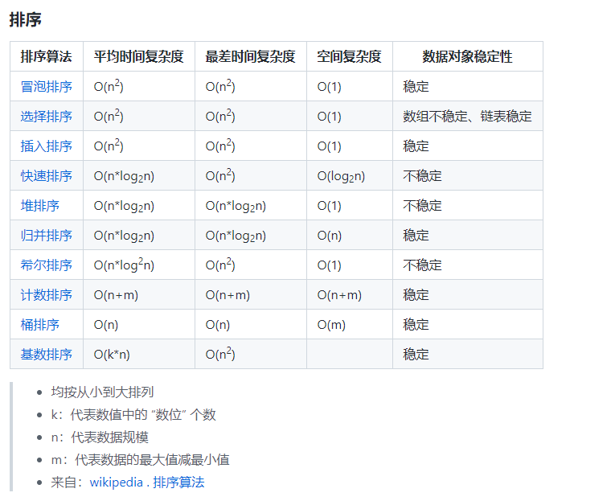
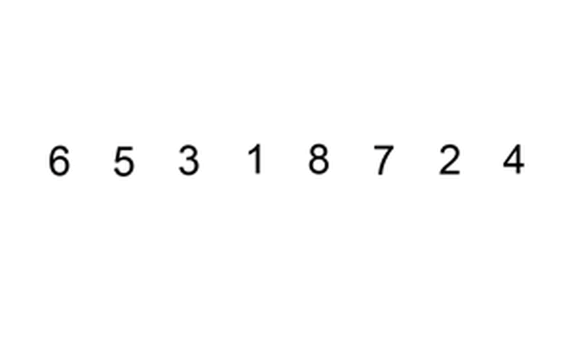
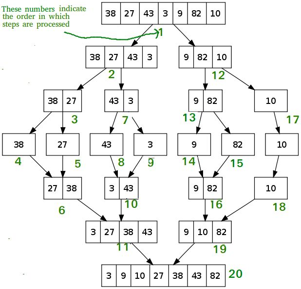
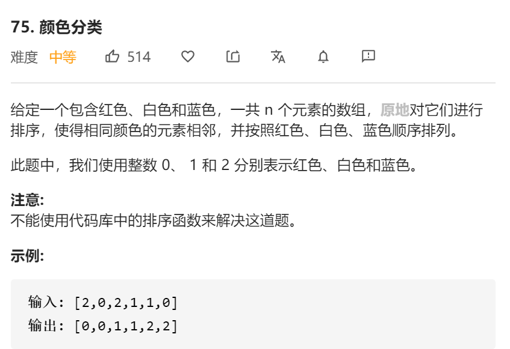
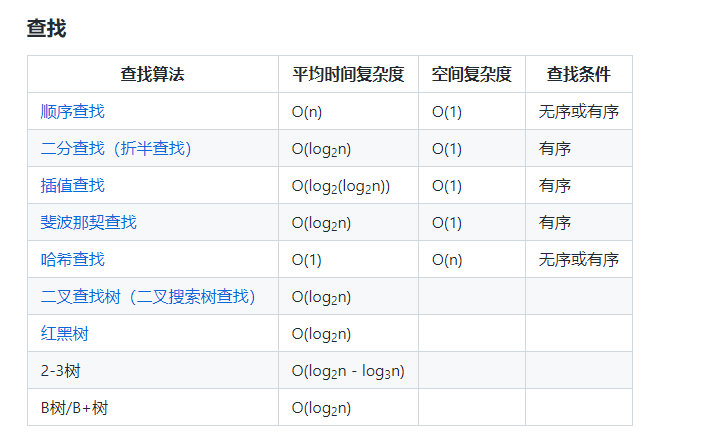
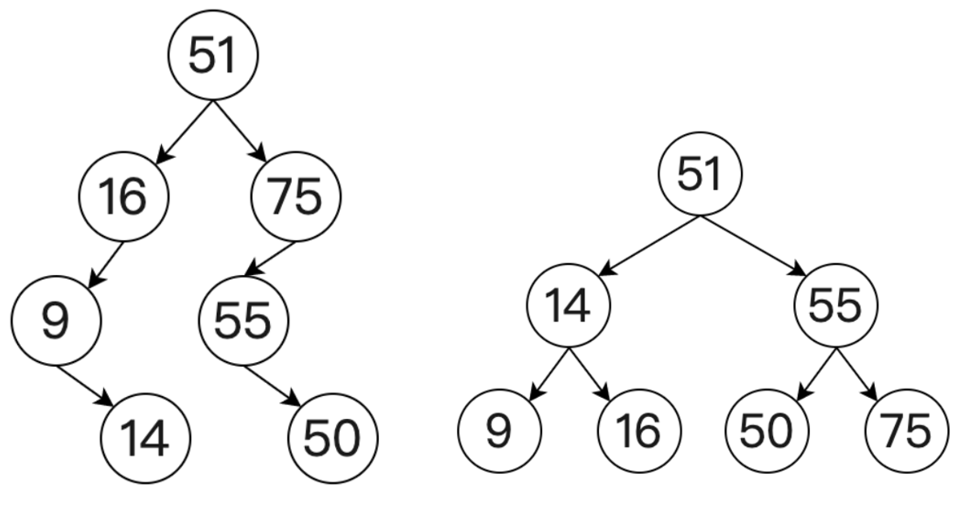
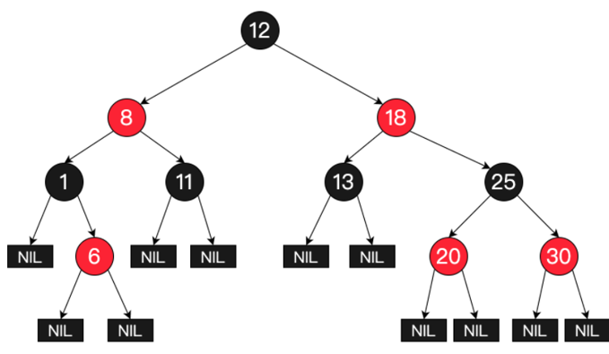

[toc]


[toc]

# 排序




## 冒泡排序

```c++
for(int i=0;i<nums.size();i++)
{
	for(int j=0;j<nums.size()-i-1;j++)
	{
		if(nums[i] > nums[i+j+1])
			swap(nums[i],nums[i+j+1]);
	}
}
```


## 插入排序

每次选择一个元素，并且将这个元素和整个数组中的所有元素进行比较，然后插入到合适的位置，图片演示如上，时间复杂度 O(n^2)



```c++
void insert_sort(vector<int>&vec) {
    int j, i;
    for (i = 1; i < vec.size(); i++) {
        int tmp=vec[i];
        for (j = i; j > 0 && vec[j - 1] > tmp; j--)
            vec[j] = vec[j - 1];
        vec[j]=tmp;
    }
}
```

##希尔排序

插入排序的修改版，根据步长由长到短分组，进行排序，直到步长为1为止，属于插入排序的一种。


```c++
void shell_sort(vector<int>&vec) {
    for(int gap=vec.size()/2;gap>0;gap/=2){
        for(int i=gap;i<vec.size();i++){
            int j = i;
            while(j-gap >= 0 && vec[i] < vec[j-gap])
            {
                vec[j] = vec[j-gap];
                j = j -gap;
            }
            vec[j] = vec[i];
        }
    }
}
```

##归并排序



##快排

非稳定排序

**内部的while一定要从基数的对位开始，调换顺序会报错**

            while(i<j&&nums[j]>=nums[left])j--;
    
            while(i<j&&nums[i]<=nums[left])i++;

```c++
/*215. 数组中的第K个最大元素
给定整数数组 nums 和整数 k，请返回数组中第 k 个最大的元素。

请注意，你需要找的是数组排序后的第 k 个最大的元素，而不是第 k 个不同的元素。

 

示例 1:

输入: [3,2,1,5,6,4] 和 k = 2
输出: 5
示例 2:

输入: [3,2,3,1,2,4,5,5,6] 和 k = 4
输出: 4
 

提示：

1 <= k <= nums.length <= 104
-104 <= nums[i] <= 104*/
class Solution {
public:
    int findKthLargest(vector<int>& nums, int k) {
        
        quickSort(nums,0,nums.size()-1,k);
        return nums[nums.size()-k];
    }
    void quickSort(vector<int>&nums,int left,int right,int k){
        if(left>=right)
            return;
        
        int i=left;
        
        int j=right;
        while(i<j){
            while(i<j&&nums[j]>=nums[left])j--;

            while(i<j&&nums[i]<=nums[left])i++;
            
            swap(nums[i],nums[j]);
        }
        swap(nums[i],nums[left]);
       //找到第k大直接退出排序
        if(i==nums.size()-k)
            return ;


        quickSort(nums, left, i-1,k);
        quickSort(nums, i+1, right,k);
        
    }
};
```

##桶排序

桶排序时间复杂度O(n),空间复杂度O(n)。稳定排序。

```c++
/*给你一个整数数组 nums 和一个整数 k ，请你返回其中出现频率前 k 高的元素。你可以按 任意顺序 返回答案。

示例 1:

输入: nums = [1,1,1,2,2,3], k = 2
输出: [1,2]
示例 2:

输入: nums = [1], k = 1
输出: [1]

提示：

1 <= nums.length <= 105
k 的取值范围是 [1, 数组中不相同的元素的个数]
题目数据保证答案唯一，换句话说，数组中前 k 个高频元素的集合是唯一的

进阶：你所设计算法的时间复杂度 必须 优于 O(n log n) ，其中 n 是数组大小。*/
class Solution {
public:
    vector<int> topKFrequent(vector<int>& nums, int k) {
        unordered_map<int , int>hash;
        int maxcnt=0;
        for(auto &i:nums){
            hash[i]++;
            maxcnt=max(maxcnt,hash[i]);
        }
        vector<vector<int>>buckets(maxcnt+1);
        for(auto &i:hash){
            buckets[i.second].push_back(i.first);
        }
        vector<int>ans;
        int current=maxcnt;
        for (int i = current; i >= 0; i--) {
            // k 为 0 表示，已经都找到
            if (k == 0) break;
            // 如果当前频率的桶为空，则跳过
            if (!buckets[i].size()) continue;
            // 不为空则要加入把桶内元素加入 res 数组, 使要找的频率 k--
            for (int j = 0; j < buckets[i].size(); j++) {
                int number = buckets[i][j];
                ans.push_back(number);
                k--;
            }
        }

        return ans;
        
    }
};
```

## 计数排序

首先计数排序从字面意思上就可以看出来，计算数字。这是一个稳定的非比较排序算法。一种基于特定范围内的键值的排序。通过计算具有不同键值的对象的数量，然后来得出每个对象在输出序列中的位置。

### 荷兰国旗问题

直接统计数量，然后重排数组，时间空间复杂度都是o(n+k)



```c++
class Solution {
public:
    void sortColors(vector<int>& nums) {
        vector<int> color(3);
        for (int i = 0; i < nums.size(); i++)
        {
            color[nums[i]]++; 
        }

        int k = 0;
        for (int j = 0; j < color.size(); j++)
        {
            while (color[j] != 0)
            {
                color[j]--;
                nums[k++] = j;
            }
        }
    }
};
```


##堆排序

堆排序时间复杂度O(nlgn),空间复杂度O(1)。不稳定排序。

```c++
/*215. 数组中的第K个最大元素
给定整数数组 nums 和整数 k，请返回数组中第 k 个最大的元素。

请注意，你需要找的是数组排序后的第 k 个最大的元素，而不是第 k 个不同的元素。

 

示例 1:

输入: [3,2,1,5,6,4] 和 k = 2
输出: 5
示例 2:

输入: [3,2,3,1,2,4,5,5,6] 和 k = 4
输出: 4
 

提示：

1 <= k <= nums.length <= 104
-104 <= nums[i] <= 104*/
```

# 查找



# 栈和队列

1、栈的插入和删除操作都是在一端进行的，而队列的操作却是在两端进行的。

2、栈是先进后出，队列是先进先出。

3、栈只允许在表尾一端进行插入和删除，队列只允许在表尾一端进行插入，在表头一端进行删除。

# 树

## 二叉树

二叉树（Binary Tree）是指每个节点最多只有两个分支的树结构

### 二叉搜索/查找树

一棵空树或者满足以下性质的二叉树被称之为二叉查找树（Binary Search Tree）也被称为二叉搜索树、有序二叉树（Ordered Binary Tree）或排序二叉树（Sorted Binary Tree）等。

(1)如果任意节点的左子树不为空，并且左子树上所有节点的值均小于它的根节点的值；

(2)如果任意节点的右子树不为空，并且右子树上所有节点的值均大于或等于它的根节点的值；

(3)任意节点的左、右子树分别为二叉查找树。

二叉查找树中查找的运行时间与树T的高度成正比。因为有n个结点的树的高度小则为O(logn)，大则为O(n).；

对于有n个关键字元素的数据项，高度为h的二叉查找树T，空间复杂度为O(n)；其中，查找元素，插入元素，删除元素的时间复杂度均为O(h)；

### 平衡树(AVL树)

所谓的平衡树是指一种改进的二叉查找树，顾名思义平衡树就是将二叉查找树平衡均匀地分布，这样的好处就是可以减少二叉查找树的深度。

一般情况下二叉查找树的查询复杂度取决于目标节点到树根的距离（即深度），当节点的深度普遍较大时，查询的平均复杂度就会上升，因此为了实现更高效的查询就有了平衡树。

非平衡二叉树(左)和平衡二叉树(右)如下图所示：



### 红黑树

红黑树除了具备二叉查找树的基本特性之外，还具备以下特性：

(1)    节点是红色或黑色；

(2)    根节点是黑色；

(3)    所有叶子都是黑色的空节点（NIL 节点）；

(4)    每个红色节点必须有两个黑色的子节点，也就是说从每个叶子到根的所有路径上，不能有两个连续的红色节点；

(5)    从一个节点到该节点的子孙节点的所有路径上包含相同数目的黑色节点。

红黑树在查找方面和AVL树操作几乎相同。但是在插入和删除操作上，AVL树每次插入删除会进行大量的平衡度计算，红黑树是牺牲了严格的高度平衡的优越条件为代价，它只要求部分地达到平衡要求，结合变色，降低了对旋转的要求，从而提高了性能.

它的添加、删除以及查询数据的时间复杂度为 O(logn)。



哪些地方用到了红黑树？

- 红黑树用于进程调度 
- 内存管理的红黑树
-  nginx的共享内存
- epoll的红黑树 
- sk_buff使用的红黑树

# 表

## 哈希表--数组+链表

```c++
/*
 * @Author: your name
 * @Date: 2022-03-07 19:50:48
 * @LastEditTime: 2022-03-23 22:44:33
 * @LastEditors: Please set LastEditors
 * @Description: 打开koroFileHeader查看配置 进行设置: https://github.com/OBKoro1/koro1FileHeader/wiki/%E9%85%8D%E7%BD%AE
 * @FilePath: /myinterview/hash.h
 */

#include<utility>
#include<vector>
using namespace std;
template<typename K,typename V>
class hashnode{
public:
   // hashnode():_pair(make_pair(key,value)),next(nullptr){}
   // hashnode(K key,V value):_pair(make_pair(key,value)),next(nullptr){}
    hashnode(std::pair<K,V> _pair):_pair(_pair),next(nullptr){}
    std::pair<K,V>& getpair(){
        return _pair;
    }
    hashnode* getnext(){
        return next;
    }
    void setnext( hashnode*_next){
        next=_next;
    }
private:
    std::pair<K,V> _pair;
    hashnode* next;
    
};

template<typename K,typename V,typename hashfunc>
class hashtable{
public:
    hashtable():hash_pair(vector<hashnode<K,V>*>(10,nullptr)),hash(){};

    ~hashtable(){
        for(int i=0;i<hash_pair.size();i++){
             hashnode<K,V> *cursor=hash_pair[i];
             hashnode<K,V> *next=nullptr;
             while(cursor){
                 next=cursor->getnext();
                 delete cursor;
                 cursor=next;
             }
             hash_pair[i]=nullptr;

        }
    }

    void insert(std::pair<K,V> pair){
       hashnode<K,V>*ptr=search(pair.first);
       if(ptr==nullptr){
           hash_pair[gethash(pair.first)%10]=new hashnode<K,V>(pair);
       }else if(ptr->getpair().first!=pair.first){//找到的是prev，执行插入
           ptr->setnext(new hashnode<K,V>(pair));
       }else if(ptr->getpair().first==pair.first){//找到的是cursor，执行更新
           ptr->getpair().second=pair.second;
       }
            
    }

    int erase(K key){
         hashnode<K,V>*ptr=search(key);
         if(ptr==nullptr||ptr->getpair().first!=key)//没有节点等于key
            return 0;
         else{
                hashnode<K,V> *cursor=hash_pair[gethash(key)%10];
                hashnode<K,V> *prev=nullptr;
                while(cursor){
                    if(cursor->getpair().first==key){//返回key值相同节点;
                        break;
                        }
                    else
                        { //记录前节点;
                            prev=cursor;
                            cursor=cursor->getnext();
                            }
                }
                    prev->setnext(cursor->getnext());
                    delete cursor;
                    return 1;
            } 
        }
        
    V& operator[](K key){
        hashnode<K,V>*ptr= search(key); 
        if(ptr->getpair().first==key){
            return ptr->getpair().second;
        }else if(ptr==nullptr){
            hashnode<K,V>*tmp=new hashnode<K,V>({key,V()});
            hash_pair[gethash(key)%10]=tmp;
            return tmp->getpair().second;
        }else{
            hashnode<K,V>*tmp=new hashnode<K,V>({key,V()});
            ptr->setnext(tmp);
            return tmp->getpair().second;
        }
    }


private:
    vector<hashnode<K,V>*>hash_pair;
    hashfunc hash;

    int gethash(K key){
        return  hash(key);
    }

    hashnode<K,V>* search(K key){
         int index=gethash(key)%10;
         if(hash_pair[index]==nullptr)
            {
                return nullptr;
            }
        else{
            hashnode<K,V> *cursor=hash_pair[index];
            hashnode<K,V> *prev=nullptr;
            while(cursor){
                    if(cursor->getpair().first==key){//返回key值相同节点;
                        return cursor;
                        }
                    else
                        { //记录前节点;
                            prev=cursor;
                            cursor=cursor->getnext();
                            }
                }
                return prev;
        }       
    }
};
//哈希函数
class hashfunc{
public:
    int  operator()(int a){
        return a*114514;
    }
};
```

# bitmap

```c++
class BitMap
{
public:
    BitMap(size_t num)
    {
        _v.resize((num >> 5) + 1); // 相当于num/32 + 1
    }

    void Set(size_t num) //set 1
    {
        size_t index = num >> 5; // 相当于num/32
        size_t pos = num % 32;
        _v[index] |= (1 << pos);
    }

    void ReSet(size_t num) //set 0
    {
        size_t index = num >> 5; // 相当于num/32
        size_t pos = num % 32;
        _v[index] &= ~(1 << pos);
    }

    bool HasExisted(size_t num)//check whether it exists
    {
        size_t index = num >> 5;
        size_t pos = num % 32;
        bool flag = false;
        if (_v[index] & (1 << pos))
            flag = true;
        return flag;

    }

private:
    vector<size_t> _v;
}; 
```

