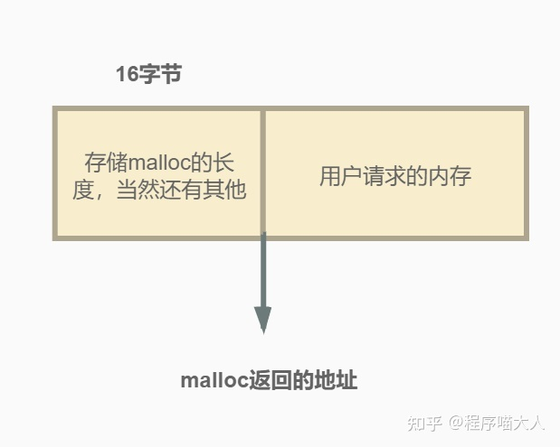

# 类

## 三五法则

当定义一个类时，我们显式地或隐式地指定了此类型的对象在拷贝、赋值和销毁时做什么。一个类通过定义三种特殊的成员函数来控制这些操作：**拷贝构造函数**、**拷贝赋值运算符**和**析构函数**。

拷贝构造函数定义了当用同类型的另一个对象初始化新对象时做什么，拷贝赋值运算符定义了将一个对象赋予同类型的另一个对象时做什么，析构函数定义了此类型的对象销毁时做什么。我们将这些操作称为**拷贝控制操作**。

------

　　由于拷贝控制操作是由三个特殊的成员函数来完成的，所以我们称此为“C++三法则”。在较新的 C++11 标准中，为了支持移动语义，
　　又增加了移动构造函数和移动赋值运算符，这样共有五个特殊的成员函数，所以又称为“C++五法则”。
　　也就是说，“三法则”是针对较旧的 C++89 标准说的，“五法则”是针对较新的 C++11 标准说的。
　　为了统一称呼，后来人们把它叫做“C++ 三/五法则”。

------

**“需要析构函数的类也需要拷贝和赋值操作”**
　　从“需要析构函数”可知，类中必然出现了指针类型的成员（否则不需要我们写析构函数，默认的析构函数就够了），所以，我们需要自己写析构函数来释放给指针所分配的内存来防止内存泄漏。
　　那么为什么说“也需要拷贝构造函数和赋值操作”呢？原因是：类中出现了指针类型的成员，必须防止浅拷贝问题。所以需要自己书写拷贝构造函数和拷贝赋值运算符，而不能使用默认的拷贝构造函数和默认的拷贝赋值运算符。

**“需要拷贝操作的类也需要赋值操作，反之亦然”**

**“析构函数不能是删除的成员”**
　　如果析构函数是删除的，那么无法销毁此类型的对象。对于一个删除了析构函数的类型，编译器不允许定义该类型的变量或创建该类的临时对象。而且，如果一个类有某个成员的类型删除了析构函数，我们也不能定义该类的变量或临时对象。

## 封装与继承

### 几种继承方式


`下面的表总结了公有、私有和保护继承的不同`

| 变化      | 公有继承        | 保护继承        | 私有继承        |
| ------- | ----------- | ----------- | ----------- |
| 基类的公有成员 | 派生类的公有成员    | 派生类的保护成员    | 派生类私有成员     |
| 基类的保护成员 | 派生类的保护成员    | 派生类的保护成员    | 派生类私有成员     |
| 基类的私有成员 | 只能通过基类的接口访问 | 只能通过基类的接口访问 | 只能通过基类的接口访问 |

## 类的构造函数

### 空类的默认函数

要默认生成六个默认函数！！！


```c++
class A
{
public:
    A();//构造函数
    A(const A& a);//拷贝构造函数
    ~A();//析构函数
    A& operator=(const A& a);//赋值运算符重载
    A* operator &();//取地址运算符重载
    const A* operator &() const;//const修饰的取地址运算符重载
};
```


###构造或析构函数中可以调用虚函数吗？

```c++
class A{
public:
    A(){
        print();
    }
      ~A(){

        //print();
    }
    virtual void print(){
        cout<<"A->print()"<<endl;
    }


};

class B: public A{
public:
    B(){
        print();
    }
    ~B(){
        //print();
    }
     void print(){
        cout<<"B->print()"<<endl;
    }
};

int main(){
    cout<<"father pointer point to child obj"<<endl;
    A* ba=new B();
    cout<<"child pointer point to child obj"<<endl;
    B* bb=new B();

}
//在构造函数调用print，按照构造顺序调用print版本
//father pointer point to child obj
//A->print()
//B->print()
//child pointer point to child obj
//A->print()
//B->print()

//在析构函数调用print，按照析构顺序调用print版本
//father pointer point to child obj
//B->print()
//A->print()
//child pointer point to child obj
//B->print()
//A->print()
```


# 函数

## 虚函数


virtual =0 关键字说明这是一个纯虚函数，需要在子类去实现它，但纯虚函数本身是可以有定义的。在父类中声明为加了virtual关键字的函数，在子类中重写时候不需要加virtual也是虚函数

每个对象的开头位置都有一个虚指针vptr，这个类的所有对象中的vptr指向共同的vtbl，vtbl专门存放有virtual关键字的函数


## 父类构造函数不可以是虚函数

当类中声明虚函数时，编译器会在类中生成一个虚函数表，虚函数表是一个存储成员函数指针的数据结构。

虚函数表是由编译器自动生成与维护的，virtual成员函数会被编译器放入虚函数表中，当存在虚函数时，每个对象都有一个指向虚函数的指针(vptr指针)。在实现多态的过程中，父类和派生类都有vptr指针。

vptr的初始化：当对象在创建时，由编译器对vptr指针进行初始化。在定义子类对象时，vptr先指向父类的虚函数表，在父类构造完成之后，子类的vptr才指向自己的虚函数表。

如果构造函数时虚函数，那么调用构造函数就需要去找vptr，而此时vptr还没有初始化。

## 析构函数常常是虚函数

与构造函数不同，vptr已经完成初始化，析构函数可以声明为虚函数，且类有继承时，析构函数常常必须为虚函数。

- 若析构函数是虚函数，delete 时，基类和子类都会被释放；
- 若析构函数不是虚函数，delete 时，只有基类会被释放，而子类没有释放，从而存在内存泄漏的隐患。

# 类型

## static关键字和extern关键字

```
static
```

- static修饰全局变量时，在静态存储区（bss、data段）开辟存储空间，其实全局变量本来就是被隐式static修饰的，被修饰后，这个变量只在本文件中使用（include进入文件也能用），如果要在其他源文件使用，需要加extern关键字

- static修饰局部变量（一般是函数中的变量，函数中的变量一般在栈中，修饰后放入data段内），约等于全局变量，在整个进程周期中，只定义和初始化一次，

- 关于初始化：可分为1.编译时初始化  2.加载时初始化  3.运行时初始化
  - 编译时初始化--静态变量是基本数据类型，且是个常值，是这样的
  - 加载时初始化--1.静态变量是一个基本数据类型，但是初始值非常量  2.静态变量是一个类对象
  - 运行时初始化--初始化发生在变量第一次被引用，对于局部静态对象是这样的 

- static修饰函数，修饰函数时，表示该函数的作用域时源文件，其他文件无法调用该函数，一般用作某文件的内部函数使用

- static修饰类成员变量：这个变量在所有这个类的对象间共享

- static修饰类成员函数:也叫静态成员函数
    　　> 它的形参列表之中没有隐含的this指针
  　　　　> 　　> 不能调用非静态的数据成员
    　　> 　　> 　　> 不能调用非静态的成员函数
    　　> 　　> 　　> 　　> 　 可以直接通过类名调用

  


```
extern
```


- extern声明变量：表明该变量已经在其他源文件中被定义
- extern修饰函数：表明该函数在其他源文件里已经被定义

## 类型转换

c++提供四种类型转换的关键字    static_cast   dynamic_cast   const_cast   reinterpret_cast


**dynamic_cast主要用于“安全地向下转型”**

```c++
Base* base = new Derived;
    if(Derived *der= dynamic_cast<Derived*>(base))
    {
        cout<<"第一种情况转换成功"<<endl;
        der->Show();
        cout<<endl;
    }
Base * base1 = new Base;
    if(Derived *der1 = dynamic_cast<Derived*>(base1))
    {
        cout<<"第二种情况转换成功"<<endl;
        der1->Show();
    }
    else 
    {
        cout<<"第二种情况转换失败"<<endl;
    }
//第一种情况转换成功
//第二种情况转换失败
```

**dynamic_cast和引用类型**

在前面的例子中，使用了dynamic_cast将基类指针转换为派生类指针，也可以使用dynamic_cast将基类引用转换为派生类引用。

在引用上，dynamic_cast依旧是常用于“安全的向下转型”。与指针一样，引用的向下转型也可以分为两种情况，**与指针不同的是，并不存在空引用，所以引用的dynamic_cast检测失败时会抛出一个bad_cast异常：**

```c++
int main()
{    
    //第一种情况，转换成功
    Derived b ;
    Base &base1= b;
    Derived &der1 = dynamic_cast<Derived&>(base1);
    cout<<"第一种情况：";
    der1.Show();
    cout<<endl;

    //第二种情况
    Base a ;
    Base &base = a ;
    cout<<"第二种情况：";
    try{
        Derived & der = dynamic_cast<Derived&>(base);
    }
    catch(bad_cast)
    {
        cout<<"转化失败,抛出bad_cast异常"<<endl;
    }
    system("pause");
}
```


reinterpret_cast 用于进行各种不同类型的指针之间、不同类型的引用之间以及指针和能容纳指针的整数类型之间的转换。转换时，执行的是逐个比特复制的操作。

这种转换提供了很强的灵活性，但转换的安全性只能由程序员的细心来保证了。例如，程序员执意要把一个 int* 指针、函数指针或其他类型的指针转换成 string* 类型的指针也是可以的，至于以后用转换后的指针调用 string 类的成员函数引发错误，程序员也只能自行承担查找错误的烦琐工作：（C++ 标准不允许将函数指针转换成对象指针，但有些编译器，如 Visual Studio 2010，则支持这种转换）。

### 隐式转换

隐式类型转换是指c++自动将一种类型转换成另一种类型，是编译器的一种自主行为。

为什么c++需要隐式类型转换？

c++多态的特性，就是通过父类的对象实现对子类的封装，以父类的类型返回之类对象。

c++中使用父类的地方一定可以使用子类代替，这也得益于隐式类型转换。

c++是一种强类型的语言，有着非常严格的类型检查，采用隐式类型转换会使程序员更方便快捷一点。

```c++
class complex{
public:
    complex(int real,int image):imag(image),rea(real){}
    operator double(){
        return rea;
    }
private:
    int rea,imag;
};
int main(){
    complex *cp =new complex(100,101);
    cout<<cp->operator double()<<endl;// 显示转为 double 100
    cout<<*cp<<endl;//隐式转为 double 100
}
```

#Lambda

先来看一下lambda表达式的语法形式：

```
[ capture ] ( params ) opt -> ret { body; };
```

其中carpture是捕获列表，params是参数，opt是选项，ret则是返回值的类型，body则是函数的具体实现。

1.捕获列表描述了lambda表达式可以访问上下文中的哪些变量。
	[] :表示不捕获任何变量
	[=]：表示按值捕获变量
	[&]：表示按引用捕获变量
	[this]：值传递捕获当前的this
	但是捕获列表不允许变量的重复传递：例如

```
[=,x]
```

上面这种捕获是不允许的，=表示按值的方式捕获所有的变量，x相当于被重复捕获了。

2.params表示lambda的参数，用在{}中。
3.opt表示lambda的选项，例如mutable，后面会介绍一下mutable的用法。
4.ret表示lambda的返回值，也可以显示指明返回值，lambda会自动推断返回值，但是值得注意的是只有当lambda的表达式仅有一条return语句时，自动推断才是有效的。像下面这种的表达式就需要加上返回类型。

```c++
[](double x )->double{int y = x ;return x - y;};
```

虽然lambda表达式是匿名函数，但是实际上也可以给lambda表达式指定一个名称，如下表示：

```c++
auto f = [](int x ){return x % 3 ==0;};
```

# c++内存泄漏

\1. 在类的构造函数和析构函数中没有匹配的调用new和delete函数

两种情况下会出现这种内存泄露：一是在堆里创建了对象占用了内存，但是没有显示地释放对象占用的内存；二是在类的构造函数中动态的分配了内存，但是在析构函数中没有释放内存或者没有正确的释放内存

\2. 没有正确地清除嵌套的对象指针

\3. 在释放对象数组时在delete中没有使用方括号

方括号是告诉编译器这个指针指向的是一个对象数组，同时也告诉编译器正确的对象地址值并调用对象的析构函数，如果没有方括号，那么这个指针就被默认为只指向一个对象，对象数组中的其他对象的析构函数就不会被调用，结果造成了内存泄露。如果在方括号中间放了一个比对象数组大小还大的数字，那么编译器就会调用无效对象（内存溢出）的析构函数，会造成堆的奔溃。如果方括号中间的数字值比对象数组的大小小的话，编译器就不能调用足够多个析构函数，结果会造成内存泄露。

释放单个对象、单个基本数据类型的变量或者是基本数据类型的数组不需要大小参数，释放定义了析构函数的对象数组才需要大小参数。

\4. 指向对象的指针数组不等同于对象数组

对象数组是指：数组中存放的是对象，只需要delete []p，即可调用对象数组中的每个对象的析构函数释放空间

指向对象的指针数组是指：数组中存放的是指向对象的指针，不仅要释放每个对象的空间，还要释放每个指针的空间，delete []p只是释放了每个指针，但是并没有释放对象的空间，正确的做法，是通过一个循环，将每个对象释放了，然后再把指针释放了。

\5. 缺少拷贝构造函数

两次释放相同的内存是一种错误的做法，同时可能会造成堆的奔溃。

按值传递会调用（拷贝）构造函数，引用传递不会调用。

在C++中，如果没有定义拷贝构造函数，那么编译器就会调用默认的拷贝构造函数，会逐个成员拷贝的方式来复制数据成员，如果是以逐个成员拷贝的方式来复制指针被定义为将一个变量的地址赋给另一个变量。这种隐式的指针复制结果就是两个对象拥有指向同一个动态分配的内存空间的指针。当释放第一个对象的时候，它的析构函数就会释放与该对象有关的动态分配的内存空间。而释放第二个对象的时候，它的析构函数会释放相同的内存，这样是错误的。

所以，如果一个类里面有指针成员变量，要么必须显示的写拷贝构造函数和重载赋值运算符，要么禁用拷贝构造函数和重载赋值运算符

 C++中构造函数，拷贝构造函数和赋值函数的区别和实现参见：http://www.cnblogs.com/liushui-sky/p/7728902.html

\6. 缺少重载赋值运算符

这种问题跟上述问题类似，也是逐个成员拷贝的方式复制对象，如果这个类的大小是可变的，那么结果就是造成内存泄露，如下图:

\7. 关于nonmodifying运算符重载的常见迷思

a. 返回栈上对象的引用或者指针（也即返回局部对象的引用或者指针）。导致最后返回的是一个空引用或者空指针，因此变成野指针

b. 返回内部静态对象的引用。

c. 返回一个泄露内存的动态分配的对象。导致内存泄露，并且无法回收

解决这一类问题的办法是重载运算符函数的返回值不是类型的引用，二应该是类型的返回值，即不是 int&而是int

\8. 没有将基类的析构函数定义为虚函数

当基类指针指向子类对象时，如果基类的析构函数不是virtual，那么子类的析构函数将不会被调用，子类的资源没有正确是释放，因此造成内存泄露

9.析构的时候void*，导致析构函数没有调用

10.构造的时候浅拷贝，释放的时候调用了两侧delete

11.野指针：指向被释放的或者访问受限内存的指针。

造成野指针的原因：

指针变量没有被初始化（如果值不定，可以初始化为NULL）
指针被free或者delete后，没有置为NULL, free和delete只是把指针所指向的内存给释放掉，并没有把指针本身干掉，此时指针指向的是“垃圾”内存。释放后的指针应该被置为NULL.
指针操作超越了变量的作用范围，比如返回指向栈内存的指针就是野指针。


解决办法：

（1）shared_ptr共享的智能指针：

shared_ptr使用引用计数，每一个shared_ptr的拷贝都指向相同的内存。在最后一个shared_ptr析构的时候，内存才会被释放。

注意事项： 
1.不要用一个原始指针初始化多个shared_ptr。 
2.不要再函数实参中创建shared_ptr，在调用函数之前先定义以及初始化它。 
3.不要将this指针作为shared_ptr返回出来。 
4.要避免循环引用。

（2）unique_ptr独占的智能指针：

<1>Unique_ptr是一个独占的智能指针，他不允许其他的智能指针共享其内部的指针，不允许通过赋值将一个unique_ptr赋值给另外一个 unique_ptr。

<2>unique_ptr不允许复制，但可以通过函数返回给其他的unique_ptr，还可以通过std::move来转移到其他的unique_ptr，这样它本身就不再 拥有原来指针的所有权了。

<3>如果希望只有一个智能指针管理资源或管理数组就用unique_ptr，如果希望多个智能指针管理同一个资源就用shared_ptr。

(3)weak_ptr弱引用的智能指针：
弱引用的智能指针weak_ptr是用来监视shared_ptr的，不会使引用计数加一，它不管理shared_ptr内部的指针，主要是为了监视shared_ptr的生命 周期，更像是shared_ptr的一个助手。 weak_ptr没有重载运算符*和->，因为它不共享指针，不能操作资源，主要是为了通过shared_ptr获得资源的监测权，它的构造不会增加引用计数，它的析构不会减少引用计数，纯粹只是作为一个旁观者来监视shared_ptr中关连的资源是否存在。 weak_ptr还可以用来返回this指针和解决循环引用的问题。

# 智能指针

智能指针(smart pointer)是存储指向动态分配（堆）对象指针的类，用于生存期控制，能够确保自动正确的销毁动态分配的对象，防止内存泄露（利用自动调用类的析构函数来释放内存）。它的一种通用实现技术是使用引用计数（除此之外还有资源独占(unique_ptr),只引用不计数（weak_ptr））。智能指针类将一个计数器与类指向的对象相关联，引用计数跟踪该类有多少个对象共享同一指针。每次创建类的新对象时，初始化指针并将引用计数置为1；当对象作为另一对象的副本而创建时，拷贝构造函数拷贝指针并增加与之相应的引用计数；对一个对象进行赋值时，赋值操作符减少左操作数所指对象的引用计数（如果引用计数为减至0，则删除对象），并增加右操作数所指对象的引用计数；调用析构函数时，构造函数减少引用计数（如果引用计数减至0，则删除基础对象）。

## shared_ptr

- *智能指针将一个计数器与类指向的对象相关联，引用计数跟踪共有多少个类对象共享同一指针*
- 每次创建类的新对象时，初始化指针并将引用计数置为1
- *当对象作为另一对象的副本而创建时，拷贝构造函数拷贝指针并增加与之相应的引用计数*
- 对一个对象进行赋值时，赋值操作符减少左操作数所指对象的引用计数（如果引用计数为减至0，则删除对象），并增加右操作数所指对象的引用计数；这是因为左侧的指针指向了右侧指针所指向的对象，因此右指针所指向的对象的引用计数加1
- 调用析构函数时，减少引用计数，如果引用计数减至0，则删除基础对象和引用计数对象
- 为什么计数是int*指针而不是member变量：需要维护一个所有shared_ptr可访问的内存

```c++
//
// Created by 18181 on 2022/3/24.
//

#ifndef FORK_SHARED_PTR_H
#define FORK_SHARED_PTR_H
#include "iostream"

template<typename T>
class shared_ptr {
public:
    shared_ptr(T *_t) : p(_t), count_(new int(1)){}
    shared_ptr() : p(nullptr), count_(nullptr){}

    shared_ptr(shared_ptr<T>& r) {
        p = r.get();
        count_ = r.getcount();
        if (count_) {
            (*count_)++;
        }
    }

    shared_ptr& operator=(const shared_ptr<T>& rhs) {
        if(this == &rhs) {
            return *this;
        }

        reset();
        p = rhs.get();
        count_ = rhs.getcount();

        if(count_) {
            (*count_)++;
        }
        return *this;
    }

    T* get() const {
        return p;
    }

    int* getcount() const{
        return count_;
    }
    int count(){
        return count_?*count_:0;
    }

    T* operator->() {
        return p;
    }

    T& operator*() {
        return *p;
    }

    ~shared_ptr(){
        reset();
    }

    void reset(){
        if(count_){
            (*count_)--;
            if(*count_ == 0){
                delete p;
                delete count_;
            }
        }
    }

private:
    T *p;
    int * count_;
};

class A{
public:
	int s=1;
    friend ostream& operator<<(std::ostream& os, const A&a){
    os<<a.s;
    return os;
}
};

int main(){
    shared_ptr<A> emp;
    std::cout<< " empty shared_pointer emp count: " <<emp.count()<<std::endl;
    shared_ptr<A> sp(new A());
    std::cout<< " shared_pointer sp count: " <<sp.count()<<std::endl;
    shared_ptr<A> sp2(sp);//sp2 share with sp
    std::cout<< " shared_pointer sp count: " <<sp.count()<<" sp2 count: "<<sp2.count()<<std::endl;
    shared_ptr<A> sp1(new A());
    std::cout<< "after copy assignment sp1 count: "<< sp1.count() <<std::endl;
    sp = sp1;
    std::cout<< "after == assignment sp count: "<< sp.count() <<" sp1: " <<sp1.count()<<" sp2 count: "<<sp2.count()<<std::endl;

    shared_ptr<A>a(new A());
    std::cout<<*a<<std::endl;
    std::cout<<a->s<<std::endl;

}

#endif //FORK_SHARED_PTR_H
//输出
//shared_ptr<A>a(new A());
//std::cout<<*a<<std::endl;
//std::cout<<a->s<<std::endl;
```


## weak_ptr

- weak_ptr是一种持有被shared_ptr管理者的资源的弱引用的智能指针。它必须通过转化为shared_ptr来访问管理的资源。
- weak_ptr被用来跟踪资源，它通过转化为shared_ptr来获取临时所有权。如果这个时候原先拥有资源的shared_ptr销毁了，资源的生命周期将会被延长至这个转化得到的shared_ptr析构之前。
- weak_ptr另外一个作用是打破shared_ptr可能的循环引用（循环引用会导致应该释放的资源没有释放，此处不展开）。

## unique_ptr

和 shared_ptr 指针最大的不同之处在于，unique_ptr 指针指向的堆内存无法同其它 unique_ptr 共享，也就是说，每个 unique_ptr 指针都独自拥有对其所指堆内存空间的所有权。

- *每个 unique_ptr 指针指向的堆内存空间的引用计数，都只能为 1*
- 一旦该 unique_ptr 指针放弃对所指堆内存空间的所有权，则该空间会被立即释放回收。

```c++

#ifndef FORK_UNIQUE_PTR_H
#define FORK_UNIQUE_PTR_H
#include "iostream"
template<typename T>
class unique_ptr {
public:
    unique_ptr():p_(nullptr), count_(nullptr){}
    explicit unique_ptr(T *_t):p_(_t),count_(new int(1)){}
    ~unique_ptr(){
        if(count_){
        delete p_;
        delete count_;}
    }

    // Disable copy from lvalue.
    unique_ptr(const unique_ptr&) = delete;
    unique_ptr& operator=(const unique_ptr&) = delete;

    unique_ptr( unique_ptr<T>&& rhs){
        p_ = rhs.get();
        count_ = rhs.getcount();
        rhs.reset();
    }

    unique_ptr<T>& operator=( unique_ptr&& rhs){

        p_ = rhs.get();
        count_ = rhs.getcount();
        rhs.reset();
        return *this;
    }

    unique_ptr<T>& operator=(T* p) = delete;

    T* get() const
    {
        return p_;
    }

    int* getcount() const{
        return count_;
    }

    int count(){
        return count_?*count_:0;
    }

    T* operator->() {
        return p_;
    }

    T& operator*() {
        return *p_;
    }


    void reset(){
        if(count_){
            count_ = nullptr;
            p_ = nullptr;
        }
    }


private:
    T * p_;
    int *count_;
};

class A{
public:
    int s=1;


};

class B : private A{
public:
    int s=2;

    void  print(){
        std::cout << A::s <<std::endl;
    }
};
std::ostream& operator<<(std::ostream& os, A&a){
    os<<a.s;
    return os;
}

int main(){
    unique_ptr<A>up;
    std::cout<< "empty unique_pointer emp count: " <<up.count()<<std::endl;
    unique_ptr<A>a(new A());
    std::cout<< "unique_pointer  count: " <<a.count()<<std::endl;
    //a = std::move(up);
    std::cout<<*a<<std::endl;
    std::cout<<a->s<<std::endl;
   

}

#endif //FORK_UNIQUE_PTR_H

//输出;
//empty unique_pointer emp count: 0
//unique_pointer  count: 1
//1
//1
```

# std::atomic--参考操作系统.md

<atomic>

　std::atomic对int, char, bool等数据结构进行原子性封装，在多线程环境中，对std::atomic对象的访问不会造成竞争-冒险。利用std::atomic可实现数据结构的无锁设计。

1. **std::atomic_flag**

　　std::atomic_flag是一个原子的布尔类型，可支持两种原子操作：

- test_and_set, 如果atomic_flag对象被设置，则返回true; 如果atomic_flag对象未被设置，则设置之，返回false
- clear. 清除atomic_flag对象

　　std::atomic_flag可用于多线程之间的同步操作，类似于linux中的信号量。使用atomic_flag可实现mutex.

2. **std::atomic**

　　std::atomic对int, char, bool等数据结构进行原子性封装，在多线程环境中，对std::atomic对象的访问不会造成竞争-冒险。利用std::atomic可实现数据结构的无锁设计。

```c++
#include <stack>
#include <iostream>
#include "thread"
#include "atomic"

class MutexTest
{
public:
    MutexTest(): m_charStack() { }
    ~MutexTest() { }

    void Push(int n, char c)
    {
        //类似加锁，只能有一个取得，不保证顺序，可能是aaabbb，也可能是bbbaaa
        while(lock.test_and_set(std::memory_order_relaxed)) ;
            for (int i = 0; i < n; ++i) {
                m_charStack.push(c);
                std::cout << c;
            }
        lock.clear();
        std::cout << std::endl;
    }
private:
    std::stack<char> m_charStack;
    std::atomic_flag lock =  ATOMIC_FLAG_INIT;

};
int main() {
    MutexTest test;
    std::thread mutexTestThread1(&MutexTest::Push, &test, 10, 'a');
    std::thread mutexTestThread2(&MutexTest::Push, &test, 10, 'b');

    mutexTestThread1.join();
    mutexTestThread2.join();
}
```

```c++
#include <iostream>
#include <thread>
#include <atomic>

using namespace std;

//std::atomic<long> cnt(0);
std::atomic_long cnt(0);

void counter()
{
    for (int i = 0; i < 100000; i++) {
        cnt += 1;
    }
}

int main(int argc, char* argv[])
{
    auto t1 = std::chrono::high_resolution_clock::now();
    std::thread threads[100];
    for (int i = 0; i != 100; i++)
    {
        threads[i] = std::thread(counter);
    }
    for (auto &th : threads)
        th.join();

    auto t2 = std::chrono::high_resolution_clock::now();
    std::chrono::duration<double, std::milli> elapsed = t2 - t1;
    std::cout << "result: " << cnt << std::endl;
    std::cout << "duration: " << elapsed.count() << " ms" << std::endl;
    return 0;
}
```

3.atomic_compare_exchange 函数

以原子方式将在内存位置具有所需的值相等的值进行比较。如果值是相同的与新值替换的内存位置。

# std::thread()

- 默认构造函数，创建一个空的 `std::thread` 执行对象。
- 初始化构造函数，创建一个 `std::thread` 对象，该 `std::thread` 对象可被 `joinable`，新产生的线程会调用 `fn` 函数，该函数的参数由 `args` 给出。
- 拷贝构造函数(被禁用)，意味着 `std::thread` 对象不可拷贝构造。
- Move 构造函数，move 构造函数(move 语义是 C++11 新出现的概念，详见附录)，调用成功之后 `x` 不代表任何 `std::thread` 执行对象

成员函数

**join**：主线程等待子线程的终止。也就是说主线程的代码块中，如果碰到了t.join()方法，此时主线程需要等待（阻塞），等待子线程结束了(Waits for this thread to die.),才能继续执行t.join()之后的代码块。

**get_id**: 获取线程 ID，返回一个类型为 std::thread::id 的对象。

**joinable**: 检查线程是否可被 join。检查当前的线程对象是否表示了一个活动的执行线程，由默认构造函数创建的线程是不能被 join 的。另外，如果某个线程 已经执行完任务，但是没有被 join 的话，该线程依然会被认为是一个活动的执行线程，因此也是可以被 join 的。

**detach**: Detach 线程。 将当前线程对象所代表的执行实例与该线程对象分离，使得线程的执行可以单独进行。一旦线程执行完毕，它所分配的资源将会被释放。

调用 detach 函数之后：

- `*this` 不再代表任何的线程执行实例。
- joinable() == false
- get_id() == std::thread::id()

另外，如果出错或者 joinable() == false，则会抛出 std::system_error。

- ```c++
  #include <iostream>
  #include <utility>
  #include <thread>
  #include <chrono>
  #include <functional>
  #include <atomic>
  
  void f1(int n)
  {
      for (int i = 0; i < 5; ++i) {
          std::cout << "Thread " << n << " executing\n";
          std::this_thread::sleep_for(std::chrono::milliseconds(10));
      }
  }
  
  void f2(int& n)///这些参数会拷贝至新线程的内存空间中(同临时变量一样)。即使函数中的参数是引用的形式，拷贝操作也会执行。
  {
      for (int i = 0; i < 5; ++i) {
          std::cout << "Thread 2 executing\n";
          ++n;
          std::this_thread::sleep_for(std::chrono::milliseconds(10));
      }
  }
  
  int main()
  {
      int n = 0;
      std::thread t1; // t1 is not a thread
      std::thread t2(f1, n + 1); // pass by value
      std::thread t3(f2, std::ref(n)); // pass by reference 见函数声明注释
      std::thread t4(std::move(t3)); // t4 is now running f2(). t3 is no longer a thread
      t2.join();
      t4.join();
      std::cout << "Final value of n is " << n << '\n';
  }
  ```

## __thread关键字

  __thread是GCC内置的线程局部存储设施，存取效率可以和全局变量相比。__thread变量每一个线程有一份独立实体，各个线程的值互不干扰。可以用来修饰那些带有全局性且值可能变，但是又不值得用全局变量保护的变量。

       __thread使用规则：只能修饰POD类型(类似整型指针的标量，不带自定义的构造、拷贝、赋值、析构的类型，二进制内容可以任意复制memset,memcpy,且内容可以复原)，不能修饰class类型，因为无法自动调用构造函数和析构函数，可以用于修饰全局变量，函数内的静态变量，不能修饰函数的局部变量或者class的普通成员变量，且__thread变量值只能初始化为编译器常量(值在编译器就可以确定const int i=5,运行期常量是运行初始化后不再改变const int i=rand()).

#MUTEX

我们在操作系统、亦或是数据库的相关知识中已经了解过了有关并发技术的基本知识，mutex 就是其中的核心之一。 C++11 引入了 mutex 相关的类，其所有相关的函数都放在 <mutex> 头文件中。

#### Mutex 系列类(四种)

- std::mutex，最基本的 Mutex 类，互斥锁。
- std::recursive_mutex，递归 Mutex 类。
- std::time_mutex，定时 Mutex 类。
- std::recursive_timed_mutex，定时递归 Mutex 类。

自旋锁封装，c++没有提供，自己写

```c++
#ifndef SPINLOCK
#defind SPINLOCK
#include<atomic>

class spin_lock
{
private:

    std::atomic_flag _atomic;

public:

    spin_lock() noexcept;
    void lock() noexcept;
    void unlock() noexcept;
    bool try_lock() noexcept;
};

spin_lock::spin_lock() noexcept :
    _atomic(ATOMIC_FLAG_INIT) {}

void spin_lock::lock() noexcept
{
    while (_atomic.test_and_set(std::memory_order_acquire));
}

void spin_lock::unlock() noexcept
{
    _atomic.clear(std::memory_order_release);
}

bool spin_lock::try_lock() noexcept
{
    return _atomic.test() ? false : (_atomic.test_and_set(std::memory_order_acquire));
}
#endif
```


#### Lock 类（两种）

- std::lock_guard，与 Mutex RAII 相关，方便线程对互斥量上锁。

- ```c++
  explicit lock_guard(_Mutex& _Mtx) : _MyMutex(_Mtx) { // construct and lock
          _MyMutex.lock();
      }
  
  ~lock_guard() noexcept {
      _MyMutex.unlock();
  }
  ```

- std::unique_lock，与 Mutex RAII 相关，方便线程对互斥量上锁，但提供了更好的上锁和解锁控制。

- ```c++
  explicit unique_lock(_Mutex& _Mtx) : _Pmtx(_STD addressof(_Mtx)), _Owns(false) { // construct and lock
      _Pmtx->lock();
      _Owns = true;
  }
  ~unique_lock() noexcept {
          if (_Owns) {
              _Pmtx->unlock();
          }
      }
  ```

#### 函数

- std::try_lock，尝试同时对多个互斥量上锁。
- std::lock，可以同时对多个互斥量上锁。
- std::call_once，如果多个线程需要同时调用某个函数，call_once 可以保证多个线程对该函数只调用一次。

std::mutex 是 C++11 中最基本的 mutex 类，通过实例化 std::mutex 可以创建互斥量， 而通过其成员函数 lock() 可以进行上锁，unlock() 可以进行解锁。 但是在实际编写代码的过程中，最好不去直接调用成员函数， 因为调用成员函数就需要在每个临界区的出口处调用 unlock()，当然，还包括异常。 这时候 C++11 还为互斥量提供了一个 RAII 语法的模板类 std::lock_guard。 RAII 在不失代码简洁性的同时，很好的保证了代码的异常安全性。

在 RAII 用法下，对于临界区的互斥量的创建只需要在作用域的开始部分，例如：


```c++
#include <thread>
#include<iostream>
int v = 1;
static std::mutex mtx;
void critical_section(int change_v) {


std::lock_guard<std::mutex> lock(mtx);

// 执行竞争操作
v = change_v;
}
// 离开此作用域后 mtx 会被释放
int main(){
  std::thread t1(critical_section, 2), t2(critical_section, 3);
t1.join();
t2.join();

std::cout << v << std::endl;
return 0;
}
```
由于 C++ 保证了所有栈对象在生命周期结束时会被销毁，所以这样的代码也是异常安全的。 无论 critical_section() 正常返回、还是在中途抛出异常，都会引发堆栈回退，也就自动调用了 unlock()。

而 std::unique_lock 则相对于 std::lock_guard 出现的，std::unique_lock 更加灵活， std::unique_lock 的对象会以独占所有权（没有其他的 unique_lock 对象同时拥有某个 mutex 对象的所有权） 的方式管理 mutex 对象上的上锁和解锁的操作。所以在并发编程中，推荐使用 std::unique_lock。

std::lock_guard 不能显式的调用 lock 和 unlock， 而 std::unique_lock 可以在声明后的任意位置调用， 可以缩小锁的作用范围，提供更高的并发度。

如果你用到了条件变量 std::condition_variable::wait 则必须使用 std::unique_lock 作为参数。

例如：


```c++
#include <iostream>

#include <thread>

int v = 1;

void critical_section(int change_v) {

static std::mutex mtx;
std::unique_lock<std::mutex> lock(mtx);
// 执行竞争操作
v = change_v;
std::cout << v << std::endl;
// 将锁进行释放
lock.unlock();

// 在此期间，任何人都可以抢夺 v 的持有权

// 开始另一组竞争操作，再次加锁
lock.lock();
v += 1;
std::cout << v << std::endl;
} 
  int main(){
    std::thread t1(critical_section, 2), t2(critical_section, 3);
    t1.join();
    t2.join();
    return 0;
  }
```
# std::condition_variable

  当std::condition_variable对象的某个wait函数被调用的时候，它使用std::unique_lock(通过std::mutex) 来锁住当前线程。当前线程会一直被阻塞，直到另外一个线程在相同的std::condition_variable对象上调用了notification函数来唤醒当前线程。

condition_variable成员函数：

condition_variable： 不可拷贝不可赋值；
notify_one()：唤醒一个等待的线程；
notify_all()：唤醒所有等待的线程；
wait()：阻塞等待直到被唤醒；
wait_for()：阻塞等待被唤醒，或者超时；
wait_until()：阻塞等待被唤醒，或者到某个时间点。


# std::promise||future

期物（Future）表现为 `std::future`，它提供了一个访问异步操作结果的途径，这句话很不好理解。 为了理解这个特性，我们需要先理解一下在 C++11 之前的多线程行为。

试想，如果我们的主线程 A 希望新开辟一个线程 B 去执行某个我们预期的任务，并返回我一个结果。 而这时候，线程 A 可能正在忙其他的事情，无暇顾及 B 的结果， 所以我们会很自然的希望能够在某个特定的时间获得线程 B 的结果。

在 C++11 的 `std::future` 被引入之前，通常的做法是： 创建一个线程 A，在线程 A 里启动任务 B，当准备完毕后发送一个事件，并将结果保存在全局变量中。 而主函数线程 A 里正在做其他的事情，当需要结果的时候，调用一个线程等待函数来获得执行的结果。

而 C++11 提供的 `std::future` 简化了这个流程，可以用来获取异步任务的结果。 自然地，我们很容易能够想象到把它作为一种简单的线程同步手段，即屏障（barrier）。

promise 对象可以保存某一类型 T 的值，该值可被 future 对象读取（可能在另外一个线程中），因此 promise 也提供了一种线程同步的手段。在 promise 对象构造时可以和一个共享状态（通常是std::future）相关联，并可以在相关联的共享状态(std::future)上保存一个类型为 T 的值。

可以通过 get_future 来获取与该 promise 对象相关联的 future 对象，调用该函数之后，两个对象共享相同的共享状态(shared state)

- promise 对象是异步 Provider，它可以在某一时刻设置共享状态的值。
- future 对象可以异步返回共享状态的值，或者在必要的情况下阻塞调用者并等待共享状态标志变为 ready，然后才能获取共享状态的值。

```c++
#include <iostream>       // std::cout
#include <functional>     // std::ref
#include <thread>         // std::thread
#include <future>         // std::promise, std::future

void print_int(std::future<int>& fut) {
    int x = fut.get(); // 获取共享状态的值.
    std::cout << "value: " << x << '\n'; // 打印 value: 10.
}

int main ()
{
    std::promise<int> prom; // 生成一个 std::promise<int> 对象.
    std::future<int> fut = prom.get_future(); // 和 future 关联.
    std::thread t(print_int, std::ref(fut)); // 将 future 交给另外一个线程t.
    prom.set_value(10); // 设置共享状态的值, 此处和线程t保持同步.
    t.join();
    return 0;
}
```

std::packaged_task是std::promise的简化形式

```c++
std::packaged_task<int()> task([]{ return 7; }); // wrap the function
std::future<int> f1 = task.get_future();  // get a future
std::thread t(std::move(task)); // launch on a thread
t.join();
std::cout<<f1.get()<<std::endl;
```


# 模板

## 可变参数模板

对于可变类模板，基本示例如下：

```c++
template<typename... Arguments>
class classname;
```

由上式可知，其特殊性在于 `...` 的使用，可变参数模板，通过使用 `...` 来帮助定义，其中，`...` 左侧为参数包（`parameter pack` ），右侧将参数包展开成多个单独的参数。

上面的类 `classname` 可以接收任意数量的参数来进行实例化，例如：

```c++
classname<> c1();
classname<float, int> c2();
classname<float, std::string, std::vector<int>> c3();
```

当然，还可以指定必须填充固定数量的参数，例如：

```c++
template<typename first, typename... Arguments>
class classname2;

// classname2<> c4(); 这是错误的用法！参数必须大于等于 1
classname2<float> c4();
```

```c++
#include <iostream>
using namespace std;
//递归终止函数
void print()
{
   cout << "empty" << endl;
}
//展开函数
template <class T, class ...Args>
void print(T head, Args... rest)
{
   cout << "parameter " << head << endl;
   print(rest...);
}


int main(void)
{
   print(1,2,3,4);
   return 0;
}
```

递归调用的过程是这样的:

```
print(1,2,3,4);
print(2,3,4);
print(3,4);
print(4);
print();
```

上面的递归终止函数还可以写成这样：

```
template <class T>
void print(T t)
{
   cout << t << endl;
}
```

修改递归终止函数后，上例中的调用过程是这样的：

```
print(1,2,3,4);
print(2,3,4);
print(3,4);
print(4);
```

# 左值和右值

1) 可位于赋值号（=）左侧的表达式就是左值；反之，只能位于赋值号右侧的表达式就是右值

2) 有名称的、可以获取到存储地址的表达式即为左值；反之则是右值。

```c++
int && a = 10;
a = 100;
cout << a << endl;//100
```


## 右值引用

一般来说，右值无法使用&取地址，c++11提供了&&来取得右值的引用(只能绑定右值)

看下面的函数，

```c++
class Copyable {
public:
    Copyable(){}
    Copyable(const Copyable &o) {
        cout << "Copied" << endl;
    }
};
Copyable ReturnRvalue() {
    return Copyable(); //返回一个临时对象
}
void AcceptVal(Copyable a) {

}
void AcceptRef(const Copyable& a) {

}

int main() {
    cout << "pass by value: " << endl;
    AcceptVal(ReturnRvalue()); // 应该调用两次拷贝构造函数
    cout << "pass by reference: " << endl;
    AcceptRef(ReturnRvalue()); //应该只调用一次拷贝构造函数
}
```


1. 左值引用， 使用 `T&`, 只能绑定**左值**-----------函数参数中，传入一个例如  void fuc(int & a)
2. 右值引用， 使用 `T&&`， 只能绑定**右值**
3. 常量左值， 使用 `const T&`, 既可以绑定**左值**又可以绑定**右值**<上面的代码示例了这一点>-----------函数参数中，传入一个例如  void fuc(const int & a)
4. 已命名的**右值引用**，编译器会认为是个**左值**
5. 编译器有返回值优化，但不要过于依赖
6. 注意 ，不是所有&&都是右值引用，有时也有“通用引用(universal reference)”的含义，出现在类型推导的场景，详见下面的完美转发

## 移动语义

实现移动语义就必须增加两个函数：移动构造函数和移动赋值构造函数

```c++
class myclass{
	public：
	~~~
	~~~
     //移动构造函数
MyString(MyString&& str) noexcept
       :m_data(str.m_data) {
       MCtor ++;
       str.m_data = nullptr; //不再指向之前的资源了
   }
      //移动赋值函数
MyString& operator=(MyString&& str) noexcept{
       MAsgn ++;
       if (this == &str) // 避免自我赋值!!
          return *this;

       delete[] m_data;
       m_data = str.m_data;
       str.m_data = nullptr; //不再指向之前的资源了
       return *this;
   }
   private:
   char* m_data;
   
   }
```

移动构造函数与拷贝构造函数的区别是，拷贝构造的参数是`const MyString& str`，是*常量左值引用*，而移动构造的参数是`MyString&& str`，是*右值引用*，而`MyString("hello")`是个临时对象，是个右值，优先进入**移动构造函数**而不是拷贝构造函数。而移动构造函数与拷贝构造不同，它并不是重新分配一块新的空间，将要拷贝的对象复制过来，而是"偷"了过来，将自己的指针指向别人的资源，然后将别人的指针修改为`nullptr`，这一步很重要，如果不将别人的指针修改为空，那么临时对象析构的时候就会释放掉这个资源，"偷"也白偷了。<delete一个空指针，编译器自动忽略，什么也不会发生，苏哦一不用判断是否为空>

### move

对于一个左值，编译器肯定是调用拷贝构造函数，能不能也移动构造而不是拷贝构造呢？`C++11`为了解决这个问题，提供了`std::move()`方法来将左值转换为右值，从而方便应用移动语义

```c++
for(int i=0;i<1000;i++){
        MyString tmp("hello");
        vecStr2.push_back(std::move(tmp)); //调用的是移动构造函数，需要MyString中实现了移动构造函数
    }
```

1. 如果我们*没有提供移动构造函数，只提供了拷贝构造函数*，`std::move()`会失效但是不会发生错误，因为编译器找不到移动构造函数就去寻找拷贝构造函数，也这是拷贝构造函数的参数是`const T&`常量左值引用的原因！

## 完美转发

通过一个函数将参数继续转交给另一个函数进行处理，原参数可能是右值，可能是左值，如果还能继续保持参数的原有特征，那么它就是完美的

下面是一个非完美转发的例子

```c++
void process(int& i){
    cout << "process(int&):" << i << endl;
}
void process(int&& i){
    cout << "process(int&&):" << i << endl;
}

void myforward(int&& i){
    cout << "myforward(int&&):" << i << endl;
    process(i);
}

int main()
{
    int a = 0;
    process(a); //a被视为左值 process(int&):0
    process(1); //1被视为右值 process(int&&):1
    process(move(a)); //强制将a由左值改为右值 process(int&&):0
    myforward(2);  //右值经过forward函数转交给process函数，却称为了一个左值，
    //原因是该右值有了名字  所以是 process(int&):2
    myforward(move(a));  // 同上，在转发的时候右值变成了左值  process(int&):0
    // forward(a) // 错误用法，右值引用不接受左值
}
```

而c++中提供了一个`std::forward()`模板函数解决这个问题。将上面的`myforward()`函数简单改写一下：

```c++
void myforward(int&& i){
    cout << "myforward(int&&):" << i << endl;
    process(std::forward<int>(i));
}

myforward(2); // process(int&&):2
```

上面修改过后还是不完美转发，`myforward()`函数能够将右值转发过去，但是并不能够转发左值，解决办法就是借助`universal references`通用引用类型和`std::forward()`模板函数共同实现完美转发。例子如下：

```c++
void RunCode(int &&m) {
    cout << "rvalue ref" << endl;
}
void RunCode(int &m) {
    cout << "lvalue ref" << endl;
}
void RunCode(const int &&m) {
    cout << "const rvalue ref" << endl;
}
void RunCode(const int &m) {
    cout << "const lvalue ref" << endl;
}

// 这里利用了universal references，如果写T&,就不支持传入右值，而写T&&，既能支持左值，又能支持右值
//int b=1;这是模板的特性 
//auto && a=b;  //int a&&=b会报错
template<typename T>
void perfectForward(T && t) {
    RunCode(forward<T> (t));
}

template<typename T>
void notPerfectForward(T && t) {
    RunCode(t);
}

int main()
{
    int a = 0;
    int b = 0;
    const int c = 0;
    const int d = 0;

    notPerfectForward(a); // lvalue ref
    notPerfectForward(move(b)); // lvalue ref
    notPerfectForward(c); // const lvalue ref
    notPerfectForward(move(d)); // const lvalue ref

    cout << endl;
    perfectForward(a); // lvalue ref
    perfectForward(move(b)); // rvalue ref
    perfectForward(c); // const lvalue ref
    perfectForward(move(d)); // const rvalue ref
}
```

# C++11新特性

C++11 最常用的新特性如下：

可变模板参数

auto关键字：编译器可以根据初始值自动推导出类型。但是不能用于函数传参以及数组类型的推导

nullptr关键字：nullptr是一种特殊类型的字面值，它可以被转换成任意其它的指针类型；而NULL一般被宏定义为0，在遇到重载时可能会出现问题。

智能指针：C++11新增了std::shared_ptr、std::weak_ptr等类型的智能指针，用于解决内存管理的问题。

初始化列表：使用初始化列表来对类进行初始化

右值引用：基于右值引用可以实现移动语义和完美转发，消除两个对象交互时不必要的对象拷贝，节省运算存储资源，提高效率

atomic原子操作用于多线程资源互斥操作

新增STL容器array-和vector相比，大小是固定的，以及tuple，类似于pair，不过可以有多个值

增加标准的线程库std::thread()

新增尾置返回类型：通过 **-> 符号**连接到函数后面，配合 auto 简化上述复杂函数的定义：

final和override：C++11 引⼊ **override** 显式的声明**要覆盖基类的虚函数**，如果不存在这样的虚函数，将不会通过编译。 **final** 则终⽌虚类被继承或虚函数被覆盖

```c++
//override
class Parent {
  virtual void watchTv(int);
};
class Child : Parent {
  virtual void watchTv(int) override;    // 合法
  virtual void watchTv(double) override; // 非法，父类没有此虚函数
};
//final
class Parent2 {
  virtual void eat() final;
};

class Child2 final : Parent2 {};  // 合法

class Grandson : Child2 {};       // 非法，Child2 已经 Final，不可被继承

class Child3 : Parent2 {
  void eat() override; // 非法，foo 已 final
};
```

# C++14新特性

decltype(auto)：decltype是C++11新增的关键字，主要用于提取变量和表达式的类型。

# 关键字

## voilate

- 保证变量的内存可见性

- 禁止指令重排序

- ### **1.1 可见性**

  概念：当多个线程访问同一个变量时，一个线程修改了这个变量的值，其他线程能够立即看到修改的值

```
内存可见性是指当一个线程修改了某个变量的值，其它线程总是能知道这个变量变化。也就是说，如果线程 A 修改了共享变量 V 的值，那么线程 B 在使用 V 的值时，能立即读到 V 的最新值。
保证这一点，需要加锁或使用voilate关键字

因为当一个线程进入临界区代码块后，线程获取到锁，会清空本地内存，然后从主内存中拷贝共享变量的最新值到本地内存作为副本，执行代码，又将修改后的副本值刷新到主内存中，最后线程释放锁。

使用 volatile 修饰共享变量后，每个线程要操作变量时会从主内存L3\L2中将变量拷贝到本地内存L1作为副本，当线程操作变量副本并写回主内存后，会通过 CPU 总线嗅探机制告知其他线程该变量副本已经失效，需要重新从主内存中读取。
```

```
总线嗅探机制
在现代计算机中，CPU 的速度是极高的，如果 CPU 需要存取数据时都直接与内存打交道，在存取过程中，CPU 将一直空闲，这是一种极大的浪费，所以，为了提高处理速度，CPU 不直接和内存进行通信，而是在 CPU 与内存之间加入很多寄存器，多级缓存，它们比内存的存取速度高得多，这样就解决了 CPU 运算速度和内存读取速度不一致问题。

由于 CPU 与内存之间加入了缓存，在进行数据操作时，先将数据从内存拷贝到缓存中，CPU 直接操作的是缓存中的数据。但在多处理器下，将可能导致各自的缓存数据不一致（这也是可见性问题的由来），为了保证各个处理器的缓存是一致的，就会实现缓存一致性协议，而嗅探是实现缓存一致性的常见机制。
每个处理器通过监听在总线上传播的数据来检查自己的缓存值是不是过期了，如果处理器发现自己缓存行对应的内存地址修改，就会将当前处理器的缓存行设置无效状态，当处理器对这个数据进行修改操作的时候，会重新从主内存中把数据读到处理器缓存中。
```


## constexpr

```c++
constexpr int multiply(int x,int y)
{
    return x* y;
}
//将在编译时期计算
const int var = multiply(10,10);
```

除了编译时计算性能的优化，congtexpr的另外一个优势是：允许函数被应用到以前调用宏的所有场合。例如：想要计算数组size的函数，size是10的倍数。如果不用constexpr，则需要创建一个宏或者模板，因为我们不能用函数的返回值去声明数组的大小。但是我们可以调用一个constexpr函数去声明一个数组。

```c++
constexpr int getDefaultArraySize(int value)
{
    return value*10;
}
int my_array[getDefaultArraySize(3)];
```


## using

- **命名空间的使用**

using namespace std;

- **在子类中引用基类的成员**

using A::valueA

```c++
class A{
public:
    int s=1;


};

class B : private A{
public:
    int s=2;

    void  print(){
        std::cout << A::s <<std::endl; //1
    }
};
```

- **别名指定**==typedef

```cpp
using value_type = _Ty
```

以后使用value_type value; 就代表_Ty value,等于 typedef

## new\delete   和  malloc\free

- malloc\free是C的**标准库函数**

```
void* malloc(size_t size)
void* free(void* pointer)
```

**malloc返回值**：当malloc分配内存时它除了分配我们指定SIZE的内存块，还会分配额外的内存来存储我们的内存块信息，用于维护该内存块。因此，malloc(0)返回一个合法的指针并指向存储内存块信息的额外内存，我们当然可以在该内存上进行读写操作，但是这样做了会破坏该内存块的维护信息，因此当我们调用free(ptr)时就会出现错误

malloc 函数其实就是在内存中：找一片指定大小的空间，然后将这个空间的首地址给一个指针变量，这里的指针变量可以是一个单独的指针，也可以是一个数组的首地址， 这要看malloc函数中参数size的具体内容。我们这里malloc分配的内存空间在逻辑上是连续的，而在物理上可以不连续。我们作为程序员，关注的 是逻辑上的连续，其它的，操作系统会帮着我们处理的。

下面是Linux 操作系统默认的Ptmalloc的malloc()后执行malloc_usable_size()的返回结果，可以看到每个内存申请都多分配了几个字节

```text
Log: check_malloc_size() malloc_size=8, malloc_usable_size=24
Log: check_malloc_size() malloc_size=16, malloc_usable_size=24
Log: check_malloc_size() malloc_size=24, malloc_usable_size=24
Log: check_malloc_size() malloc_size=16, malloc_usable_size=24
Log: check_malloc_size() malloc_size=32, malloc_usable_size=40
Log: check_malloc_size() malloc_size=48, malloc_usable_size=56
Log: check_malloc_size() malloc_size=64, malloc_usable_size=72
Log: check_malloc_size() malloc_size=80, malloc_usable_size=88
Log: check_malloc_size() malloc_size=96, malloc_usable_size=104
Log: check_malloc_size() malloc_size=112, malloc_usable_size=120
Log: check_malloc_size() malloc_size=128, malloc_usable_size=136
Log: check_malloc_size() malloc_size=144, malloc_usable_size=152
Log: check_malloc_size() malloc_size=160, malloc_usable_size=168
Log: check_malloc_size() malloc_size=176, malloc_usable_size=184
Log: check_malloc_size() malloc_size=192, malloc_usable_size=200
Log: check_malloc_size() malloc_size=208, malloc_usable_size=216
Log: check_malloc_size() malloc_size=224, malloc_usable_size=232
Log: check_malloc_size() malloc_size=240, malloc_usable_size=248
```



- new\delete是C++的**操作运算符**

```c++
int* p1=new int(1);
delete p1;

int*p2=new int[4];
delete []p2;
```

  （1）malloc开辟空间类型大小需手动计算，new是由编译器自己计算；

  （2）malloc返回类型为void*,**必须强制类型转换**对应类型指针，new则直接返回对应类型指针；

  （3）malloc开辟内存时返回内存地址要检查判空，因为若它可能开辟失败会返回NULL；new则不用判断，因为内存分配失败时，它会抛出异常bac_alloc,可以使用异常机制；

  （4）无论释放几个空间大小，free只传递指针，多个对象时delete需加[]

## new运算符和operator new()

new：指我们在C++里通常用到的运算符，比如A* a = new A;  对于new来说，有new和::new之分，前者位于std

operator new()：指对new的重载形式，它是一个函数，并不是运算符。对于operator new来说，分为全局重载和类重载，全局重载是void* ::operator new(size_t size)，在类中重载形式 void* A::operator new(size_t size)。还要注意的是这里的operator new()完成的操作一般只是分配内存，事实上系统默认的全局::operator new(size_t size)也只是调用malloc分配内存，并且返回一个void*指针。而构造函数的调用(如果需要)是在new运算符中完成的

## new和operator new之间的关系

A* a = new A；我们知道这里分为两步：1.分配内存，2.调用A()构造对象。事实上，分配内存这一操作就是由operator new(size_t)来完成的，如果类A重载了operator new，那么将调用A::operator new(size_t )，如果没有重载，就调用::operator new(size_t )，全局new操作符由C++默认提供。因此前面的两步也就是：1.调用operator new 2.调用构造函数。

（1）new ：不能被重载，其行为总是一致的。它先调用operator new分配内存，然后调用构造函数初始化那段内存。

new 操作符的执行过程：
\1. 调用operator new分配内存 ；
\2. 调用构造函数生成类对象；
\3. 返回相应指针。

（2）operator new：要实现不同的内存分配行为，应该重载operator new，而不是new。

operator new就像operator + 一样，是可以重载的。如果类中没有重载operator new，那么调用的就是全局的::operator new来完成堆的分配。同理，operator new[]、operator delete、operator delete[]也是可以重载的。

## placement new

一般来说，使用new申请空间时，是从系统的“堆”（heap）中分配空间。申请所得的空间的位置是根据当时的内存的实际使用情况决定的。但是，在某些特殊情况下，可能需要在已分配的特定内存创建对象，这就是所谓的“定位放置new”（placement new）操作。

```c++
1. 缓冲区提前分配

可以使用堆的空间，也可以使用栈的空间，所以分配方式有如下两种：

class MyClass {…};
char *buf=new char[N*sizeof(MyClass)+ sizeof(int)] 或者 char buf[N*sizeof(MyClass)+ sizeof(int)];

2. 对象的构造

MyClass * pClass=new(buf) MyClass;

3. 对象的销毁

一旦这个对象使用完毕，你必须显式的调用类的析构函数进行销毁对象。但此时内存空间不会被释放，以便其他的对象的构造。

pClass->~MyClass();

4. 内存的释放

如果缓冲区在堆中，那么调用delete[] buf;进行内存的释放；如果在栈中，那么在其作用域内有效，跳出作用域，内存自动释放。
```

 

## inline

```
类内定义的函数自动内联
```

虚函数其实是可以内联的，当虚函数不表现多态性，可以内联，但是当使用指针调用时，这是一个运行时多态，不可以内联

用在函数定义前，将函数指定为内联，在运行到内联函数时，不发生函数调用，也就没有了调用的开销（省去了参数压栈、生成汇编语言的CALL调用、返回参数、执行return等过程）

一般的，在类声明之中的成员函数自动称为内联函数

内联能提高函数的执行效率，为什么不把所有的函数都定义成内联函数？
如果所有的函数都是内联函数，还用得着“内联”这个关键字吗？
内联是以代码膨胀（复制）为代价，仅仅省去了函数调用的开销，从而提高函数的
执行效率。如果执行函数体内代码的时间，相比于函数调用的开销较大，那么效率的收
获会很少。另一方面，每一处内联函数的调用都要复制代码，将使程序的总代码量增大，
消耗更多的内存空间。以下情况不宜使用内联：
（1）如果函数体内的代码比较长，使用内联将导致内存消耗代价较高。
（2）如果函数体内出现循环，那么执行函数体内代码的时间要比函数调用的开销大。

## explicit

用于显示地指明构造函数禁止隐式转换

当构造函数只有一个实参时，可以只用一个实参完成初始化，所以可以隐式转换，用explicit关闭这种转换

```c++
class things{
public:
  thing(int a):num(a){}
private:
  int num;
}
thing sth = 1;//这里存在一个隐式转换
```

##restrict

在C语言中，restrict关键字用于修饰指针(C99标准)。通过加上restrict关键字，编程者可提示编译器：在该指针的生命周期内，其指向的对象不会被别的指针所引用。

需要注意的是，在C++中，并无明确统一的标准支持restrict关键字。但是很多编译器实现了功能相同的关键字，例如gcc和clang中的__restrict关键字。

那么restrict关键字能给程序的实际运行带来哪些好处呢？下面举例说明

```cpp
int add1(int* a, int* b)
{
    *a = 10;
    *b = 12;
    return *a + *b;
}
```

大家猜猜`add1`函数的返回值是多少？是10 + 12 = 22吗？

答案是不一定。在指针a和b的地址不同时，返回22没有问题。但是当指针a与b指向的是同一个int对象时，该对象先被赋值为10，后被赋值为12，因此*a和*b都返回12,因此`add1`函数最终返回24

使用`-O3`优化, `add1`对应的汇编代码如下。可以看到，在计算返回值时，为了得到`*a`的值访问了1次内存，而不管在何种条件下(`a == b` or `a != b`)，`*b`的值都是12。因此聪明的编译器将`*a`的值载入`eax`寄存器后，直接加上立即数12，而无需再访问内存获取`*b`的值。在无法确定指针a和b是否相同的情况下，编译器只能帮你到这里了.

```
0000000000400a10 <_Z4add1PiS_>:
  400a10:   c7 07 0a 00 00 00       movl   $0xa,(%rdi) ; *a = 10
  400a16:   c7 06 0c 00 00 00       movl   $0xc,(%rsi) ; *b = 10
  400a1c:   8b 07                   mov    (%rdi),%eax ; 结果 = *a
  400a1e:   83 c0 0c                add    $0xc,%eax   ; 结果 += 12 
  400a21:   c3                      retq  
```

但是如果加上了restrict关键字，情况便大不相同。C/C++和经过-O3优化的汇编代码如下。通过restrict关键字，编译器依然确认指针a和b不可能指向同一个内存地址，因此在求`*a + *b`时，无需访问内存，因为`*a`必然等于立即数10，`*b`必然等于立即数12。

```cpp
int add2(int* __restrict  a, int* __restrict b) 
{
    *a = 10;
    *b = 12;
    return *a + *b ;
}
0000000000400a30 <_Z4add2PiS_>:
  400a30:   c7 07 0a 00 00 00       movl   $0xa,(%rdi) ; *a = 10
  400a36:   b8 16 00 00 00          mov    $0x16,%eax  ; 结果 = 22
  400a3b:   c7 06 0c 00 00 00       movl   $0xc,(%rsi) ; *b = 12
  400a41:   c3                      retq   
```

通过无restrict和有restrict两种情况下的汇编指令可看到，后者比前者少访问一次内存，且少执行一条指令。因此我们预期有restrict的版本能够获得可观的性能提升：

## define和const

```
编译器处理不同
宏定义是一个“编译时”概念，在预处理阶段展开（在编译时把所有用到宏定义值的地方用宏定义常量替换），不能对宏定义进行调试，生命周期结束于编译时期；
const常量是一个“运行时”概念，在程序运行使用，类似于一个只读行数据

存储方式不同
宏定义是直接替换，不会分配内存，存储于程序的代码段中；
const常量需要进行内存分配

类型和安全检查不同
宏定义是字符替换，没有数据类型的区别，同时这种替换没有类型安全检查，可能产生边际效应等错误；
const常量是常量的声明，有类型区别，需要在编译阶段进行类型检查
```

## =default和=delete

在C++中，声明自定义的类型之后，编译器会默认生成一些成员函数，这些函数被称为默认函数。其中包括

（1）（默认）构造函数

（2）拷贝（复制）构造函数

（3）拷贝（复制）赋值运算符

（4）移动构造函数

（5）移动赋值运算符

（6）析构函数

另外，编译器还会默认生成一些操作符函数，包括

（7）operator ,

（8）operator &

（9）operator &&

（10）operator *

（11）operator ->

（12）operator ->*

（13）operator new

（14）operator delete


【1】显式缺省函数（=default）

如果类设计者又实现了这些函数的自定义版本后，编译器就不会去生成默认版本。

大多数时候，我们需要声明带参数的构造函数，此时就不会生成默认构造函数，这样会导致类不再是POD类型（可参见随笔《[C++11 POD类型](https://www.cnblogs.com/Braveliu/p/12237340.html)》），从而影响类的优化：

```c++
#include <iostream>
using namespace std;

class Test
{
public:
    Test(int i) : data(i) {}

private:
    int data;
};

int main()
{
    std::cout << std::is_pod<Test>::value << std::endl;  // 0
}
```

C++11中提供了新的机制来控制默认函数生成来避免这个问题：声明时在函数末尾加上”= default”来显式地指示编译器去生成该函数的默认版本，这样就保证了类还是POD类型：

```c++
#include <iostream>
using namespace std;

class Test
{
public:
    Test() = default;  // 显式指定缺省函数
    Test(int i) : data(i) {}

private:
    int data;
};

int main()
{
    std::cout << std::is_pod<Test>::value << std::endl;  // 1
}
```


【2】显式删除函数（=delete）

另一方面，有时候可能需要限制一些默认函数的生成。

例如：需要禁止拷贝构造函数的使用。以前通过把拷贝构造函数声明为private访问权限，这样一旦使用编译器就会报错。

而在C++11中，只要在函数的定义或者声明后面加上”= delete”就能实现这样的效果（相比较，这种方式不容易犯错，且更容易理解）：

```c++
#include <iostream>
using namespace std;

class Test
{
public:
    Test() = default;  // 显式指定缺省函数
    Test(int i) : data(i) {}
    Test(const Test& t) = delete; // 显式删除拷贝构造函数

private:
    int data;
};

int main()
{
    Test objT1;
//    Test objT2(objT1); // 无法通过编译
}
```


# 杂项

## 面向对象

```
面向对象三大特性

封装：数据和代码捆绑在一起，避免外界干扰和不确定性访问。封装可以使得代码模块化。确保用户代码不会无意间破坏封装对象的状态

继承：让某种类型对象获得另一个类型对象的属性和方法。继承可以扩展已存在的代码

多态：同一事物表现出不同事物的能力，即向不同对象发送同一消息，不同的对象在接收时会产生不同的行为（重载实现编译时多态，虚函数实现运行时多态）。多态的目的则是为了接口重用
```

## C与C++的区别，面试用

```
1.C面向过程，c++面向对象，c是结构化语言，它的重点在于算法和数据结构，C++，首要考虑的是如何构造一个对象模型，让这个模型能够配合对应的问题，这样就可以通过获取对象的状态信息得到输出或实现过程控制。

2.struct和class，最本质的一个区别就是默认的访问控制，truct是public的，class是private的。

3.动态内存管理。 C语言通过malloc和free来分配和释放堆内存，C++通过new和delete来管理。new / malloc有什么区别？ delete/free有什么区别？ 等待考官继续问你。

4.此外，C的强制类型转换也不同。C的强制类型转换使⽤ (type) 类型强制转换。C++有四种static_cast\dynamic_cast\const_cast\reinterpret_cast,等面试官继续文，如果你不懂这四种的使用场景，我劝你最好不要说这条
```


## 指针和引用

```
(1)指针是一个变量，存储的是一个地址，指向内存的一个存储单元；引用跟原来的变量实质上是同一个东西，是原变量的一个别名
(2)可以有const指针，但是没有const引用
(3)指针可以有多级，但是引用只能是一级（int **p；合法 而 int &&a是不合法的）->在模板中可以，借助引用折叠，当我们间接创建一个引用的引用，这些引用形成了“折叠”
(4)指针的值可以为空，但是引用的值不能为NULL，引用在定义的时候必须初始化；
(5)指针的值在初始化后可以改变，即指向其它的存储单元，而引用在进行初始化后就不会再改变了。
(6)"sizeof引用"得到的是所指向的变量(对象)的大小，而"sizeof指针"得到的是指针本身的大小；
(7)指针和引用的自增(++)运算意义不一样；
```

## 野指针（悬垂指针

野指针的定义：“野指针”不是NULL指针，是指向“垃圾”内存的指针。if无法判断一个指针是正常指针还是“野指针”。

**产生原因：**

1. 指针定义时未被初始化：指针在被定义的时候，如果程序不对其进行初始化的话，它会随机指向一个区域，因为任意指针变量（出了static修饰的指针）它的默认值都是随机的
2. 指针被释放时没有置空：我们在用malloc（）开辟空间的时候，要检查返回值是否为空，如果为空，则开辟失败；如果不为空，则指针指向的是开辟的内存空间的首地址。指针指向的内存空间在用free()和delete释放后，如果程序员没有对其进行置空或者其他赋值操作的话，就会成为一个野指针
3. 指针操作超越变量作用域：不要返回指向栈内存的指针或者引用，因为栈内存在函数结束的时候会被释放。
  

**危害：**指针指向的内容已经无效了，而指针没有被置空，解引用一个非空的无效指针是一个未被定义的行为，也就是说不一定导致错误，野指针被定位到是哪里出现问题，在哪里指针就失效了，不好查找错误的原因。

规避方法：

1. 初始化指针的时候将其置为nullptr，之后对其操作。
2. 释放指针的时候将其置为nullptr。

## 循环和递归

```
两者的相同点：
1.两者都可以完成循环遍历的功能。
2.两者都需要设置结束循环的条件。
3.两者每次循环或递归时，执行的程序体都是一样的。
4.两者在条件判断有误时，都可能会发生无法终止的情况（死循环和无限递归）。

两者的不同点：

递归时，每递归一层，就会在内存生成一个调用栈，来保存本次递归的信息。所以如果递归深度过深，有栈溢出的问题。循环则不会有这样的问题。
循环是一次正向的过程，递归需要回溯。
写法上的区别：递归是不断的调用自身的函数。循环则不需要。
一般来说递归的写法更简洁。
所有递归都可以改写为循环。递归实现的效率不如循环，递归可能引起严重的调用栈溢出等问题。
```

##程序是从main开始运行的吗

```
一个典型的程序运行步骤如下：
 1、操作系统在创建进程后，把控制权交到了程序的入口，这个入口往往是运行库的中的某个入口函数。
 2、入口函数对运行库和程序运行环境进行初始化，包括堆、I/O、线程、全局变量构造，等等。
 3、入口函数在完成初始化之后，调用main函数，正式开始执行程序主体部分。
 4、main函数执行完毕之后，返回到入口函数，入口函数进行清理工作，包括全局变量析构、堆销毁、关闭I/O等，然后进行系统调用结束进程。
```

## 调试时指针地址只有48位

64位系统，调试时显示的地址为48位
用是64位的系统，

调试时显示的地址为48位，

地址为48位是表象，出现这样结果的原因是x86_64处理器硬件限制。

x86_64处理器地址线只有48条，

硬件要求传入的地址48位到63位地址必须相同，
若表示为16进制，
则前4位为ffff或者是0000。
有两段合法的地址空间：
0x00000000 0000 0000-0x0000 7fff ffff ffff
0xffff8000 0000 0000-0xffff ffff ffff ffff

可表示的地址空间为2 48 2^{48}2 
48
 Byte=256TB,这就是当前处理器的寻址能力

操作系统一般使用地段地址，只用到第一段地址空间，

要用到第二段地址空间，则需要内存达到寻址空间的一般128TB。

可知：0x7fff ffff da20完整的地址其实是0x0000 7fff ffff da20,为64位

 

地址数值只有48位是表像，实际上它是64位地址，这是当前的x86_64处理器硬件限制所致。
目前面世的x86_64处理器的地址线只有48条，硬件要求传入的地址的48到63位必须与47位相同。因此有两段合法的地址空间，最直观的是0 - 0x00007fff ffffffff，另一段是0xffff8000 00000000 - 0xffffffff ffffffff。
两段加一起一共2^48 = 256TB，这就是当前处理器的寻址能力。
一般我们是见不到第二段地址的，
因为操作系统一般用低段地址，
高段这部分需要你的机器至少有128T以上内存 

##限制对象只能建立在堆上或者栈上

1.限制为堆对象

 当对象建立在栈上面时，是由编译器分配内存空间的，调用构造函数来构造栈对象。当对象使用完后，编译器会调用析构函数来释放栈对象所占的空间。编译器管理了对象的整个生命周期。如果编译器无法调用类的析构函数，情况会是怎样的呢？比如，类的析构函数是私有的，编译器无法调用析构函数来释放内存。所以，编译器在为类对象分配栈空间时，会先检查类的析构函数的访问性，其实不光是析构函数，只要是非静态的函数，编译器都会进行检查。如果类的析构函数是私有的，则编译器不会在栈空间上为类对象分配内存。

        因此，将析构函数设为私有，类对象就无法建立在栈上了
另一个问题是，类的使用很不方便，使用new建立对象，却使用destory函数释放对象，而不是使用delete。（使用delete会报错，因为delete对象的指针，会调用对象的析构函数，而析构函数类外不可访问）这种使用方式比较怪异。为了统一，可以将构造函数设为protected，然后提供一个public的static函数来完成构造，这样不使用new，而是使用一个函数来构造，使用一个函数来析构。代码如下，类似于单例模式：

2.限制为栈对象

 只有使用new运算符，对象才会建立在堆上，因此，只要禁用new运算符就可以实现类对象只能建立在栈上。将operator new()设为私有即可。代码如下：

```c++
class A
{
private:
    void* operator new(size_t t){}     // 注意函数的第一个参数和返回值都是固定的
    void operator delete(void* ptr){} // 重载了new就需要重载delete
public:
    A(){}
    ~A(){}
};
```

```c++
class Sobj{
private:
    ~Sobj() = default;
};

//堆对象
class Dobj{
private:
    void* operator new(size_t t){}
};

int main()
{
    Sobj *s = new Sobj();
    //Sobj s1;
    Dobj d;
    //Dobj d1 = new Dobj();
    
}
```

##查看大小端

```c++
int main()
{
	int a = 0x00000008;
	char* b = (char*)&a;
	if(*b)
		cout<<"小端"<<endl;
}
```


## 全局对象构造顺序

