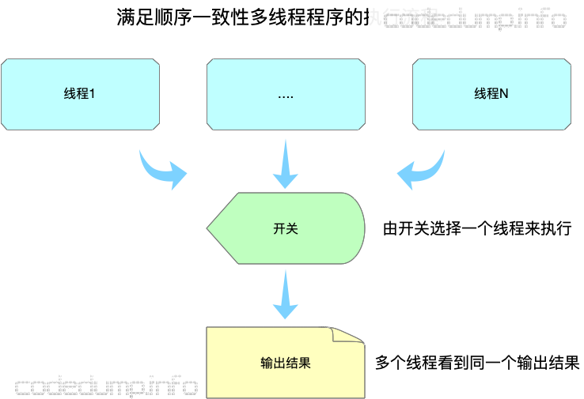
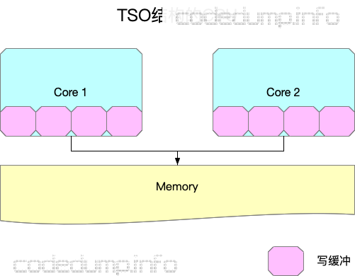
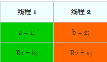
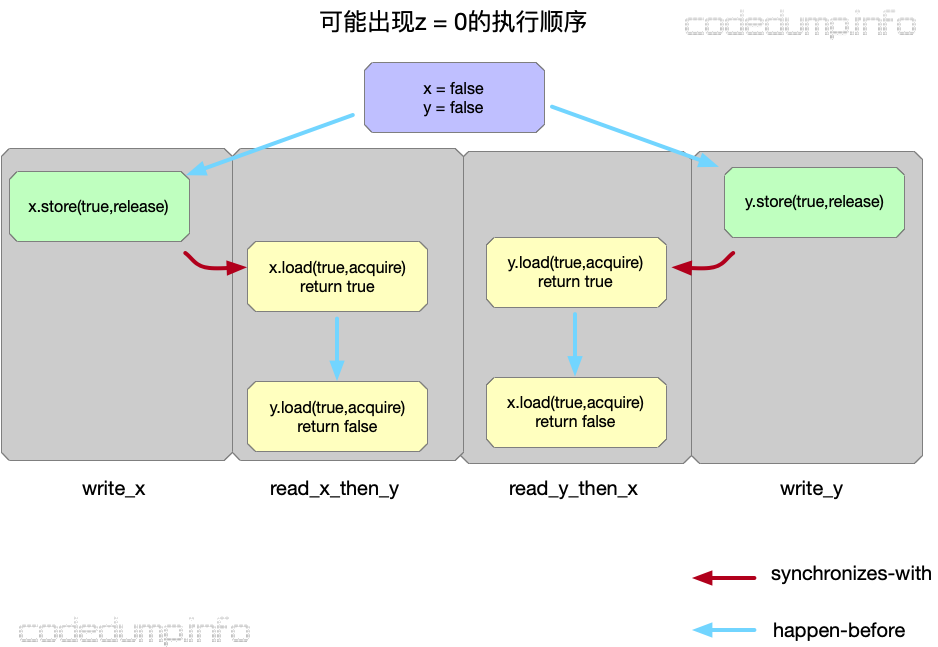
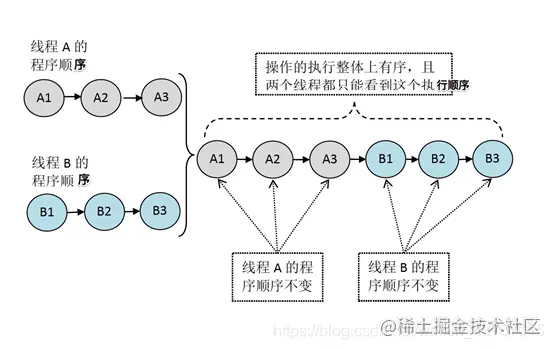
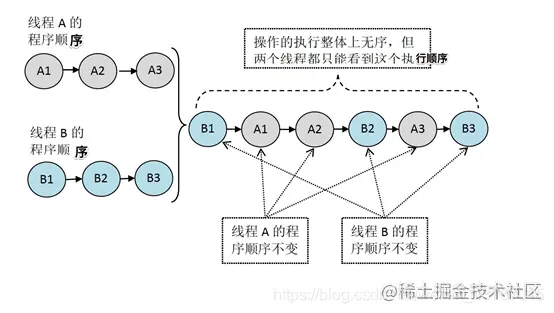

[toc]

#多线程

## 多线程数据访问问题

假设在程序执行之前，A=B=0，有两个线程同时分别执行如下的代码：

| 线程1      | 线程2      |
| ---------- | ---------- |
| 1.A=1      | 3.B=2      |
| 2.print(B) | 4.print(A) |

其可能的结果包括：(0,0)、(1,0)、(0,2)、(1,2)、(0,1)、(2,0)、(2,1)。（这里只有7个结果，是因为有两个(0,0)，所以少了一个）。

在此处引入

###**Sequential Consistency (顺序一致性）**

- 每个处理器的执行顺序和代码中的顺序（program order）一样。
- 所有处理器都只能看到一个单一的操作执行顺序。

在要求满足SC内存模型的情况下，上面多线程执行中（0,0）是不可能输出的。

**缺点**：顺序一致性实际上是一种强一致性，可以想象成整个程序过程中由一个开关来选择执行的线程，这样才能同时保证顺序一致性的两个条件,这样实际上还是相当于同一时间只有一个线程在工作，这种保证导致了程序是低效的，无法充分利用上多核的优点。



###全存储排序（Total Store Ordering, 简称TSO）

有一些CPU架构，在处理核心中增加写缓存，一个写操作只要写入到本核心的写缓存中就可以返回，此时的CPU结构如图所示（图中并没有画出三级cache）：



在新的CPU架构下，写一个值可能值写到本核心的缓冲区中就返回了，接着执行下面的一条指令，因此可能出现以下的情况：


- 执行操作1，core 1写入A的新值1到core 1的缓冲区中之后就马上返回了，还并没有更新到所有CPU都能访问到的内存中。
- 执行操作3，core 2写入B的新值2到core 2的缓冲区中之后就马上返回了，还并没有更新到所有CPU都能访问到的内存中。
- 执行操作2，由于操作2访问到本core缓冲区中存储的B值还是原来的0，因此输出0。
- 执行操作4，由于操作4访问到本core缓冲区中存储的A值还是原来的0，因此输出0。

可以看到，在引入了只能由每个core才能访问到的写缓冲区之后，之前SC中不可能出现的输出(0,0)的情况在这样的条件下可能出现了。

### 松弛型内存模型(Relaxed memory models)

以上已经介绍了两种内存模型，SC是最简单直白的内存模型，TSO在SC的基础上，加入了写缓存，写缓存的加入导致了一些在SC条件下不可能出现的情况也成为了可能。

然而，即便如此，以上两种内存模型都没有改变单线程执行一个程序时的执行顺序。在这里要讲的松弛型内存模型，则改变了程序的执行顺序。

在松散型的内存模型中，编译器可以在满足程序单线程执行结果的情况下进行重排序（reorder），来看下面的程序：

```c++
int A, B;
void foo() {
  A = B + 1;
  B = 0;
}
int main() {
  foo();
  return 0;
}
```

如果在不使用优化的情况下编译，gcc foo.c -S，foo函数中针对A和B操作的汇编代码如下：

``` 
    movl	B(%rip), %eax
	addl	$1, %eax
	movl	%eax, A(%rip)
	movl	$0, B(%rip)
```

而如果使用O2优化编译，gcc foo.c -S -O2 则得到下面的汇编代码：

```
	movl	B(%rip), %eax
	movl	$0, B(%rip)
	addl	$1, %eax
	movl	%eax, A(%rip)
```

即先把变量B的值赋给寄存器eax，然后变量B置零，再将寄存器eax加一的结果赋值给变量A。

其原因在于，foo函数中，只要将变量B的值暂存下来，那么对变量B的赋值操作可以被打乱而并不影响程序的执行结果，这就是编译器可以做的重排序优化。

回到前面的例子中，在松弛型内存模型中，程序的执行顺序就不见得和代码中编写的一样了，这是这种内存模型和SC、TSO模型最大的差异。

```
乱序即有CPU造成的也有和编译器造成的。在传统的单线程语义下，CPU和编译器的乱序优化是不会影响程序语义的正确性的，所以对程序员来说就是透明的。但是在多线程环境下，因为CPU和编译器都缺少对多线程程序语义的“整体性”的了解，所以就可能造成违反多线程语义的错误的优化。说简单点，就是因为CPU和编译器还未能跟上多核时代的步伐。要保证正确性最简答的办法就是不做乱序优化，直接按照我文中所指的Sequential Consistency的方式顺序执行，可是这样对程序的性能影响太大，本质上CPU和编译器之所以要乱序执行就是为了提高性能。所以现在的折衷方案是由程序员来在适当的地方使用带有acquire和release的原语来“告诉”CPU和编译器你在这个地方不能给我做优化，其他的地方你可以做。Acquire和release语义的原语在内部会调用memory barrier来保证memory order。
source: http://www.parallellabs.com/2010/03/06/why-should-programmer-care-about-sequential-consistency-rather-than-cache-coherence/
```

### 内存栅栏(memory barrier)

讲完了三种内存模型，这里还需要了解一下内存栅栏的概念。

由于有了缓冲区的出现，导致一些操作不用到内存就可以返回继续执行后面的操作，为了保证某些操作必须是写入到内存之后才执行，就引入了内存栅栏（memory barrier，又称为memory fence）操作。内存栅栏指令保证了，在这条指令之前所有的内存操作的结果，都在这个指令之后的内存操作指令被执行之前，写入到内存中。也可以换另外的角度来理解内存栅栏指令的作用：显式的在程序的某些执行点上保证SC。


再次以前面的例子来说明这个指令，在X64下面，内存屏障指令使用汇编指令`asm volatile ("pause" ::: "memory");`来实现，如果将这个指令放到两个赋值语句之间：

```c++
int A, B;
void foo()
{
    A = B + 1;
    asm volatile ("pause" ::: "memory");
    B = 0;
}
int main() {
  foo();
  return 0;
}
```

那么再次使用O2编译出来的汇编代码就变成了：

```
.LFB1:
  .cfi_startproc
  movl  B(%rip), %eax
  addl  $1, %eax
  movl  %eax, A(%rip)
#APP
# 6 "foo.c" 1
  pause
# 0 "" 2
#NO_APP
  movl  $0, B(%rip)
```

可以看到，插入内存屏障指令之后，生成的汇编代码顺序就不会乱序了。

# std::memory_order内存序

memory order的问题就是因为指令重排引起的, 指令重排导致 原来的内存可见顺序发生了变化, 在单线程执行起来的时候是没有问题的, 但是放到 多核/多线程执行的时候就出现问题了, 为了效率引入的额外复杂逻辑的的弊端就出现了。

C++11引入memory order的意义在于我们现在有了一个与运行平台无关和编译器无关的标准库， 让我们可以在high level languange层面实现对多处理器对共享内存的交互式控制。多线程终于可以跨平台
　

std::memory_order（可译为内存序，访存顺序）

　　动态内存模型可理解为存储一致性模型，主要是从行为(behavioral)方面来看多个线程对同一个对象同时(读写)操作时(concurrency)所做的约束，动态内存模型理解起来稍微复杂一些，涉及了内存，Cache，CPU 各个层次的交互，尤其是在共享存储系统中，为了保证程序执行的正确性，就需要对访存事件施加严格的限制。

　　假设存在两个共享变量a, b，初始值均为 0，两个线程运行不同的指令，如下表格所示，线程 1 设置 a 的值为 1，然后设置 R1 的值为 b，线程 2 设置 b 的值为 2，并设置 R2 的值为 a，请问在不加任何锁或者其他同步措施的情况下，R1，R2 的最终结果会是多少？




​		由于没有施加任何同步限制，两个线程将会交织执行，但交织执行时指令不发生重排，即线程 1 中的 a = 1 始终在 R1 = b 之前执行，而线程 2 中的 b = 2 始终在 R2 = a 之前执行 ，因此可能的执行序列共有 4!/(2!*2!) = 6 种

 		多线程环境下顺序一致性包括两个方面，(1). 从多个线程平行角度来看，程序最终的执行结果相当于多个线程某种交织执行的结果，(2)从单个线程内部执行顺序来看，该线程中的指令是按照程序事先已规定的顺序执行的(即不考虑运行时 CPU 乱序执行和 Memory Reorder)。当然，顺序一致性代价太大，不利于程序的优化，现在的编译器在编译程序时通常将指令重新排序。对编译器和 CPU 作出一定的约束才能合理正确地优化你的程序，那么这个约束是什么呢？答曰：**内存模型**。C++程序员要想写出高性能的多线程程序必须理解内存模型，编译器会给你的程序做优化(静态)，CPU为了提升性能也有乱序执行(动态)，总之，程序在最终执行时并不会按照你之前的原始代码顺序来执行，因此内存模型是程序员、编译器，CPU 之间的契约，遵守契约后大家就各自做优化，从而尽可能提高程序的性能。

```c++
//C++11 中规定了 6 中访存次序(Memory Order)，如下：
enum memory_order {
    memory_order_relaxed,
    memory_order_consume,
    memory_order_acquire,
    memory_order_release,
    memory_order_acq_rel,
    memory_order_seq_cst
};
```

上述 6 中访存次序(内存序)分为 3 类，

- 顺序一致性模型(std::memory_order_seq_cst)

- Acquire-Release 模型(std::memory_order_acquire, std::memory_order_release, std::memory_order_acq_rel) （获取/释放语义模型）
- Release-Consume(std::memory_order_consume)

- Relax 模型(std::memory_order_relaxed)（宽松的内存序列化模型）。


| memory order         | 作用                                                         |
| -------------------- | ------------------------------------------------------------ |
| memory_order_relaxed | 没有fencing作用                                              |
| memory_order_consume | 后面依赖此原子变量的访存指令勿重排至此条指令之前             |
| memory_order_acquire | 后面访存指令勿重排至此条指令之前                             |
| memory_order_release | 前面访存指令勿重排至此条指令之后。当此条指令的结果对其他线程可见后，之前的所有指令都可见 |
| memory_order_acq_rel | acquire + release语意                                        |
| memory_order_seq_cst | acq_rel语意外加所有使用seq_cst的指令有严格地全序关系         |

##memory_order_seq_cst（顺序一致性）

Sequential Consistency。最直白、简单的一种内存模型：顺序一致性内存模型

1. 每个处理器的执行顺序和代码中的顺序（program order）一样。

2. 所有处理器都只能看到一个单一的操作执行顺序。

3. 会对所有使用此 memory order 的原子操作进行同步，所有线程看到的内存操作的顺序都是一样的，就像单个线程在执行所有线程的指令一样

4. 通常情况下，默认使用 memory_order_seq_cst，所以你如果不确定怎么这些 memory order，就用这个。

5. ```c++
   #include <atomic>
   #include <thread>
   #include <assert.h>
   std::atomic<bool> x,y;
   std::atomic<int> z;
   void write_x()
   {
       x.store(true,std::memory_order_seq_cst);
   }
   void write_y()
   {
       y.store(true,std::memory_order_seq_cst);
   }
   void read_x_then_y()
   {
       while(!x.load(std::memory_order_seq_cst));
       if(y.load(std::memory_order_seq_cst))
           ++z;
   }
   void read_y_then_x()
   {
       while(!y.load(std::memory_order_seq_cst));
       if(x.load(std::memory_order_seq_cst))
           ++z;
   }
   int main()
   {
       x=false;
       y=false;
       z=0;
       std::thread a(write_x);
       std::thread b(write_y);
       std::thread c(read_x_then_y);
       std::thread d(read_y_then_x);
       a.join();
       b.join();
       c.join();
       d.join();
       assert(z.load()!=0);//断言永远不会报错，z一定=2
   }
   ```

##memory_order_relaxed

没有顺序一致性的要求，也就是说同一个线程的原子操作还是按照happens-before关系，但不同线程间的执行关系是任意。

- 针对一个变量的读写操作是原子操作；
- 不同线程之间针对该变量的访问操作先后顺序不能得到保证，即有可能乱序。

来看示例代码：

```c++
#include <atomic>
#include <thread>
#include <assert.h>
std::atomic<bool> x,y;
std::atomic<int> z;
void write_x_then_y()
{
    x.store(true,std::memory_order_relaxed);
    y.store(true,std::memory_order_relaxed);//为了提高效率。arm架构甚至可能，把单线程的执行顺序进行修改调换，先执行后一条，再执行前一条，还好x86架构是强顺序模型，单线程按顺序执行
}

void read_y_then_x()
{
    while(!y.load(std::memory_order_relaxed));
    if(x.load(std::memory_order_relaxed))
        ++z;
}

int main()
{
    x=false;
    y=false;
    z=0;
    std::thread a(write_x_then_y);
    std::thread b(read_y_then_x);
    a.join();
    b.join();
    assert(z.load()!=0);//对原子变量的访问都使用memory_order_relaxed模型，导致了最后的断言可能失败，即在程序结束时z可能为0
}
```

##memory_order_release

1. 对写入施加 release 语义（store），在代码中这条语句前面的所有读写操作都无法被重排到这个操作之后，即 store-store 不能重排为 store-store, load-store 也无法重排为 store-load
2. 当前线程内的所有写操作，对于其他对这个原子变量进行 acquire 的线程可见
3. 当前线程内的与这块内存有关的所有写操作，对于其他对这个原子变量进行 consume 的线程可见

##memory_order_acquire

1. 对读取施加 acquire 语义（load），在代码中这条语句后面所有读写操作都无法重排到这个操作之前，即 load-store 不能重排为 store-load, load-load 也无法重排为 load-load

2. 在这个原子变量上施加 release 语义的操作发生之后，acquire 可以保证读到所有在 release 前发生的写入


##memory_order_acq_rel

1. 对读取和写入施加 acquire-release 语义，无法被重排
2. 可以看见其他线程施加 release 语义的所有写入，同时自己的 release 结束后所有写入对其他施加 acquire 语义的线程可见
3. 同时包含memory_order_acquire和memory_order_release标志

```c++
#include <atomic>
#include <thread>
#include <assert.h>
std::atomic<bool> x,y;
std::atomic<int> z;
void write_x()
{
    x.store(true,std::memory_order_release);
}
void write_y()
{
    y.store(true,std::memory_order_release);
}
void read_x_then_y()
{
    while(!x.load(std::memory_order_acquire));
    if(y.load(std::memory_order_acquire))
        ++z;
}
void read_y_then_x()
{
    while(!y.load(std::memory_order_acquire));
    if(x.load(std::memory_order_acquire))
        ++z;
}
int main()
{
    x=false;
    y=false;
    z=0;
    std::thread a(write_x);
    std::thread b(write_y);
    std::thread c(read_x_then_y);
    std::thread d(read_y_then_x);
    a.join();
    b.join();
    c.join();
    d.join();
    assert(z.load()!=0);
}
```

上面这个例子中，并不能保证程序最后的断言即z!=0为真，其原因在于：在不同的线程中分别针对x、y两个变量进行了同步操作并不能保证x、y变量的读取操作。

线程write_x针对变量x使用了write-release模型，这样保证了read_x_then_y函数中，在load变量y之前x为true；同理线程write_y针对变量y使用了write-release模型，这样保证了read_y_then_x函数中，在load变量x之前y为true。

然而即便是这样，仍然可能出现以下类似的情况：.



如上图所示：

- 初始条件为x = y = false。
- 由于在read_x_and_y线程中，对x的load操作使用了acquire模型，因此保证了是先执行write_x函数才到这一步的；同理先执行write_y才到read_y_and_x中针对y的load操作。
- 然而即便如此，也可能出现在read_x_then_y中针对y的load操作在y的store操作之前完成，因为y.store操作与此之间没有先后顺序关系；同理也不能保证x一定读到true值，因此到程序结束是就出现了z = 0的情况。

从上面的分析可以看到，即便在这里使用了release-acquire模型，仍然没有保证z=0，其原因在于：最开始针对x、y两个变量的写操作是分别在write_x和write_y线程中进行的，不能保证两者执行的顺序导致。因此修改如下：

```c++
#include <atomic>
#include <thread>
#include <assert.h>
std::atomic<bool> x,y;
std::atomic<int> z;
void write_x_then_y()
{
    x.store(true,std::memory_order_relaxed);
    y.store(true,std::memory_order_release);
}
void read_y_then_x()
{
    while(!y.load(std::memory_order_acquire));
    if(x.load(std::memory_order_relaxed))
        ++z;
}
int main()
{
    x=false;
    y=false;
    z=0;
    std::thread a(write_x_then_y);
    std::thread b(read_y_then_x);
    a.join();
    b.join();
    assert(z.load()!=0);
}
```


如上图所示：

- 初始条件为x = y = false。
- 在write_x_then_y线程中，先执行对x的写操作，再执行对y的写操作，由于两者在同一个线程中，所以即便针对x的修改操作使用relaxed模型，修改x也一定在修改y之前执行。
- 在write_x_then_y线程中，对y的load操作使用了acquire模型，而在线程write_x_then_y中针对变量y的读操作使用release模型，因此保证了是先执行write_x_then_y函数才到read_y_then_x的针对变量y的load操作。
- 因此最终的执行顺序如上图所示，此时不可能出现z=0的情况。

从以上的分析可以看出，针对同一个变量的release-acquire操作，更多时候扮演了一种“线程间使用某一变量的同步”作用，由于有了这个语义的保证，做到了线程间操作的先后顺序保证（inter-thread happens-before）。

##memory_order_consume

1. 从上面对Acquire-Release模型的分析可以知道，虽然可以使用这个模型做到两个线程之间某些操作的synchronizes-with关系，然后这个粒度有些过于大了。

   在很多时候，线程间只想针对有依赖关系的操作进行同步，除此之外线程中的其他操作顺序如何无所谓。

2. memory_order_consume对当前要读取的内存施加 release 语义（store），在代码中这条语句后面所有与这块内存有关的读写操作都无法被重排到这个操作之前

3. 在这个原子变量上施加 release 语义的操作发生之后，acquire 可以保证读到所有在 release 前发生的并且与这块内存有关的写入

4. ```c++
   b = *a;
   c = *b;
   ```

其中第二行代码的执行结果依赖于第一行代码的执行结果，此时称这两行代码之间的关系为“carry-a-dependency ”。C++中引入的memory_order_consume内存模型就针对这类代码间有明确的依赖关系的语句限制其先后顺序。

```c++
#include <string>
#include <thread>
#include <atomic>
#include <assert.h>
struct X
{
    int i;
    std::string s;
};
std::atomic<X*> p;
std::atomic<int> a;
void create_x()
{
    X* x=new X;
    x->i=42;
    x->s="hello";
    a.store(99,std::memory_order_relaxed);
    p.store(x,std::memory_order_release);
}
void use_x()
{
    X* x;
    while(!(x=p.load(std::memory_order_consume)))
        std::this_thread::sleep_for(std::chrono::microseconds(1));
    assert(x->i==42);
    assert(x->s=="hello");
    assert(a.load(std::memory_order_relaxed)==99);
}
int main()
{
    std::thread t1(create_x);
    std::thread t2(use_x);
    t1.join();
    t2.join();
}
```

以上的代码中：

- create_x线程中的store(x)操作使用memory_order_release，而在use_x线程中，有针对x的使用memory_order_consume内存模型的load操作，两者之间由于有carry-a-dependency关系，因此能保证两者的先后执行顺序。所以，x->i == 42以及x->s==“hello”这两个断言都不会失败。
- 然而，create_x中针对变量a的使用relax内存模型的store操作，use_x线程中也有针对变量a的使用relax内存模型的load操作。这两者的先后执行顺序，并不受前面的memory_order_consume内存模型影响，所以并不能保证前后顺序，因此断言a.load(std::memory_order_relaxed)==99真假都有可能。

以上可以对比Acquire-Release以及Release-Consume两个内存模型，可以知道：

- Acquire-Release能保证不同线程之间的Synchronizes-With关系，这同时也约束到同一个线程中前后语句的执行顺序。
- **而Release-Consume只约束有明确的carry-a-dependency关系的语句的执行顺序，同一个线程中的其他语句的执行先后顺序并不受这个内存模型的影响**。

## 细说顺序一致模型

- **sequenced-before**

sequenced-before用于表示**单线程**之间，两个操作上的先后顺序，这个顺序是非对称、可以进行传递的关系。

它不仅仅表示两个操作之间的先后顺序，还表示了操作结果之间的可见性关系。两个操作A和操作B，如果有A sequenced-before B，除了表示操作A的顺序在B之前，还表示了操作A的结果操作B可见。

- **happens-before**

与sequenced-before不同的是，happens-before关系表示的**不同线程**之间的操作先后顺序，同样的也是非对称、可传递的关系。

如果A happens-before B，则A的内存状态将在B操作执行之前就可见。在上一篇文章中，某些情况下一个写操作只是简单的写入内存就返回了，其他核心上的操作不一定能马上见到操作的结果，这样的关系是不满足happens-before的。

- **synchronizes-with**

synchronizes-with关系强调的是变量被修改之后的传播关系（propagate），即如果一个线程修改某变量的之后的结果能被其它线程可见，那么就是满足synchronizes-with关系的。

显然，满足synchronizes-with关系的操作一定满足happens-before关系了。

顺序一致模型中，一个线程看到的程序的执行顺序，是和它的代码的编写顺序一致的。比如在一个线程中，代码逻辑是先编写A，再编写B，最后再编写C，那么在一致性模型的约束下，程序的执行顺序是 A -> B -> C 。是不会发生指令重排序的。

假设这两个线程使用监视器锁来正确同步：A 线程的三个操作执行后释放监视器锁，随后 B 线程获取同一个监视器锁。那么程序在顺序一致性模型中的执行效果如下：



现在再假设这两个线程没有做同步，下面是这个未同步程序在顺序一致性模型中的执行示意图：

