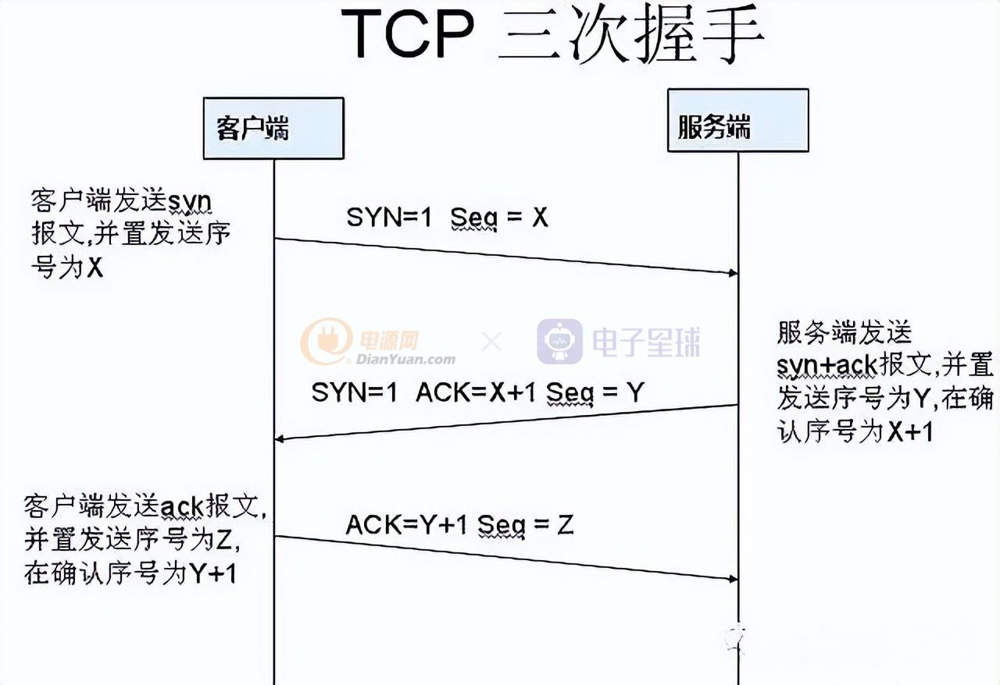
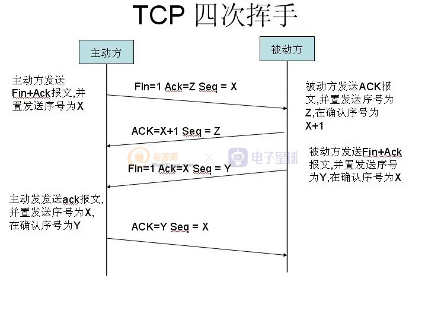
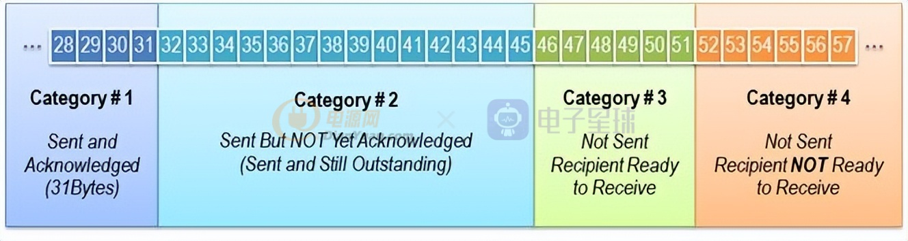
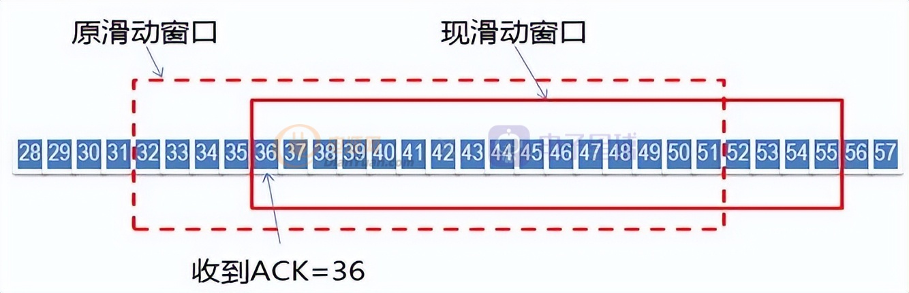

[toc]

# **1.分别简述一下TCP连接和断开(三次握手及四次挥手)的过程**

**三次握手过程（假设客户端主动发起连接）：**

1、第一次握手，客户端将标志位SYN置为1，随机产生一个seq值，比如为X，并将该数据包发送给Server，客户端进入SYN_SENT状态，等待服务端确认。

2、第二次握手：服务端收到数据包后由标志位SYN=1知道客户端请求建立连接，服务端将标志位SYN和ACK都置为1，ack=X+1，随机产生一个值Seq，比如为Y，并将该数据包发送给客户端以确认连接请求，服务端进入SYN_RCVD状态。

3、第三次握手：客户端收到确认后，检查ACK是否为X+1，如果正确则将标志位Seq置为Z，将ACK置为Y+1，并将该数据包发送给服务端，服务端检查ACK是否为Y+1，Seq是否为Z，如果正确则建立连接，客户端和服务端进入ESTABLISHED状态完成握手，双方就可以开始传输数据了。

**四次挥手（假设客户端主动关闭）：**

1、第一次挥手：客户端发送一个FIN+ACK的报文，用来关闭客户端到服务端的数据传送，客户端进入FIN_WAIT_1状态。

2、第二次挥手：服务端收到FIN后，发送一个ACK给客户端，确认序号为X+1（与SYN相同，一个FIN占用一个序号），服务端进入CLOSE_WAIT状态。

3、第三次挥手：服务端发送一个FIN，用来关闭服务端到客户端的数据传送，服务端进入LAST_ACK状态。

4、第四次挥手：客户端收到FIN后，客户端进入TIME_WAIT状态，接着发送一个ACK给服务端，确认序号为收到序号+1， 服务端进入CLOSED状态，客户端经过2MSL也进入CLOSED状态，完成四次挥手。

# 2.为什么收到服务端的确认之后，客户端还需要进行第三次“握手”呢？

主要**为了防止已失效的连接请求报文段突然又传送到了服务端，因而产生错误**。如客户端发出连接请求，但因连接请求报文丢失而未收到确认，于是客户端再重传一次连接请求。后来收到了确认，建立了连接。数据传输完毕后，就释放了连接，客户端发出了两个连接请求报文段，其中第一个丢失，第二个到达了服务端，但是第一个丢失的报文段只是在某些网络结点长时间滞留了，延误到连接释放以后的某个时间才到达服务端，此时服务端误认为客户端又发出一次新的连接请求，于是就向客户端发出确认报文段，同意建立连接。如果不采用第三次握手，只要服务端发出确认，就建立新的连接了，此时客户端不理睬服务端的确认且不发送数据，则服务端一致等待客户端发送数据，浪费资源。

通俗来讲就是，第二次握手能够验证客户端发送信息的服务端能够接收且正常响应，**第三次握手能够验证服务端发送的消息客户端能够接收且正常响应**，双方都能接收且响应正常就可以进行下一步传输信息了。

# 3.为什么要 4 次挥手？

主要是为了确保数据能够完成传输。 在关闭连接时，当收到主动关闭方的 FIN 报文通知时，它仅仅表示它没有数据发送给你了，但不代表你已经把所有的数据都全部发送给对方了，所以你不会马上会关闭传输数据的SOCKET，而是回复一个ACK确认收到对方的关闭请求，而你需要把剩下的数据传输给对方之后，再发送 FIN 报文给对方来表示你同意现在可以关闭连接了，所以这里的 **ACK 报文和 FIN 报文多数情况下都是分开发送的**。

# 4.TIME_WAIT 状态产生的原因？TIME_WAIT 的时间？

1、为实现**TCP**全双工连接的可靠释放

在进行关闭连接最后一次“挥手”时，最后的ACK是由主动关闭端发出的，如果这个最终的ACK丢失，服务器将重发最终的FIN，因此客户端必须维护状态信息允许它重发最终的ACK。如果主动关闭一方不维护这样一个TIME_WAIT状态，那么当被动关闭一方重发的FIN到达时，主动关闭一方的TCP传输层会用RST包响应对方，这会被对方认为是有错误发生，然而这只是正常的关闭连接过程，并非异常。

2、为使旧的数据包在网络过期消失

假设如果不存在TIME_WAIT 状态，在上一个连接断开后，又有新的同样的四元组（IP+端口）连接无缝接入，在上个连接中因为一些网络抖动或其他原因还在进行传输的旧重复数据包，对于新的连接来说就是脏数据，不属于本次连接的数据，不能让它影响新的连接，所以需要经过2MSL让其旧重复自动过期消失。

TIME_WAIT 的持续时间为2MSL，就是 2 个报文最长生存时间，1 个 MSL 在 RFC 上建议是 2 分钟，而实现传统上 使用 30 秒，因而，TIME_WAIT 状态一般维持在 1-4 分钟左右。

# 5.当关闭连接时最后一个 ACK 丢失怎么办？

如果最后一个 ACK 丢失的话，TCP 就会认为被动关闭方的 FIN 丢失，然后被动关闭方进行重发 FIN。 在主动关闭方收到 FIN 后，就会设置一个 2MSL 报文最大生存时间，这个时间足够在 ACK 丢失的情况下，可以等到下一个 FIN 的到来。如 果在 TIME－WAIT 状态有一个新的 FIN 到达了，客户就会发送一个新的 ACK，继续完成关闭连接步骤。但是如果重传 FIN 到达客户端时，客户端已经进入 CLOSED 状态时，那么客户就 永远收不到这个重传的 FIN 报文段，服务器收不到 ACK，服务器无法关闭连接。

# 6.TCP 如 何 保 证 可 靠 传 输 ？

1、在传递数据之前，会有三次握手来建立连接。

2、应用数据被分割成 TCP 认为最适合发送的数据块。这和 UDP 完全不同，应用程序产生的数据报长度将保持不变。 (数据长度大小据分合理)

3、当 TCP 发出一个段后，它启动一个定时器，等待目的端确认收到这个报文段。如果不能及时收到一个确认，将重发这个报文段。(超时重传)4、当 TCP 收到发自 TCP 连接另一端的数据，它将发送一个确认。这个确认不是立即发送， 通常将推迟几分之一秒 。(对于收到的请求，给出确认响应，响应机制)。

5、TCP 将保持它首部和数据的检验和，可以检测数据在传输过程中的任何变化，防止数据部分丢失或篡改。如果收到段的检验和有差错，TCP 将丢弃这个报文段和不确认收到此报文段，将会对此数据进行重新传输。（数据校验）

6、既然 TCP 报文段作为 IP 数据报来传输，而 IP 数据报的到达可能会失序，因此 TCP 报 文段的到达也可能会失序。如果必要，TCP 将对收到的数据进行重新排序，将收到的数据 以正确的顺序交给应用层。 (对失序数据进行重新排序，然后才交给应用层)

7、既然 IP 数据报会发生重复，TCP 的接收端必须丢弃重复的数据。(对于重复数据，能够 丢弃重复数据)

8、TCP 还能提供流量控制。TCP 连接的每一方都有固定大小的缓冲空间。TCP 的接收端 只允许另一端发送接收端缓冲区所能接纳的数据。这将防止较快主机致使较慢主机的缓冲 区溢出。(TCP 可以进行流量控制，防止较快主机致使较慢主机的缓冲区溢出)TCP 使用的 流量控制协议是可变大小的滑动窗口协议。

9、TCP 还能提供拥塞控制。当网络拥塞时，减少数据的发送。

# 7.TCP 建立连接之后怎么保持连接（检测连接断没断）？

在检测TCP是否断开或者还在连接中，这里有两种技术可以运用。一种是由 TCP 协议层实现的 Keepalive 机制，另一种是由应用层自己实现的 HeartBeat心跳包机制。

1.在 TCP 中有一个 Keep-alive 的机制可以检测连接是否正常，原理很简单：当连接闲置一定的时间之后，TCP 协议会向对方发一个 keepalive 探针包（包内几乎没数据），对方在收到包以后，如果连接一切正常，就会回复一个 ACK；如果连接出现异常了，就回复一个 RST（复位标志）；如果对方没有回复，那么，服务器每隔一段时间再次发送 keepalive 探针包， 如果连续发送几次的探针包都没得到响应，说明连接被断开了，需要注意的是，这个间隔时间和发送次数可以自定义设置的，还有这个与HTTP中Keep-alive 作用不一样，HTTP的Keep-alive是为了减少频繁的握手挥手，千万别搞混了。

2.心跳包机制，其实也是类似于Keep-alive机制，它像心跳一样每隔固定时间发一次，以此来告诉服务器，这个客户端还活着。事实上这是为了保持长连接，至于这个包的内容，是没有什么特别规定的，不过一般都是很小的包，或者只包含包头的一个空包。由应用程序自己发送 心跳包来检测连接的健康性。客户端可以在一个 Timer 中或低级别的线程中定时向服务器 发送一个短小精悍的包，并等待服务器的回应。客户端程序在一定时间内没有收到服务器回应即认为连接不可用，同样，服务器在一定时间内没有收到客户端的心跳包则认为客户端已经掉线。

# 8.TCP协议的滑动窗口具体是怎样控制流量的？

首先确定一点是TCP滑动窗口分为接收窗口和发送窗口，接收窗口也就是在接收端，发送窗口在发送端。

滑动窗口协议是传输层进行流控的一种措施，它是建立在“超时重传”的可靠性基础之上的，接收方通过通告发送方自己的窗口大小，从而控制发送方的发送速度，从而达到防止发送方发送速度过快而导致自己被淹没的目的。

对于TCP会话的发送方，任何时候在其发送缓存内的数据都可以分为4类，“已经发送并得到对端ACK的”，“已经发送但还未收到对端ACK的”，“未发送但对端允许发送的”，“未发送且对端不允许发送”。“已经发送但还未收到对端ACK的”和“未发送但对端允许发送的”这两部分数据称之为发送窗口。

当收到接收方新的ACK对于发送窗口中后续字节的确认是，窗口滑动，如下图

对于TCP的接收方，在某一时刻在它的接收缓存内存在3种。“已接收”，“未接收准备接收”，“未接收并未准备接收”（由于ACK直接由TCP协议栈回复，默认无应用延迟，不存在“已接收未回复ACK”）。其中“未接收准备接收”称之为接收窗口。

TCP是双工的协议，会话的双方都可以同时接收、发送数据。TCP会话的双方都各自维护一个“发送窗口”和一个“接收窗口”。其中各自的“接收窗口”大小取决于应用、系统、硬件的限制，但是TCP传输速率不能大于应用的数据处理速率，各自的“发送窗口”速率要求取决于对应接收端通告的“接收窗口”，要求相同。

# 9.TCP 与 UDP 的对比区别

通信形式。TCP 是面向连接的双工通信协议，而 UDP 是无连接的协议。这意味通过 TCP 发送数据之前，通信双方必须先建立连接，建立连接的过程也被称为 TCP 三次握手。

1. 可靠性。 TCP 提供交付保证,这意味着一个使用 TCP 协议发送的消息是保证交付给客户端的， 如果消息在传输过程中丢失,那么它将重发。UDP 是不可靠的,它不提供任何交付的保证， 一个数据报包在运输途中可能会丢失。
2. 有序性。 消息数据在网络传输过程中可能因网络抖动等原因会变得无序，在TCP 协议中，接收方会根据序号将消息排序，所以无需担心数据丢失乱序重复，而UDP协议的传输 是不提供任何有序性的保证。
3. 速度。TCP传输速度比较慢，因为 TCP 必须创建连接，以保证消息的可靠交付和有序性。而UDP则不需要建立连接，单向传输，速度自然就快些。
4. 量级。 TCP 是重量级的协议，UDP 协议则是轻量级的协议。一个 TCP 数据报的报头大小最 少是 20 字节，UDP 数据报的报头固定是 8 个字节。TCP 报头中包含序列号，ACK 号，数 据偏移量，保留，控制位，窗口，紧急指针，可选项，填充项，校验位，源端口和目的端口。而 UDP 报头只包含长度，源端口号，目的端口，和校验和。
5. 流控。在消息流量控制方面，TCP 有流量控制和拥塞控制，UDP 没有流量控制和拥塞控制。
6. TCP 面向字节流，UDP 是面向报文的。 TCP 是字节流的协议，无记录边界。 UDP 发送的每个数据报是记录型的数据报，所谓的记录型数据报就是接收进程可以识别接收到的数据报的记录边界。
7. TCP 只能单播，不能发送广播和组播，，而UDP 可以单播、广播和组播。

# 10.TCP 存在的缺陷有哪些？

TCP协议虽然有很多的优点，但也存在不少的缺陷，尤其在网络渗透方面。黑客可以利用TCP协议的特点去制造攻击，造成服务器瘫痪，以下就列举常见的三种利用TCP协议攻击的方式：

1.TCP 三次握手可能会出现 SYN Flood 攻击。这是一种利用TCP协议缺陷，发送大量伪造的TCP连接请求，使被攻击方资源耗尽（CPU满负荷或内存不足）的攻击方式。

2.TCP 三次握手可能会出现 Land 攻击。Land 攻击是一种使用相同的源和目的主机和端口发送数据包到某台机器的攻击。当操作系统接收到这类数据包时，不知道该如何处理，或者循环发送和接收该数据包，这样会消耗大量的系统资源，从而有可能造成系统崩溃或死机。

3.Connection Flood 攻击。connection flood攻击是非常有效的利用小流量冲击大带宽的攻击手段，这种攻击方式曾经风靡一时。攻击的原理是利用真实IP向服务器发起大量的连接，并且建立连接之后很长时间不释放，占用服务器的资源，造成服务器服务器上WAIT连接状态过多，效率降低，消耗对方网络资源甚至耗尽，无法响应其他正常客户所发起的连接。