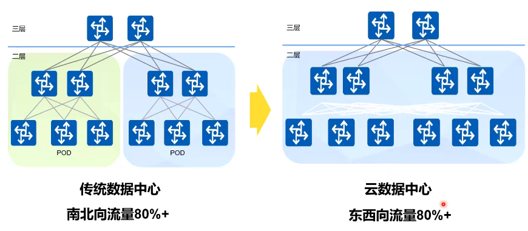
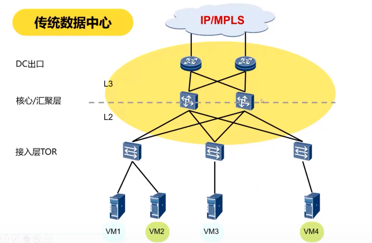
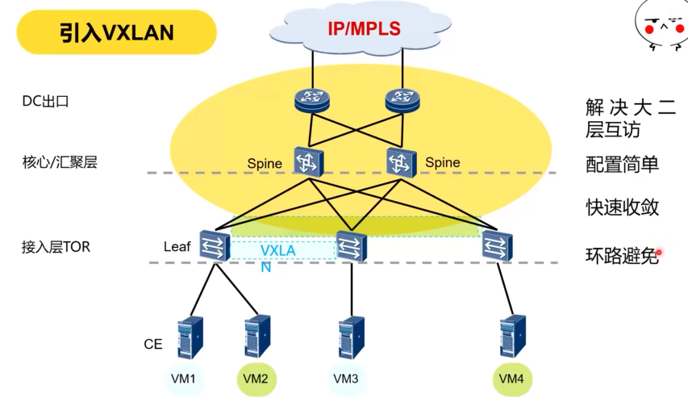
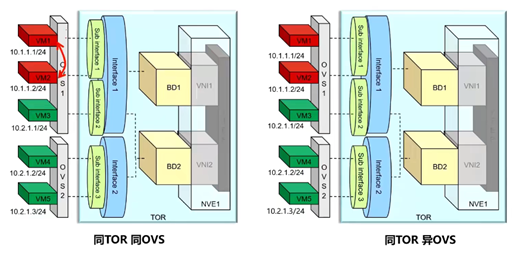
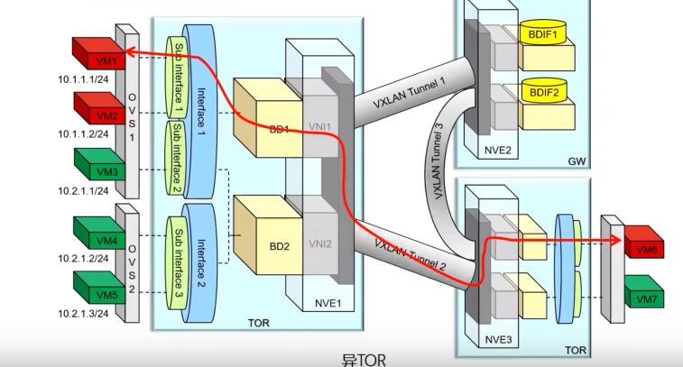
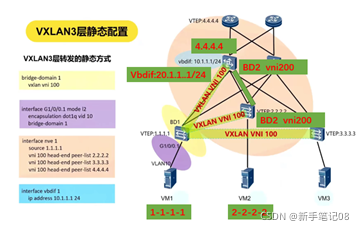
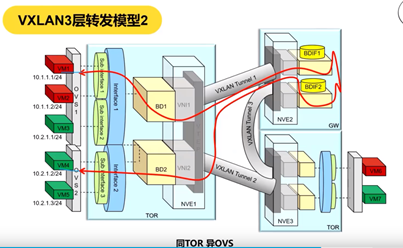
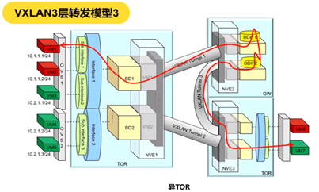

# VXLAN

## 概念

VXLAN分为静态VXLAN和动态VXLAN，动态的VXLAN由evpn生成。

Vtep：VTEP是VXLAN隧道端点，封装在NVE中，用于VXLAN报文的封装 和解封装。

VNI: vxlan network ID (类似vlan的ID一样)；

BD：BD是VXLAN网络中转发数据报文的二层广播域。 在VXLAN网络中，将VNI映射到广播域BD，BD成为VXLAN网络转 发数据报文的实体。

vBDif:基于BD创建的三层逻辑接口。通过VBDIF接口配置IP地址可实现 不同网段的VXLAN间，及VXLAN和非VXLAN的通信，也可实现二 层网络接入三层网络。

NVE：设备运行了vxlan就是NVE

##引入

https://www.bilibili.com/video/BV1oK4y1L795/

云数据中心大量使用虚拟机，所以东西向流量占比高，同时会有虚拟机迁移的业务，引入VXLAN做大二层网络转发

传统数据中心存在的问题：

- 存在环路，需要部署stp协议破环
- 不支持ECMP，链路利用率低
- 收敛慢
- 支持网络设备数量少，一般小于100台

##二层转发

TOR为接入层交换机。每台设备上可以创建很多个ID（类似于vlan一样），所有vni共享一个vtep，每个vni有自己的一个广播域，每个vni对应一个BD

左侧VM1和VM2因为接入同一个OVS交换机，直接根据OVS的MAC地址表进行转发

右侧VM3和VM4因为在同一TOR交换机, 相同BD域，根据TOR的MAC地址表转发

下侧VM1和VM6在不同TOR，但在同一个VLAN，会进行VXLAN封装,到达对端后解封装

## 三层转发

跨vni的通信，需要一个网关进行转发，网关中创建vbdif，识别VXLAN报文进行转发

下图VM1与VM2通信

/

需要集中式网关进行转发，BDIF接口进行VXLAN封装

## EVPN

EVPN是一种二层vpn技术，控制平面采用MP-BGP通告EVPN路由信息

- 简化配置：通过MP-BGP实现VTEP自动发现、VXLAN隧道自动建立、VXLAN隧道与VXLAN自动关联，无需用户手动配置
- 转控分离：控制平面负责发布路由信息，数据平面负责转发报文，分工明确

# NAT

内部的一些主机本来已经分配到了本地IP地址（即仅在本专用网内使用的专用地址），但又想和因特网上的主机通信（并不需要加密）时，可使用NAT方法。

这种方法需要在专用网（私网IP）连接到因特网（公网IP）的路由器上安装NAT软件。装有NAT软件的路由器叫做NAT路由器，它至少有一个有效的外部全球IP地址（公网IP地址）。这样，所有使用本地地址（私网IP地址）的主机在和外界通信时，都要在NAT路由器上将其本地地址转换成全球IP地址，才能和因特网连接。

NAT的实现方式有三种，即静态转换Static Nat、动态转换Dynamic Nat和端口多路复用OverLoad。

**静态转换**是指将内部网络的私有IP地址转换为公有IP地址，IP地址对是一对一的，是一成不变的，某个私有IP地址只转换为某个公有IP地址。借助于[静态](https://baike.baidu.com/item/静态)转换，可以实现外部网络对内部网络中某些特定设备（如服务器）的访问。

**动态转换**是指将内部网络的私有IP地址转换为公用IP地址时，IP地址是不确定的，是随机的，所有被授权访问上Internet的私有IP地址可随机转换为任何指定的合法IP地址。也就是说，只要指定哪些内部地址可以进行转换，以及用哪些合法地址作为外部地址时，就可以进行动态转换。动态转换可以使用多个合法外部地址集。当[ISP](https://baike.baidu.com/item/ISP/10152)提供的合法IP地址略少于网络内部的计算机数量时。可以采用动态转换的方式。

**端口多路复用（Port address Translation,PAT）**是指改变外出数据包的源端口并进行端口转换，即端口[地址转换](https://baike.baidu.com/item/地址转换)（PAT，Port Address Translation）.采用端口多路复用方式。内部网络的所有[主机](https://baike.baidu.com/item/主机)均可共享一个合法外部IP地址实现对Internet的访问，从而可以最大限度地节约IP地址资源。同时，又可隐藏网络内部的所有[主机](https://baike.baidu.com/item/主机)，有效避免来自internet的攻击。因此，网络中应用最多的就是端口多路复用方式。

**ALG（Application Level Gateway）**，即应用程序级网关技术：传统的NAT技术只对IP层和传输层头部进行转换处理，但是一些[应用层协议](https://baike.baidu.com/item/应用层协议/3668945)，在协议数据报文中包含了地址信息。为了使得这些应用也能透明地完成NAT转换，NAT使用一种称作ALG的技术，它能对这些应用程序在通信时所包含的地址信息也进行相应的NAT转换。例如：对于FTP协议的PORT/PASV命令、DNS协议的 "A" 和 "PTR" queries命令和部分ICMP消息类型等都需要相应的ALG来支持。

# 网关

## 转发网关和NAT网关

数据包经过的网关，MAC 地址只要过网关，就必定会改变（源MAC变为当前网关的MAC，目标MAC变为下一跳网关的MAC），而IP地址可能改变可能不改变。不改变 IP 地址的网关，我们称为转发网关；改变 IP 地址的网关（局域网IP转换成公网IP），我们称为NAT 网关。
