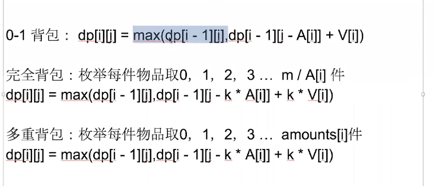

[toc]

# 动态规划




## 01背包

01背包问题是最基本的背包问题，其题意可大概描述为一共有N件物品，每件物品都有其相应的体积和价值，给你一个背包，背包有容量上限，怎样往背包中装物品，能让背包中的物品价值最高。

问题：

A:每件物品消耗的容量  A = [2,3,4,5]

V:每件物品的价值 V = [3,4,5,6]

此类问题是典型的动态规划问题，动态规划的目标是背包中物品的总价值，动态规划的变量是物品的体积和价值，以及背包的容量上限，经过分析，我们可以定义一下dp状态：
       dp/[ i ]/[ j ] ——在背包容量为j时，从前i件物品里挑选装入背包可得到的最大价值 
       dp/[ i ]/[ j ]有两种情况：1. 第i件物品不装入背包 2.第i件物品装入背包（装入背包需要满足物品装入背包后背包容量没有超限）
       据此我们可以得到状态转移方程：

```c++
dp[i][j] = max(dp[i-1][j], dp[i-1][j-A[i]]+V[i]); if(j-A[i]>=0)

    vector<int> V={6,2,3,4,6};
    vector<int> A={5,4,3,2,2};
	//背包限重容量为9
    vector<vector<int>> dp(V.size()+1,vector<int>(9+1));
    vector<vector<vector<int>>> chose(V.size()+1,vector<vector<int>>(dp[0].size(),vector<int>(V.size())));//用于背包溯源
    for (int i = 1 ; i <= V.size(); i++)
    {
        for (int j = 0 ; j <dp[0].size() ; j++)
        {
            // dp[i][j] = dp[i-1][j];
            if(j-A[i-1] >= 0)
            {
                dp[i][j] = max(dp[i-1][j], dp[i-1][j - A[i-1]] + V[i-1]);
                int flag = dp[i-1][j - A[i-1]] + V[i-1]; //背包溯源
                if (flag != dp[i][j])
                {
                    chose[i][j] = chose[i-1][j];
                }
                else
                {
                    chose[i][j] = chose[i-1][j - A[i-1]];
                    chose[i][j][i-1] += 1;
                 }
            }
        }
    }
//优化空间，只能倒序，否则一个物品相当于添加了多次---完全背包可以正序
    vector<int> dp(9+1);
	//vector<vector<int>> chose(vector<vector<int>>(dp.size(),vector<int>(V.size())));//用于背包溯源
    for (int i = 1 ; i <= V.size(); i++)
    {
        for(int j = dp.size()-1; j>=0 ; j--)
        {
            if(j-A[i-1] >= 0)
            {
                dp[j] = max(dp[j],dp[j-A[i-1] ] + V[i-1] );
                //int flag = dp[j - A[i-1]] + V[i-1]; //背包溯源
                //if (flag != dp[j])
                //{
                //    chose[j] = chose[j];
                //}
                //else
                //{
                //    chose[j] = chose[j - A[i-1]];
                //    chose[j][i-1] += 1;
                //}
            }

        }
    }
```

##多重背包

是0-1背包的变种，所以也要倒着推

````c++
    vector<int> V = {30,50,100,200};
    vector<int> A = {2,3,3,3};
    vector<int> count = {1,1,2,1};//每种物品的数量
    //背包大小为9
    vector<int> dp(9+1);
    vector<vector<int>> chose(dp.size(),vector<int>(V.size()));//溯源
    for (int i =1 ; i<=V.size(); i++)
    {

        for (int j =dp.size()-1 ; j >=0; j--)
        {
            for(int k = 1; j-k*A[i-1]>=0 && k <= count[i-1]; k++)
            {
                if (dp[j-k*A[i-1]] + k*V[i-1] > dp[j])
                {
                    dp[j] = dp[j-k*A[i-1]] + k*V[i-1];
                    chose[j] = chose[j - k*A[i-1]];
                    chose[j][i-1]+=k;
                }
            }
        }

    }
````


## 多重限制背包

背包问题变种，有多个限定条件，A+B

```c++
//给定n种物品和一个背包。物品i的重量是Ai，体积是Bi，其价值为Vi，背包的容量为c，容积为d。问应如何选择装入背包中的物品，使得装入背包中物品的总价值最大? 在选择装入背包的物品时，对每种物品只有两个选择：装入或不装入，且不能重复装入。
    vector<int> V={6,2,3,4,6};
    vector<int> A={5,4,3,2,2};
	vector<int> B={1,1,1,1,1};// 背包限重为9，限制容量为2,所以dp数组开为二维

    vector<vector<int>> dp(9+1,vector<int>(2+1));
    vector<vector<int>> chose(dp.size(),vector<int>(dp[0].size()));//用于背包溯源
    for (int i = 1 ; i <= V.size(); i++)
    {
        for (int j = dp.size()-1 ; j >= 0 ; j--)
        {
            // dp[i][j] = dp[i-1][j];
            for (int k = dp[0].size()-1; k>=0; k--)
            {
                if(j-A[i-1] >= 0 && k - B[i-1] >=0)
                {
                    if (dp[j - A[i-1]][k - B[i-1]] + V[i-1] > dp[j][k] )
                    {
                        dp[j][k] = dp[j - A[i-1]][k-B[i-1]] + V[i-1];
                        chose[j][k] = chose[j - A[i-1]][k-B[i-1]];
                        chose[j][k] += 1;
                    }
                    else if (dp[j - A[i-1]][k - B[i-1]] + V[i-1] > dp[j][k])
                    {
                        dp[j] = dp[j];
                    }
                }
            }

        }
    }
```


## 完全背包

枚举每件物品取 0，1，2，3...m/A[I] 件

```
dp[i][j] = max(dp[i-1][j],dp[i][j-k*A[i]] + k*V[i])
```

可以转换为 0 1 背包，只要把完全背包多出来的件数等价于一件新的物品就行

```c++
    vector<int> V={30,50,100,200};
    vector<int> A={2,3,4,5};

	//背包大小为9
    vector<int> dp(9+1);
    vector<vector<int>> chose(dp.size(),vector<int>(V.size()));
    for (int i =1 ; i<=V.size(); i++)
    {
        for (int j =0 ; j <dp.size(); j++)
        {
            // dp[i][j] = dp[i-1][j];
            for(int k = 0; j-k*A[i-1] >= 0; k++)
            {
                dp[j] = max(dp[j], dp[j - k*A[i-1]] + k*V[i-1]);
                int flag = dp[j - k*A[i-1]] + k*V[i-1]; //背包溯源
                if (flag != dp[j])
                {
                	chose[j] = chose[j];
                }
                else
                {
                	chose[j] = chose[j - k*A[i-1]];
                 	chose[j][i-1] +=k;
                }
            }
        }
    }
```


# DFS深度优先搜索

# BFS广度优先搜索

