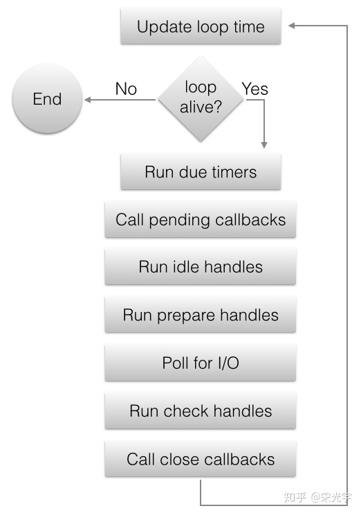

# 创建一个socket

```
server_sockfd = socket(AF_INET, SOCK_STREAM, 0)
```

创建一个字节流套接字

```
bind(sercer_sockfd, &server_sockaddr, sizeof(server_sockaddr)) == -1
```

将socket和服务器监听地址与端口绑定


# 循环机制



##  timer

我们通过 timer 开放出来的 API 为线索，来分析它的内部实现：

```text
int uv_timer_init(uv_loop_t* loop, uv_timer_t* handle);
int uv_timer_start(uv_timer_t* handle, uv_timer_cb cb, uint64_t timeout, uint64_t repeat);
int uv_timer_stop(uv_timer_t* handle);
```

`uv_timer_init` 没有什么特殊的地方，只是初始化一下 `handle` 的状态，并将其添加到 `loop->handle_queue` 中

`uv_timer_start` 内部做了这些工作：

```text
int uv_timer_start(uv_timer_t* handle,
                   uv_timer_cb cb,
                   uint64_t timeout,
                   uint64_t repeat) {
  uint64_t clamped_timeout;

  // loop->time 表示 loop 当前的时间。loop 每次迭代开始时，会用当次时间更新该值
  // clamped_timeout 就是该 timer 未来超时的时间点，这里直接计算好，这样未来就不需要
  // 计算了，直接从 timers 中取符合条件的即可
  if (clamped_timeout < timeout)
    clamped_timeout = (uint64_t) -1;

  handle->timer_cb = cb;
  handle->timeout = clamped_timeout;
  handle->repeat = repeat;

  // 除了预先计算好的 clamped_timeout 以外，未来当 clamped_timeout 相同时，使用这里的
  // 自增 start_id 作为比较条件来觉得 handle 的执行先后顺序
  handle->start_id = handle->loop->timer_counter++;

  // 将 handle 插入到 timer_heap 中，这里的 heap 是 binary min heap，所以根节点就是
  // clamped_timeout 值（或者 start_id）最小的 handle
  heap_insert(timer_heap(handle->loop),
              (struct heap_node*) &handle->heap_node,
              timer_less_than);
  // 设置 handle 的开始状态
  uv__handle_start(handle);

  return 0;
}
```

`uv_timer_stop` 内部做了这些工作：

```text
int uv_timer_stop(uv_timer_t* handle) {
  if (!uv__is_active(handle))
    return 0;

  // 将 handle 移出 timer_heap，和 heap_insert 操作一样，除了移出之外
  // 还会维护 timer_heap 以保障其始终是 binary min heap
  heap_remove(timer_heap(handle->loop),
              (struct heap_node*) &handle->heap_node,
              timer_less_than);
  // 设置 handle 的状态为停止
  uv__handle_stop(handle);

  return 0;
}
```

到目前为止，我们已经知道所谓的 `start` 和 `stop` 其实可以粗略地概括为，往属性 `loop->timer_heap` 中插入或者移出 handle，并且这个属性使用一个名为 binary min heap 的数据结构

然后我们再回顾上文的 `uv_run`：

```text
int uv_run(uv_loop_t* loop, uv_run_mode mode) {
  // ...
  while (r != 0 && loop->stop_flag == 0) {
    // ...
    uv__update_time(loop);
    uv__run_timers(loop);
    // ...
  }
  // ...
}
uv__update_time` 我们已经见过了，作用就是在循环开头阶段、使用当前时间设置属性 `loop->time
```

我们只需要最后看一下 `uv__run_timers` 的内容，就可以串联整个流程：

```text
void uv__run_timers(uv_loop_t* loop) {
  struct heap_node* heap_node;
  uv_timer_t* handle;

  for (;;) {
    // 取根节点，该值保证始终是所有待执行的 handle
    // 中，最先超时的那一个
    heap_node = heap_min(timer_heap(loop));
    if (heap_node == NULL)
      break;

    handle = container_of(heap_node, uv_timer_t, heap_node);
    if (handle->timeout > loop->time)
      break;

    // 停止、移出 handle、顺便维护 timer_heap
    uv_timer_stop(handle);
    // 如果是需要 repeat 的 handle，则重新加入到 timer_heap 中
    // 会在下一次事件循环中、由本方法继续执行
    uv_timer_again(handle);
    // 执行超时 handle 其对应的回调
    handle->timer_cb(handle);
  }
}
```

以上，就是 timer 在 Libuv 中的大致实现方式

## pending

上面，我们已经了解了每次事件循环迭代中、处于第一顺位的 timer 的处理，接下来我们来看处在第二顺位的 pending 队列的处理：

```text
static int uv__run_pending(uv_loop_t* loop) {
  QUEUE* q;
  QUEUE pq;
  uv__io_t* w;

  if (QUEUE_EMPTY(&loop->pending_queue))
    return 0;

  QUEUE_MOVE(&loop->pending_queue, &pq);

  // 不断从队列中弹出元素进行操作
  while (!QUEUE_EMPTY(&pq)) {
    q = QUEUE_HEAD(&pq);
    QUEUE_REMOVE(q);
    QUEUE_INIT(q);
    w = QUEUE_DATA(q, uv__io_t, pending_queue);
    w->cb(loop, w, POLLOUT);
  }

  return 1;
}
```

从源码来看，仅仅是从队列 `loop->pending_queue` 中不断弹出元素然后执行，并且弹出的元素是 `uv__io_t` 结构体的属性，从名字来看大致应该是 IO 相关的操作

另外，对 `loop->pending_queue` 进行插入操作的只有函数 [uv__io_feed](https://link.zhihu.com/?target=https%3A//github.com/going-merry0/libuv/blob/feature/learn/src/unix/core.c%23L951)，该函数的被调用点基本是执行一些 IO 相关的收尾工作