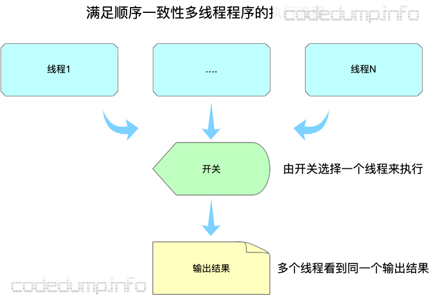
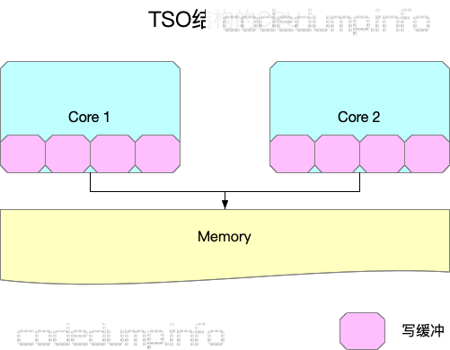
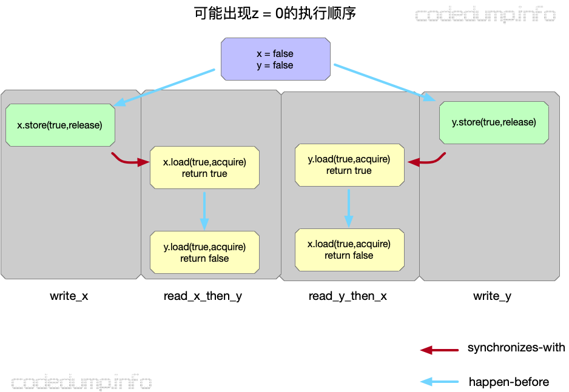
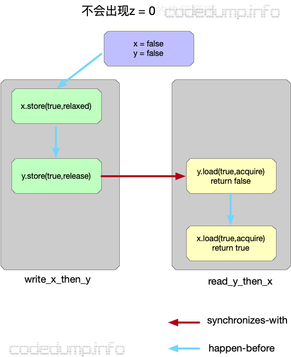

# CPU

##CPU架构

随着硬件技术的发展，内存的访问已经跟不上CPU的执行速度，此时内存成了瓶颈。为了加速读写速度，每个CPU也都有自己内部才能访问的缓存：


- 有多个CPU处理器，每个CPU处理器内部又有多个核心。
- 存在只能被一个CPU核心访问的L1 cache。
- 存在只能被一个CPU处理器的多个核心访问的L2 cache。
- 存在能被所有CPU处理器都能访问到的L3 cache以及内存。
- L1 cache、L2 cache、L3 cache的容量空间依次变大，但是访问速度依次变慢。

## 进程调度


#多线程

## 多线程数据访问问题

假设在程序执行之前，A=B=0，有两个线程同时分别执行如下的代码：

| 线程1      | 线程2      |
| ---------- | ---------- |
| 1.A=1      | 3.B=2      |
| 2.print(B) | 4.print(A) |

其可能的结果包括：(0,0)、(1,0)、(0,2)、(1,2)、(0,1)、(2,0)、(2,1)。（这里只有7个结果，是因为有两个(0,0)，所以少了一个）。

在此处引入

###**Sequential Consistency (顺序一致性）**

- 每个处理器的执行顺序和代码中的顺序（program order）一样。
- 所有处理器都只能看到一个单一的操作执行顺序。

在要求满足SC内存模型的情况下，上面多线程执行中（0,0）是不可能输出的。

**缺点**：顺序一致性实际上是一种强一致性，可以想象成整个程序过程中由一个开关来选择执行的线程，这样才能同时保证顺序一致性的两个条件,这样实际上还是相当于同一时间只有一个线程在工作，这种保证导致了程序是低效的，无法充分利用上多核的优点。



###全存储排序（Total Store Ordering, 简称TSO）

有一些CPU架构，在处理核心中增加写缓存，一个写操作只要写入到本核心的写缓存中就可以返回，此时的CPU结构如图所示（图中并没有画出三级cache）：



在新的CPU架构下，写一个值可能值写到本核心的缓冲区中就返回了，接着执行下面的一条指令，因此可能出现以下的情况：


- 执行操作1，core 1写入A的新值1到core 1的缓冲区中之后就马上返回了，还并没有更新到所有CPU都能访问到的内存中。
- 执行操作3，core 2写入B的新值2到core 2的缓冲区中之后就马上返回了，还并没有更新到所有CPU都能访问到的内存中。
- 执行操作2，由于操作2访问到本core缓冲区中存储的B值还是原来的0，因此输出0。
- 执行操作4，由于操作4访问到本core缓冲区中存储的A值还是原来的0，因此输出0。

可以看到，在引入了只能由每个core才能访问到的写缓冲区之后，之前SC中不可能出现的输出(0,0)的情况在这样的条件下可能出现了。

### 松弛型内存模型(Relaxed memory models)

以上已经介绍了两种内存模型，SC是最简单直白的内存模型，TSO在SC的基础上，加入了写缓存，写缓存的加入导致了一些在SC条件下不可能出现的情况也成为了可能。

然而，即便如此，以上两种内存模型都没有改变单线程执行一个程序时的执行顺序。在这里要讲的松弛型内存模型，则改变了程序的执行顺序。

在松散型的内存模型中，编译器可以在满足程序单线程执行结果的情况下进行重排序（reorder），来看下面的程序：

```c++
int A, B;
void foo() {
  A = B + 1;
  B = 0;
}
int main() {
  foo();
  return 0;
}
```

如果在不使用优化的情况下编译，gcc foo.c -S，foo函数中针对A和B操作的汇编代码如下：

``` 
    movl	B(%rip), %eax
	addl	$1, %eax
	movl	%eax, A(%rip)
	movl	$0, B(%rip)
```

而如果使用O2优化编译，gcc foo.c -S -O2 则得到下面的汇编代码：

```
	movl	B(%rip), %eax
	movl	$0, B(%rip)
	addl	$1, %eax
	movl	%eax, A(%rip)
```

即先把变量B的值赋给寄存器eax，然后变量B置零，再将寄存器eax加一的结果赋值给变量A。

其原因在于，foo函数中，只要将变量B的值暂存下来，那么对变量B的赋值操作可以被打乱而并不影响程序的执行结果，这就是编译器可以做的重排序优化。

回到前面的例子中，在松弛型内存模型中，程序的执行顺序就不见得和代码中编写的一样了，这是这种内存模型和SC、TSO模型最大的差异。

```
乱序即有CPU造成的也有和编译器造成的。在传统的单线程语义下，CPU和编译器的乱序优化是不会影响程序语义的正确性的，所以对程序员来说就是透明的。但是在多线程环境下，因为CPU和编译器都缺少对多线程程序语义的“整体性”的了解，所以就可能造成违反多线程语义的错误的优化。说简单点，就是因为CPU和编译器还未能跟上多核时代的步伐。要保证正确性最简答的办法就是不做乱序优化，直接按照我文中所指的Sequential Consistency的方式顺序执行，可是这样对程序的性能影响太大，本质上CPU和编译器之所以要乱序执行就是为了提高性能。所以现在的折衷方案是由程序员来在适当的地方使用带有acquire和release的原语来“告诉”CPU和编译器你在这个地方不能给我做优化，其他的地方你可以做。Acquire和release语义的原语在内部会调用memory barrier来保证memory order。
source: http://www.parallellabs.com/2010/03/06/why-should-programmer-care-about-sequential-consistency-rather-than-cache-coherence/
```

### 内存栅栏(memory barrier)

讲完了三种内存模型，这里还需要了解一下内存栅栏的概念。

由于有了缓冲区的出现，导致一些操作不用到内存就可以返回继续执行后面的操作，为了保证某些操作必须是写入到内存之后才执行，就引入了内存栅栏（memory barrier，又称为memory fence）操作。内存栅栏指令保证了，在这条指令之前所有的内存操作的结果，都在这个指令之后的内存操作指令被执行之前，写入到内存中。也可以换另外的角度来理解内存栅栏指令的作用：显式的在程序的某些执行点上保证SC。


再次以前面的例子来说明这个指令，在X64下面，内存屏障指令使用汇编指令`asm volatile ("pause" ::: "memory");`来实现，如果将这个指令放到两个赋值语句之间：

```c++
int A, B;
void foo()
{
    A = B + 1;
    asm volatile ("pause" ::: "memory");
    B = 0;
}
int main() {
  foo();
  return 0;
}
```

那么再次使用O2编译出来的汇编代码就变成了：

```
.LFB1:
  .cfi_startproc
  movl  B(%rip), %eax
  addl  $1, %eax
  movl  %eax, A(%rip)
#APP
# 6 "foo.c" 1
  pause
# 0 "" 2
#NO_APP
  movl  $0, B(%rip)
```

可以看到，插入内存屏障指令之后，生成的汇编代码顺序就不会乱序了。

# std::memory_order内存序

memory order的问题就是因为指令重排引起的, 指令重排导致 原来的内存可见顺序发生了变化, 在单线程执行起来的时候是没有问题的, 但是放到 多核/多线程执行的时候就出现问题了, 为了效率引入的额外复杂逻辑的的弊端就出现了。

C++11引入memory order的意义在于我们现在有了一个与运行平台无关和编译器无关的标准库， 让我们可以在high level languange层面实现对多处理器对共享内存的交互式控制。多线程终于可以跨平台
　

std::memory_order（可译为内存序，访存顺序）

　　动态内存模型可理解为存储一致性模型，主要是从行为(behavioral)方面来看多个线程对同一个对象同时(读写)操作时(concurrency)所做的约束，动态内存模型理解起来稍微复杂一些，涉及了内存，Cache，CPU 各个层次的交互，尤其是在共享存储系统中，为了保证程序执行的正确性，就需要对访存事件施加严格的限制。

　　假设存在两个共享变量a, b，初始值均为 0，两个线程运行不同的指令，如下表格所示，线程 1 设置 a 的值为 1，然后设置 R1 的值为 b，线程 2 设置 b 的值为 2，并设置 R2 的值为 a，请问在不加任何锁或者其他同步措施的情况下，R1，R2 的最终结果会是多少？


​		由于没有施加任何同步限制，两个线程将会交织执行，但交织执行时指令不发生重排，即线程 1 中的 a = 1 始终在 R1 = b 之前执行，而线程 2 中的 b = 2 始终在 R2 = a 之前执行 ，因此可能的执行序列共有 4!/(2!*2!) = 6 种

 		多线程环境下顺序一致性包括两个方面，(1). 从多个线程平行角度来看，程序最终的执行结果相当于多个线程某种交织执行的结果，(2)从单个线程内部执行顺序来看，该线程中的指令是按照程序事先已规定的顺序执行的(即不考虑运行时 CPU 乱序执行和 Memory Reorder)。当然，顺序一致性代价太大，不利于程序的优化，现在的编译器在编译程序时通常将指令重新排序。对编译器和 CPU 作出一定的约束才能合理正确地优化你的程序，那么这个约束是什么呢？答曰：**内存模型**。C++程序员要想写出高性能的多线程程序必须理解内存模型，编译器会给你的程序做优化(静态)，CPU为了提升性能也有乱序执行(动态)，总之，程序在最终执行时并不会按照你之前的原始代码顺序来执行，因此内存模型是程序员、编译器，CPU 之间的契约，遵守契约后大家就各自做优化，从而尽可能提高程序的性能。

```c++
//C++11 中规定了 6 中访存次序(Memory Order)，如下：
enum memory_order {
    memory_order_relaxed,
    memory_order_consume,
    memory_order_acquire,
    memory_order_release,
    memory_order_acq_rel,
    memory_order_seq_cst
};
```

上述 6 中访存次序(内存序)分为 3 类，

- 顺序一致性模型(std::memory_order_seq_cst)

- Acquire-Release 模型(std::memory_order_acquire, std::memory_order_release, std::memory_order_acq_rel) （获取/释放语义模型）
- Release-Consume(std::memory_order_consume)

- Relax 模型(std::memory_order_relaxed)（宽松的内存序列化模型）。


##memory_order_seq_cst（顺序一致性）

Sequential Consistency。最直白、简单的一种内存模型：顺序一致性内存模型

1. 每个处理器的执行顺序和代码中的顺序（program order）一样。

2. 所有处理器都只能看到一个单一的操作执行顺序。

3. 会对所有使用此 memory order 的原子操作进行同步，所有线程看到的内存操作的顺序都是一样的，就像单个线程在执行所有线程的指令一样

4. 通常情况下，默认使用 memory_order_seq_cst，所以你如果不确定怎么这些 memory order，就用这个。

5. ```c++
   #include <atomic>
   #include <thread>
   #include <assert.h>
   std::atomic<bool> x,y;
   std::atomic<int> z;
   void write_x()
   {
       x.store(true,std::memory_order_seq_cst);
   }
   void write_y()
   {
       y.store(true,std::memory_order_seq_cst);
   }
   void read_x_then_y()
   {
       while(!x.load(std::memory_order_seq_cst));
       if(y.load(std::memory_order_seq_cst))
           ++z;
   }
   void read_y_then_x()
   {
       while(!y.load(std::memory_order_seq_cst));
       if(x.load(std::memory_order_seq_cst))
           ++z;
   }
   int main()
   {
       x=false;
       y=false;
       z=0;
       std::thread a(write_x);
       std::thread b(write_y);
       std::thread c(read_x_then_y);
       std::thread d(read_y_then_x);
       a.join();
       b.join();
       c.join();
       d.join();
       assert(z.load()!=0);//断言永远不会报错，z一定=2
   }
   ```

##memory_order_relaxed

没有顺序一致性的要求，也就是说同一个线程的原子操作还是按照happens-before关系，但不同线程间的执行关系是任意。

- 针对一个变量的读写操作是原子操作；
- 不同线程之间针对该变量的访问操作先后顺序不能得到保证，即有可能乱序。

来看示例代码：

```c++
#include <atomic>
#include <thread>
#include <assert.h>
std::atomic<bool> x,y;
std::atomic<int> z;
void write_x_then_y()
{
    x.store(true,std::memory_order_relaxed);
    y.store(true,std::memory_order_relaxed);//为了提高效率。arm架构甚至可能，把单线程的执行顺序进行修改调换，先执行后一条，再执行前一条，还好x86架构是强顺序模型，单线程按顺序执行
}

void read_y_then_x()
{
    while(!y.load(std::memory_order_relaxed));
    if(x.load(std::memory_order_relaxed))
        ++z;
}

int main()
{
    x=false;
    y=false;
    z=0;
    std::thread a(write_x_then_y);
    std::thread b(read_y_then_x);
    a.join();
    b.join();
    assert(z.load()!=0);//对原子变量的访问都使用memory_order_relaxed模型，导致了最后的断言可能失败，即在程序结束时z可能为0
}
```

##memory_order_release

1. 对写入施加 release 语义（store），在代码中这条语句前面的所有读写操作都无法被重排到这个操作之后，即 store-store 不能重排为 store-store, load-store 也无法重排为 store-load
2. 当前线程内的所有写操作，对于其他对这个原子变量进行 acquire 的线程可见
3. 当前线程内的与这块内存有关的所有写操作，对于其他对这个原子变量进行 consume 的线程可见

##memory_order_acquire

1. 对读取施加 acquire 语义（load），在代码中这条语句后面所有读写操作都无法重排到这个操作之前，即 load-store 不能重排为 store-load, load-load 也无法重排为 load-load

2. 在这个原子变量上施加 release 语义的操作发生之后，acquire 可以保证读到所有在 release 前发生的写入


##memory_order_acq_rel

1. 对读取和写入施加 acquire-release 语义，无法被重排
2. 可以看见其他线程施加 release 语义的所有写入，同时自己的 release 结束后所有写入对其他施加 acquire 语义的线程可见
3. 同时包含memory_order_acquire和memory_order_release标志

```c++
#include <atomic>
#include <thread>
#include <assert.h>
std::atomic<bool> x,y;
std::atomic<int> z;
void write_x()
{
    x.store(true,std::memory_order_release);
}
void write_y()
{
    y.store(true,std::memory_order_release);
}
void read_x_then_y()
{
    while(!x.load(std::memory_order_acquire));
    if(y.load(std::memory_order_acquire))
        ++z;
}
void read_y_then_x()
{
    while(!y.load(std::memory_order_acquire));
    if(x.load(std::memory_order_acquire))
        ++z;
}
int main()
{
    x=false;
    y=false;
    z=0;
    std::thread a(write_x);
    std::thread b(write_y);
    std::thread c(read_x_then_y);
    std::thread d(read_y_then_x);
    a.join();
    b.join();
    c.join();
    d.join();
    assert(z.load()!=0);
}
```

上面这个例子中，并不能保证程序最后的断言即z!=0为真，其原因在于：在不同的线程中分别针对x、y两个变量进行了同步操作并不能保证x、y变量的读取操作。

线程write_x针对变量x使用了write-release模型，这样保证了read_x_then_y函数中，在load变量y之前x为true；同理线程write_y针对变量y使用了write-release模型，这样保证了read_y_then_x函数中，在load变量x之前y为true。

然而即便是这样，仍然可能出现以下类似的情况：.



如上图所示：

- 初始条件为x = y = false。
- 由于在read_x_and_y线程中，对x的load操作使用了acquire模型，因此保证了是先执行write_x函数才到这一步的；同理先执行write_y才到read_y_and_x中针对y的load操作。
- 然而即便如此，也可能出现在read_x_then_y中针对y的load操作在y的store操作之前完成，因为y.store操作与此之间没有先后顺序关系；同理也不能保证x一定读到true值，因此到程序结束是就出现了z = 0的情况。

从上面的分析可以看到，即便在这里使用了release-acquire模型，仍然没有保证z=0，其原因在于：最开始针对x、y两个变量的写操作是分别在write_x和write_y线程中进行的，不能保证两者执行的顺序导致。因此修改如下：

```c++
#include <atomic>
#include <thread>
#include <assert.h>
std::atomic<bool> x,y;
std::atomic<int> z;
void write_x_then_y()
{
    x.store(true,std::memory_order_relaxed);
    y.store(true,std::memory_order_release);
}
void read_y_then_x()
{
    while(!y.load(std::memory_order_acquire));
    if(x.load(std::memory_order_relaxed))
        ++z;
}
int main()
{
    x=false;
    y=false;
    z=0;
    std::thread a(write_x_then_y);
    std::thread b(read_y_then_x);
    a.join();
    b.join();
    assert(z.load()!=0);
}
```



如上图所示：

- 初始条件为x = y = false。
- 在write_x_then_y线程中，先执行对x的写操作，再执行对y的写操作，由于两者在同一个线程中，所以即便针对x的修改操作使用relaxed模型，修改x也一定在修改y之前执行。
- 在write_x_then_y线程中，对y的load操作使用了acquire模型，而在线程write_x_then_y中针对变量y的读操作使用release模型，因此保证了是先执行write_x_then_y函数才到read_y_then_x的针对变量y的load操作。
- 因此最终的执行顺序如上图所示，此时不可能出现z=0的情况。

从以上的分析可以看出，针对同一个变量的release-acquire操作，更多时候扮演了一种“线程间使用某一变量的同步”作用，由于有了这个语义的保证，做到了线程间操作的先后顺序保证（inter-thread happens-before）。

##memory_order_consume

1. 从上面对Acquire-Release模型的分析可以知道，虽然可以使用这个模型做到两个线程之间某些操作的synchronizes-with关系，然后这个粒度有些过于大了。

   在很多时候，线程间只想针对有依赖关系的操作进行同步，除此之外线程中的其他操作顺序如何无所谓。

2. memory_order_consume对当前要读取的内存施加 release 语义（store），在代码中这条语句后面所有与这块内存有关的读写操作都无法被重排到这个操作之前

3. 在这个原子变量上施加 release 语义的操作发生之后，acquire 可以保证读到所有在 release 前发生的并且与这块内存有关的写入

4. ```c++
   b = *a;
   c = *b;
   ```

其中第二行代码的执行结果依赖于第一行代码的执行结果，此时称这两行代码之间的关系为“carry-a-dependency ”。C++中引入的memory_order_consume内存模型就针对这类代码间有明确的依赖关系的语句限制其先后顺序。

```c++
#include <string>
#include <thread>
#include <atomic>
#include <assert.h>
struct X
{
    int i;
    std::string s;
};
std::atomic<X*> p;
std::atomic<int> a;
void create_x()
{
    X* x=new X;
    x->i=42;
    x->s="hello";
    a.store(99,std::memory_order_relaxed);
    p.store(x,std::memory_order_release);
}
void use_x()
{
    X* x;
    while(!(x=p.load(std::memory_order_consume)))
        std::this_thread::sleep_for(std::chrono::microseconds(1));
    assert(x->i==42);
    assert(x->s=="hello");
    assert(a.load(std::memory_order_relaxed)==99);
}
int main()
{
    std::thread t1(create_x);
    std::thread t2(use_x);
    t1.join();
    t2.join();
}
```

以上的代码中：

- create_x线程中的store(x)操作使用memory_order_release，而在use_x线程中，有针对x的使用memory_order_consume内存模型的load操作，两者之间由于有carry-a-dependency关系，因此能保证两者的先后执行顺序。所以，x->i == 42以及x->s==“hello”这两个断言都不会失败。
- 然而，create_x中针对变量a的使用relax内存模型的store操作，use_x线程中也有针对变量a的使用relax内存模型的load操作。这两者的先后执行顺序，并不受前面的memory_order_consume内存模型影响，所以并不能保证前后顺序，因此断言a.load(std::memory_order_relaxed)==99真假都有可能。

以上可以对比Acquire-Release以及Release-Consume两个内存模型，可以知道：

- Acquire-Release能保证不同线程之间的Synchronizes-With关系，这同时也约束到同一个线程中前后语句的执行顺序。
- **而Release-Consume只约束有明确的carry-a-dependency关系的语句的执行顺序，同一个线程中的其他语句的执行先后顺序并不受这个内存模型的影响**。

## 细说顺序一致模型

- **sequenced-before**

sequenced-before用于表示**单线程**之间，两个操作上的先后顺序，这个顺序是非对称、可以进行传递的关系。

它不仅仅表示两个操作之间的先后顺序，还表示了操作结果之间的可见性关系。两个操作A和操作B，如果有A sequenced-before B，除了表示操作A的顺序在B之前，还表示了操作A的结果操作B可见。

- **happens-before**

与sequenced-before不同的是，happens-before关系表示的**不同线程**之间的操作先后顺序，同样的也是非对称、可传递的关系。

如果A happens-before B，则A的内存状态将在B操作执行之前就可见。在上一篇文章中，某些情况下一个写操作只是简单的写入内存就返回了，其他核心上的操作不一定能马上见到操作的结果，这样的关系是不满足happens-before的。

- **synchronizes-with**

synchronizes-with关系强调的是变量被修改之后的传播关系（propagate），即如果一个线程修改某变量的之后的结果能被其它线程可见，那么就是满足synchronizes-with关系的。

显然，满足synchronizes-with关系的操作一定满足happens-before关系了。

顺序一致模型中，一个线程看到的程序的执行顺序，是和它的代码的编写顺序一致的。比如在一个线程中，代码逻辑是先编写A，再编写B，最后再编写C，那么在一致性模型的约束下，程序的执行顺序是 A -> B -> C 。是不会发生指令重排序的。

假设这两个线程使用监视器锁来正确同步：A 线程的三个操作执行后释放监视器锁，随后 B 线程获取同一个监视器锁。那么程序在顺序一致性模型中的执行效果如下：


现在再假设这两个线程没有做同步，下面是这个未同步程序在顺序一致性模型中的执行示意图：


# Linux

```
查看CPU信息：
	ps：显示按照按照消耗CPU前10排序的进程
	top：任务、CPU状态、内存状态、各进程的状态监控
查看内存信息：
	ps
	top
	pmap：查看进程的内存状态，以及内存映射
查看磁盘IO信息
	iotop
	iostat
查看端口信息
	netstat
查看大小端和cpu参数
	lscpu	
```


# 进程和线程、协程

进程是对运行时程序的封装，是系统进行资源调度和分配的的基本单位，实现了操作系统的并发；

进程一般由程序、数据集合和进程控制块三部分组成。

- 程序用于描述进程要完成的功能，是控制进程执行的指令集；
- 数据集合是程序在执行时所需要的数据和工作区；
- 程序控制块(Program Control Block，简称PCB)，包含进程的描述信息和控制信息，是进程存在的唯一标志。

在早期的操作系统中并没有线程的概念，进程是能拥有资源和独立运行的最小单位，也是程序执行的最小单位。任务调度采用的是时间片轮转的抢占式调度方式，而进程是任务调度的最小单位，每个进程有各自独立的一块内存，使得各个进程之间内存地址相互隔离。

后来，随着计算机的发展，对CPU的要求越来越高，进程之间的切换开销较大，已经无法满足越来越复杂的程序的要求了。于是就发明了线程。

线程是进程的子任务，是CPU调度和分派的基本单位，用于保证程序的实时性，实现进程内部的并发；线程是操作系统可识别的最小执行和调度单位。每个线程都独自占用一个虚拟处理器：独自的寄存器组，指令计数器和处理器状态。每个线程完成不同的任务，但是共享同一地址空间（也就是同样的动态内存，映射文件，目标代码等等），打开的文件队列和其他内核资源。

```
任务调度
	在一个进程中，当一个线程任务执行几毫秒后，会由操作系统的内核（负责管理各个任务）进行调度，通过硬件的计数器中断处理器，让该线程强制暂停并将该线程的寄存器放入内存中，通过查看线程列表决定接下来执行哪一个线程，并从内存中恢复该线程的寄存器，最后恢复该线程的执行，从而去执行下一个任务。
	上述过程中，任务执行的那一小段时间叫做时间片，任务正在执行时的状态叫运行状态，被暂停的线程任务状态叫做就绪状态，意为等待下一个属于它的时间片的到来。

  这种方式保证了每个线程轮流执行，由于CPU的执行效率非常高，时间片非常短，在各个任务之间快速地切换，给人的感觉就是多个任务在“同时进行”，这也就是我们所说的并发(别觉得并发有多高深，它的实现很复杂，但它的概念很简单，就是一句话：多个任务同时执行)。多任务运行过程的示意图如下：
```


1.一个线程只能属于一个进程，而一个进程可以有多个线程，但至少有一个线程。线程依赖于进程而存在。

2.进程在执行过程中拥有独立的内存单元，而多个线程共享进程的内存。（资源分配给进程，同一进程的所有线程共享该进程的所有资源。同一进程中的多个线程共享代码段（代码和常量），数据段（全局变量和静态变量），扩展段（堆存储）。但是每个线程拥有自己的栈段，栈段又叫运行时段，用来存放所有局部变量和临时变量。）

3.进程是资源分配的最小单位，线程是CPU调度的最小单位；

4.系统开销： 由于在创建或撤消进程时，系统都要为之分配或回收资源，如内存空间、I／o设备等。因此，操作系统所付出的开销将显著地大于在创建或撤消线程时的开销。类似地，在进行进程切换时，涉及到整个当前进程CPU环境的保存以及新被调度运行的进程的CPU环境的设置。而线程切换只须保存和设置少量寄存器的内容，并不涉及存储器管理方面的操作。可见，进程切换的开销也远大于线程切换的开销。

5.通信：由于同一进程中的多个线程具有相同的地址空间，致使它们之间的同步和通信的实现，也变得比较容易。进程间通信IPC，线程间可以直接读写进程数据段（如全局变量）来进行通信——需要进程同步和互斥手段的辅助，以保证数据的一致性。在有的系统中，线程的切换、同步和通信都无须操作系统内核的干预

6.进程编程调试简单可靠性高，但是创建销毁开销大；线程正相反，开销小，切换速度快，但是编程调试相对复杂。

7.进程间不会相互影响 ；线程一个线程挂掉将导致整个进程挂掉

8.进程适应于多核、多机分布；线程适用于多核

## 线程池

一种线程的使用模式，线程过多会带来调度开销，进而影响缓存局部性和整体性能。而线程池维护着多个线程，等待着监督管理者分配可并发执行的任务。这避免了在处理短时间任务时创建与销毁线程的代价。线程池不仅能够保证内核的充分利用，还能防止过分调度。可用线程数量应该取决于可用的并发处理器、处理器内核、内存、网络sockets等的数量。

“管理一个任务队列，一个线程队列，然后每次取一个任务分配给一个线程去做，循环往复。

## 进程间通讯

每个进程各自有不同的用户地址空间，任何一个进程的全局变量在另一个进程中都看不到，所以进程之间要交换数据必须通过内核，在内核中开辟一块缓冲区，进程1把数据从用户空间拷到内核缓冲区，进程2再从内核缓冲区把数据读走，内核提供的这种机制称为**进程间通信（IPC，InterProcess Communication）**

```
1.匿名管道通信
	半双工通信方式，数据单向流动，而且只能在具有亲缘关系的进程间使用，指父子进程
·父进程创建管道，得到两个⽂件描述符指向管道的两端
·父进程fork出子进程，⼦进程也有两个⽂件描述符指向同⼀管道。
·父进程关闭fd[0],子进程关闭fd[1]，即⽗进程关闭管道读端,⼦进程关闭管道写端（因为管道只支持单向通信）。
·⽗进程可以往管道⾥写,⼦进程可以从管道⾥读,管道是⽤环形队列实现的,数据从写端流⼊从读端流出,这样就实现了进程间通信。
2.高级管道通信
	将另一个程序当做一个新的进程在当前程序进程中启动，则它算是当前程序的子进程，这种方式我们成为高级管道方式。
3.有名管道通信
	有名管道也是半双工的通信方式，但是它允许无亲缘关系进程间的通信。
4.消息队列
 	消息队列是由消息的链表，存放在内核中并由消息队列标识符标识。消息队列克服了信号传递信息少、管道只能承载无格式字节流以及缓冲区大小受限等缺点。
5.信号量通信
	信号量是一个计数器，可以用来控制多个进程对共享资源的访问。它常作为一种锁机制，防止某进程正在访问共享资源时，其他进程也访问该资源。因此，主要作为进程间以及同一进程内不同线程之间的同步手段。
6.信号
	信号是一种比较复杂的通信方式，用于通知接收进程某个事件已经发生。
7.共享内存通信
	共享内存就是映射一段能被其他进程所访问的内存，这段共享内存由一个进程创建，但多个进程都可以访问。共享内存是最快的 IPC 方式，它是针对其他进程间通信方式运行效率低而专门设计的。它往往与其他通信机制，如信号量，配合使用，来实现进程间的同步和通信。
8.套接字通信
	套接口也是一种进程间通信机制，与其他通信机制不同的是，它可用于不同机器间的进程通信。
```


# 锁机制

互斥锁：mutex，用于保证在任何时刻，都只能有一个线程访问该对象。当获取锁操作失败时，线程会进入睡眠，等待锁释放时被唤醒

读写锁：rwlock，分为读锁和写锁。处于读操作时，可以允许多个线程同时获得读操作。但是同一时刻只能有一个线程可以获得写锁。其它获取写锁失败的线程都会进入睡眠状态，直到写锁释放时被唤醒。 注意：写锁会阻塞其它读写锁。当有一个线程获得写锁在写时，读锁也不能被其它线程获取；写者优先于读者（一旦有写者，则后续读者必须等待，唤醒时优先考虑写者）。适用于读取数据的频率远远大于写数据的频率的场合。

自旋锁：spinlock，在任何时刻同样只能有一个线程访问对象。但是当获取锁操作失败时，不会进入睡眠，而是会在原地自旋，直到锁被释放。这样节省了线程从睡眠状态到被唤醒期间的消耗，在加锁时间短暂的环境下会极大的提高效率。但如果加锁时间过长，则会非常浪费CPU资源。

RCU：即read-copy-update，在修改数据时，首先需要读取数据，然后生成一个副本，对副本进行修改。修改完成后，再将老数据update成新的数据。使用RCU时，读者几乎不需要同步开销，既不需要获得锁，也不使用原子指令，不会导致锁竞争，因此就不用考虑死锁问题了。而对于写者的同步开销较大，它需要复制被修改的数据，还必须使用锁机制同步并行其它写者的修改操作。在有大量读操作，少量写操作的情况下效率非常高。

1、互斥锁和读写锁区别：

互斥锁：mutex，用于保证在任何时刻，都只能有一个线程访问该对象。当获取锁操作失败时，线程会进入睡眠，等待锁释放时被唤醒。

读写锁：rwlock，分为读锁和写锁。处于读操作时，可以允许多个线程同时获得读操作。但是同一时刻只能有一个线程可以获得写锁。其它获取写锁失败的线程都会进入睡眠状态，直到写锁释放时被唤醒。 注意：写锁会阻塞其它读写锁。当有一个线程获得写锁在写时，读锁也不能被其它线程获取；写者优先于读者（一旦有写者，则后续读者必须等待，唤醒时优先考虑写者）。适用于读取数据的频率远远大于写数据的频率的场合。

互斥锁和读写锁的区别：

1）读写锁区分读者和写者，而互斥锁不区分

2）互斥锁同一时间只允许一个线程访问该对象，无论读写；读写锁同一时间内只允许一个写者，但是允许多个读者同时读对象。


**第一, 锁具有序列化的作用**

1.2 有了序列化保证并未完事.  在我们以锁的作比拟的例子中,  我们深埋一个假设,  一个拿锁进临界区的参与者, 它见到的"作案现场" 必定是上一个进入者离开时的现场. 这在现实中是必然的, 也是直观的. 但在系统中, 这并不是必然的. 主要有以下两种原因:

   \1) 由于出于性能的考量, 在超线程, 流水线等技术持续压榨CPU的同时, CPU还会在合适的情况下采取乱序执行,  也就是, 真实的指令**执行顺序**并不一定等同程序编写时的**程序顺序.**  

   \2) 此外, CPU的访问是存在层级的, 简言之, 即先cache, 再内存.   在多CPU的[体系架构](https://www.zhihu.com/search?q=体系架构&search_source=Entity&hybrid_search_source=Entity&hybrid_search_extra={"sourceType"%3A"answer"%2C"sourceId"%3A33326216})中,  每个CPU都有自己局部的内存,  当然它也可以访问别的CPU的[局部内存](https://www.zhihu.com/search?q=局部内存&search_source=Entity&hybrid_search_source=Entity&hybrid_search_extra={"sourceType"%3A"answer"%2C"sourceId"%3A33326216}). 这意味着,  CPU访问离它近的内存快, 访问远的内存慢. 所以, 这会由于cache的刷新延迟而导致访问内存一致性的问题. 也就是内存被修改了, cache还没来得及刷新, CPU就来访问了, 此时访问的是一个无效的旧值. 也就是, **执行顺序**并不一定等同于**观察顺序**

锁的实现还必须保证解决这两个问题, 所以,

**第二, 锁具有保持访存一致性的作用**

\2. 回到Mutex, 它作为一种互斥锁, 也必须有以上二个作用. 它是这样保证这二点要求的:

2.1 互斥机制.  拿到该锁者, 独占访问. 称之为**ACQUIRE**操作.  访问完毕, 释放锁,  称之为**RELEASE**

​      操作. 这种互斥保证了序列化.

  2.2 于**ACQUIRE**和**RELEASE** 上附加保持访存一致性的语义: 即题主所提到的:

\1)  **ACQUIRE:**  **对于所有其****它参与者来说,** 在此操作**后**的所有读写操作**必然发生在ACQUIRE这个动作之后****.** 前面半句[状语从句](https://www.zhihu.com/search?q=状语从句&search_source=Entity&hybrid_search_source=Entity&hybrid_search_extra={"sourceType"%3A"answer"%2C"sourceId"%3A33326216})很重要, 它保证**执行顺序**等同于**观察顺序 .**

\2)  **RELEASE:**  **对于所有其****它参与者来说,** 在此操作**前**的所有读写操作**必然发生在****RELEASE****这个动作之前****.** 前面半句状语从句很重要, 它保证**执行顺序**等同于**观察顺序 .**

 **注意,** 这其中任意一个操作, 都只保证了一半的顺序:

  对于**ACQUIRE**来说, 并没保证**ACQUIRE前**的读写操作不会发生在**ACQUIRE**动作之后.

  对于**RELEASE**来说, 并没保证**RELEASE后**的读写操作不会发生在**RELEASE**动作之前.

但是, **ACQUIRE 和** **RELEASE 配对起来使用后, 就有了完全顺序.  成为一个屏障性的保证, 术语叫[memory barrier]

作者：larmbr宇
链接：https://www.zhihu.com/question/26588157/answer/33326216
来源：知乎
著作权归作者所有。商业转载请联系作者获得授权，非商业转载请注明出处。

#多路复用

I/O多路复用就通过一种机制，可以监视多个描述符，一旦某个描述符就绪（一般是读就绪或者写就绪），能够通知程序进行相应的读写操作。

## select


用户首先将需要进行IO操作的socket添加到select中，然后阻塞等待select系统调用返回。当数据到达时，socket被激活，select函数返回。用户线程正式发起read请求，读取数据并继续执行。

从流程上来看，使用select函数进行IO请求和同步阻塞模型没有太大的区别，甚至还多了添加监视socket，以及调用select函数的额外操作，效率更差。但是，使用select以后最大的优势是用户可以在一个线程内同时处理多个socket的IO请求。用户可以注册多个socket，然后不断地调用select读取被激活的socket，即可达到在**同一个线程内同时处理多个IO请求的目的**。而在同步阻塞模型中，必须通过多线程的方式才能达到这个目的。这是reactor设计模式的体现


```
select缺点
（1）每次调用select，都需要把fd集合从用户态拷贝到内核态，这个开销在fd很多时会很大
（2）同时每次调用select都需要在内核遍历传递进来的所有fd，这个开销在fd很多时也很大
（3）select支持的文件描述符数量太小了，默认是1024复制代码
```

## poll

poll的实现和select非常相似，只是描述fd集合的方式不同，poll使用pollfd结构而不是select的fd_set结构

```c++
int poll(struct pollfd *fds, nfds_t nfds, int timeout);


struct pollfd{
	int fd;			//文件描述符
	short events;	//等待的事件
	short revents;	//实际发生的事件
}

```

fd：每一个 pollfd 结构体指定了一个被监视的文件描述符，可以传递多个结构体，指示 poll() 监视多个文件描述符。

events：指定监测fd的事件（输入、输出、错误），每一个事件有多个取值，如下：


revents：revents 域是文件描述符的操作结果事件，内核在调用返回时设置这个域。events 域中请求的任何事件都可能在 revents 域中返回.
注意：每个结构体的 events 域是由用户来设置，告诉内核我们关注的是什么，而 revents 域是返回时内核设置的，以说明对该描述符发生了什么事件
nfds：用来指定第一个参数数组元素个数
timeout：指定等待的毫秒数，无论 I/O 是否准备好，poll() 都会返回.

返回值：

成功时，poll() 返回结构体中 revents 域不为 0 的文件描述符个数；如果在超时前没有任何事件发生，poll()返回 0；

失败时，poll() 返回 -1，并设置 errno 为下列值之一：

EBADF：一个或多个结构体中指定的文件描述符无效。
EFAULT：fds 指针指向的地址超出进程的地址空间。
EINTR：请求的事件之前产生一个信号，调用可以重新发起。
EINVAL：nfds 参数超出 PLIMIT_NOFILE 值。
ENOMEM：可用内存不足，无法完成请求。

##epoll

epoll是一种I/O事件通知机制，是linux 内核实现IO多路复用的一个实现

通知机制，就是当事件发生的时候，则主动通知。通知机制的反面，就是轮询机制。

epoll的通俗解释是一种当文件描述符的内核缓冲区非空的时候，发出可读信号进行通知，当写缓冲区不满的时候，发出可写信号通知的机制

epoll的核心是3个API，核心数据结构是：1个红黑树和1个链表


**int epoll_create(int size)**

内核会产生一个epoll 实例数据结构并返回一个文件描述符，这个特殊的描述符就是epoll实例的句柄，后面的两个接口都以它为中心

**int epoll_ctl(int epfd， int op， int fd， struct epoll_event \*event)**

将被监听的描述符添加到红黑树或从红黑树中删除或者对监听事件进行修改

**int epoll_wait(int epfd， struct epoll_event \*events， int maxevents， int timeout)**

阻塞等待注册的事件发生，返回事件的数目，并将触发的事件写入events数组中。

##select、poll、epoll


**1. 用户态将文件描述符传入内核的方式**

select：创建3个文件描述符集并拷贝到内核中，分别监听读、写、异常动作。这里受到单个进程可以打开的fd数量限制，默认是1024。

poll：将传入的struct pollfd结构体数组拷贝到内核中进行监听。

epoll：执行epoll_create会在内核的高速cache区中建立一颗红黑树以及就绪链表(该链表存储已经就绪的文件描述符)。接着用户执行的epoll_ctl函数添加文件描述符会在红黑树上增加相应的结点。

**2. 内核态检测文件描述符读写状态的方式**

select：采用轮询方式，遍历所有fd，最后返回一个描述符读写操作是否就绪的mask掩码，根据这个掩码给fd_set赋值。

poll：同样采用轮询方式，查询每个fd的状态，如果就绪则在等待队列中加入一项并继续遍历。

epoll：采用回调机制。在执行epoll_ctl的add操作时，不仅将文件描述符放到红黑树上，而且也注册了回调函数，内核在检测到某文件描述符可读/可写时会调用回调函数，该回调函数将文件描述符放在就绪链表中。

**3. 找到就绪的文件描述符并传递给用户态的方式**

select：将之前传入的fd_set拷贝传出到用户态并返回就绪的文件描述符总数。用户态并不知道是哪些文件描述符处于就绪态，需要遍历来判断。

poll：将之前传入的fd数组拷贝传出用户态并返回就绪的文件描述符总数。用户态并不知道是哪些文件描述符处于就绪态，需要遍历来判断。

epoll：epoll_wait只用观察就绪链表中有无数据即可，最后将链表的数据返回给数组并返回就绪的数量。内核将就绪的文件描述符放在传入的数组中，所以只用遍历依次处理即可。

**4. 重复监听的处理方式**

select：将新的监听文件描述符集合拷贝传入内核中，继续以上步骤。

poll：将新的struct pollfd结构体数组拷贝传入内核中，继续以上步骤。

epoll：无需重新构建红黑树，直接沿用已存在的即可。

## reactor模式

作者：后端开发老鸽
链接：https://www.zhihu.com/question/320829696/answer/2362137281
来源：知乎
著作权归作者所有。商业转载请联系作者获得授权，非商业转载请注明出处。


### **模式一：基本的Reactor模式（单线程Reactor）**

单线程Reactor的程序结构如下：


上图中的**Reactor**的基本结构是一个事件循环(event loop),以事件驱动(event-driven)和事件回调的方式实现业务逻辑，伪代码如下：

```text
while (!done)
{
  int retval = :poll(fds, nfds, timeout_ms); // select和epoll等多路复用器类似   if (retval < 0) {
      // 处理错误哦，回调用户的error handler   } else if (retval > 0) {
      // 处理IO事件(也可以处理通过timerfd的定时器事件)，回调用户的IO event handler   }
 
}
```

上图中的**acceptor**的作用是：当监听描述符(listen  fd)可读时。acceptor会接受客户端的连接请求，并将新建立的连接(描述符)注册到Reactor中，等待可读事件发生(本模式中只有一个Reactor，后面会降到多Reactor模式，在多Reactor模式中，acceptor会将新建立的连接根据一定规则注册到不同的Reactor中)

上面仅仅是一个粗略的模型，没有给出codec或者dispatcher，在实际的服务器实现中，codec和dispather是必不可少的。codec负责解析消息，处理消息可能出现的各种情况，比如，如果是收到了半条消息，那么不会触发消息事件回调，数据会停留在Buffer里面(数据已经读到Buffer中了)，等待收到一个完整的消息再通知处理函数。  ，dispather则根据消息分发到不同的处理方法中。

**此模式的特点：** 由于只有一个线程，因此事件是顺序处理的，一个线程同时只能做一件事情，事件的优先级得不到保证。因为”从poll返回后”   到”下一次调用poll进入等待之前”这段时间内，线程不会被其他连接上的数据或者事件抢占。所以在使用这种模式时，需要避免业务逻辑阻塞当前IO线程。   redis就是采用的这种线程模型，在redis中，鉴于大部分操作，如GET、SET等，处理速度都很快，所以redis的整体性能还算不错，但是如果进行某些比较耗时的操作，如在数据量很大的情况下执行KEYS，会阻塞住IO线程，导致其他请求无法快速响应。也是基于这个原因某些Redis中间件方案(如twemproxy)会将这些耗时的操作禁用。

### **模式二： Reactor + 线程池(Thread Pool)**

此模式的程序结构如下：


相比于模式一，此模式中收到请求后，不在Reactor线程计算，而是使用线程池来计算，这会充分的利用多核CPU。采用此模式时有可能存在多个线程同时计算同一个连接上的多个请求，算出的结果的次序是不确定的，  所以需要网络框架在设计协议时带一个id标示，以便以便让客户端区分response对应的是哪个request。

### **模式三: Multiple Reactors**

此模式的程序结构如下：


此模式的特点是one loop per thread， 有一个main Reactor负责accept连接, 然后把该连接挂在某个sub  Reactor中(可以采用round-robin或者随机方法)，这样该连接的所有操作都在哪个sub  Reactor所处的线程中完成。多个连接可能被分配到多个线程中，充分利用CPU。在应用场景中，Reactor的个数可以采用  固定的个数，比如跟CPU数目一致。此模式与模式二相比，减少了进出thread  pool两次上线文切换，小规模的计算可以在当前IO线程完成并且返回结果，降低响应的延迟。并可以有效防止当IO压力过大时一个Reactor处理能力饱和问题。**纯转发的proxy服务适合使用这种模式**

### **模式四: Multiple Reactors + 线程池(Thread Pool)**

此模式的程序结构如下


此模式是模式二和模式三的混合体，它既使用多个 reactors 来处理 IO，又使用线程池来处理计算。此模式适适合既有突发IO(利用Multiple Reactor分担)，又有突发计算的应用（利用线程池把一个连接上的计算任务分配给多个线程）。

# 内存

正文段：由CPU执行的机器指令部分，通常，正文段是可共享的，只读的，防止程序由于意外修改其指令

初始化数据段：简称为数据段，它包含了程序中需要明确赋初值的变量

未初始化数据段：也称为BSS段，在程序开始执行之前，内核将此段的数据初始化为0或空指针

栈：自动变量以及每次函数调用时所保存的信息。每次函数调用时，其返回地址以及调用者的环境信息都存放在栈中。最近被调用的函数在栈上自动为其分配存储空间。递归函数每次调用自身时，就会形成一个新的栈帧，因此一次函数调用实例中的变量集不会影响另一次函数调用实例中的变量

栈上边是命令行参数和进程的环境变量

堆：通常在堆中进行动态存储分配。历史惯例：堆位于未初始化数据段和栈之间


## 虚拟内存

计算机对内存分为物理内存与虚拟内存。物理内存就是计算机的实际内存大小，由 RAM 芯片组成的。虚拟内存则是虚拟出来的。

虚拟内存将用户逻辑内存与物理内存分开。这在现有物理内存有限的情况下，为程序员提供了巨大的虚拟内存。并由操作系统完成从[虚拟内存](https://so.csdn.net/so/search?q=虚拟内存&spm=1001.2101.3001.7020)的虚拟地址到真实内存地址或者磁盘空间之间的映射工作。除了将逻辑内存与物理内存分开外，虚拟内存允许文件和内存通过共享页而为多个进程所共享。这带来了以下好处：

1. 通过将共享对象映射到虚拟地址空间中，系统库可以为多个进程所共享。尽管每个进程都将库视为其虚拟地址空间的一部分，但是驻留在物理内存中的库的实际页可由所有进程共享（图 3）。通常，库按只读方式映射到与其链接的进程空间。
2. 类似地，虚拟内存允许进程共享内存。进程之间可以通过使用共享内存来进行通信。虚拟内存允许一个进程创建一个内存区域，以便与其他进程共享。共享这个内存区域的进程认为，它是其虚拟地址空间的一部分，而事实上这部分是共享的，如图 3 所示。
3. 当通过系统调用 fork() 创建进程时，可以共享页面，从而加快进程创建。

## 分页分段

```
分段的内存碎片太大，是计算中发展过程中尝试过的方案，现在的方案是内存分页，通过某种方式，将虚拟地址映射到物理地址，映射的关系是通过一张表实现的，也就是页表。
```

### 分段


### 分页

分页机制的思想是:通过映射，可以使连续的线性地址与物理地址相关联，逻辑上连续的线性地址对应的物理地址可以不连续。 分页的作用 - 将线性地址转换为物理地址 - 用大小相同的页替换大小不同的段


## 虚拟内存


# 编译

## 静态库和动态库

gcc生成动态和静态库

```sh
gcc -static a.c -o a.o
ar rcs -o liba.a a.o   //生成 .o文件后用ar打包成静态库
ar t libtest.a  //查看库中包含的.o文件
```

```sh
gcc -shared -fPIC a.c -o libmyshare.so  //-fPIC生成位置无关代码，以供动态库使用
nm libmyshare.so //nm查看动态库里面的符号
gcc test.c   -L .  -lmyshare -o test   //test中引用动态库符号，使用extern ，引用库中不存在的，或static的符号会报错
./test //提示找不到库
ldd test//使用ldd命令查看库依赖，竟然找不到当前文件夹下的动态库，搜了一下，应该有两种方法：

一、可以把当前路径加入 /etc/ld.so.conf中然后运行ldconfig，或者以当前路径为参数运行ldconfig（要有root权限才行）。

二、把当前路径加入环境变量LD_LIBRARY_PATH中
export LD_LIBRARY_PATH=.:$LD_LIBRARY_PATH

当然，如果你觉得不会引起混乱的话，可以直接把该库拷入/lib,/usr/lib/等位置（无可避免，这样做也要有权限），这样链接器和加载器就都可以准确的找到该库了。


./test  运行成功
```


共享库的一个优点是，可以用库函数的新版本代替老版本而无需对该库的程序进行重新连接编译

- 静态库：链接步骤中，链接器将从库文件中取得代码，复制到可执行文件中，此种称为静态库。其特点是可执行文件中包含了库代码的一份完整拷贝；缺点就是被多次使用就会有多份冗余拷贝。即静态库中的指令都全部被直接包含在最终生成的 EXE 文件中了，有两个缺点1.对磁盘空间的浪费-如果生成多个exe文件，每个exe里都有静态库目标代码的拷贝2.多个程序调用静态库，在内存里有多个静态库的副本，浪费内存3.修改静态库后需要对程序重新编译
- 动态库：动态链接库是一个包含可由多个程序同时使用的代码和数据的库。动态链接提供了一种方法，使进程可以调用不属于其可执行代码的函数。只在第一次加载时进入内存，只且保存一份。函数的可执行代码位于一个 DLL （so）中，该 DLL （so）包含一个或多个已被编译、链接并与使用它们的进程分开存储的函数

关于windows下的动态库伴随一个lib文件

Windows下用VS创建DLL项目生成.dll文件时，*一般*会伴随生成一个.lib文件；使用这个.dll文件时，需要将伴随的.lib加进链接选项。事实上，这里的.lib文件中只包含简单的导出定义，实际的代码还是在.dll文件中。这里的.lib文件并非是上面提到的 静态库，而是动态链接库的**导入库**(Import Libary)。虽然共用扩展名，但它们的内容是完全不一样的。导入库只在链接的时候需要，程序运行的时候只需要.dll文件即可。此外，DLL项目中必须至少导出一个函数、变量或者类才会有.lib生成， 没有导出的话就不生成.lib文件。由于一般情况下DLL项目都是为了导出符号给别的项目用，所以才给人一种动态库总伴随着一个“静态库”文件的假象。

备注：LIB是编译时用到的，DLL是运行时用到的。如果要完成源代码的编译，需要LIB(其实直接使用win32 API 的Loadlibrary函数直接加载dll也是可以的);如果要使动态链接的程序运行起来，只需要DLL。

**动态库中的LIB**:该LIB包含了函数所在的DLL文件和文件中函数位置的信息（索引），函数实现代码由运行时加载在进程空间中的DLL提供。


## Linux库打桩机制

利用打桩机制，可以最总对某个特殊库函数的调用次数，验证和最总它的输入和输出值

给定一个需要大壮的目标函数，创建一个包装函数，函数原型和目标函数一样，欺骗系统调用此函数，然后在这个函数内调用目标函数

### 编译打桩

### 链接打桩

### 运行打桩

# exit，abort，return


