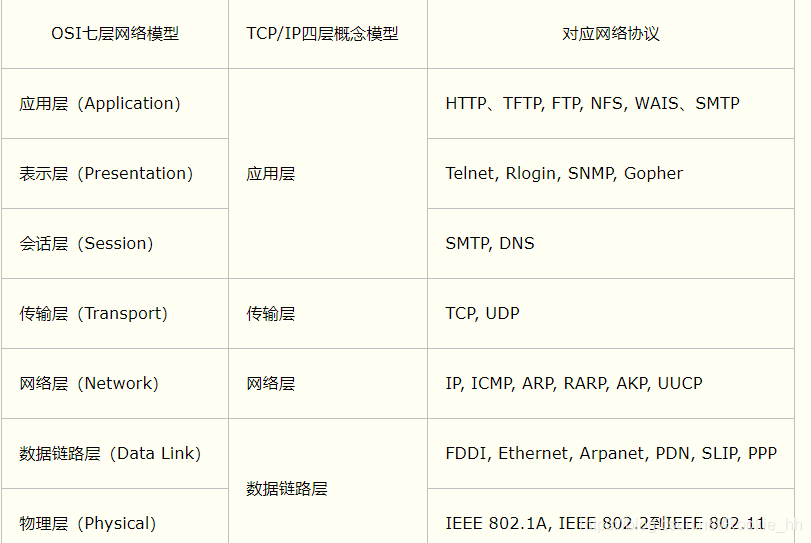
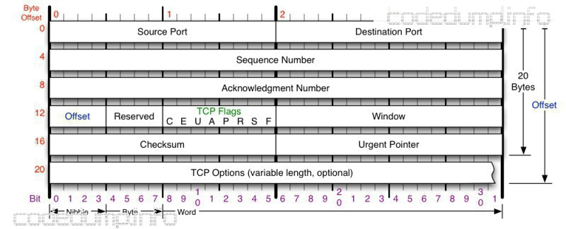
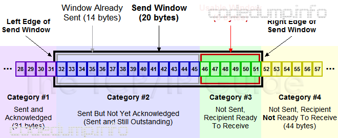
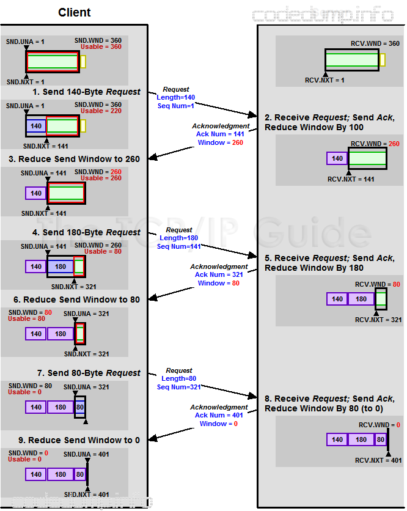
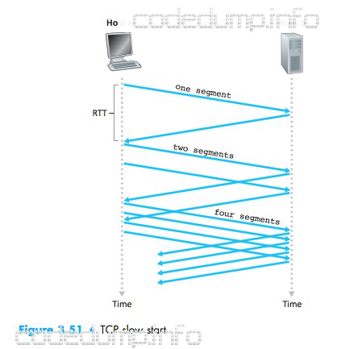

#OSI七层和TCP四层



# TCP

##TCP状态转移


## TCP协议格式



- 端口号：tcp使用端口号来标记目标和源端口，tcp头中并没有ip地址信息，根据前面的tcp/ip模型，ip地址这是三层做的事情。
- 序号（Sequence Number）：用于对tcp字节流进行编号，以解决网络包乱序问题。
- 确认号（Acknowledgement Number）：用于确认接收到的报文段序号，用来解决丢包问题。
- 窗口：用于通知对端接收窗口大小，用于解决流控问题。
- TCP标志位，用于控制TCP协议状态机的，包括以下几个：
  - ACK：只有这个标志位置位时，前面的确认号字段才有效。
  - SYN：在连接建立时用来同步序号。当 SYN=1，ACK=0 时表示这是一个连接请求报文段。若对方同意建立连接，则响应报文中 SYN=1，ACK=1。
  - FIN：用来释放一个连接，当 FIN=1 时，表示此报文段的发送方的数据已发送完毕，并要求释放连接。
  - RST：重置连接，比如向一个不存在监听服务的端口发请求时，就会收到RST包。
- TCP选项：这部分可选，不属于TCP头部必然存在的部分。
  - MSS（Maximum Segment Size，最大报文长度）：MSS选项用于在TCP连接建立时，收发双方协商通信时每一个报文段所能承载的最大数据长度。为了达到最佳的传输效能，TCP协议在建立连接的时候通常要协商双方的MSS值，这个值TCP协议在实现的时候往往用MTU值代替（需要减去IP数据包包头的大小20Bytes和TCP数据段的包头20Bytes）所以一般MSS值1460。

## 三次握手

  1.客户端发起第一次握手(SYN=1, seq=x)

  2.服务器端发起第二次握手(SYN=1, seq=y, ACKnum=x+1)

  3.客户端发起第三次握手(ACKnum=y+1)

**为什么不是两次握手？**

```
  #rfc 793
  The principle reason for the three-way handshake is to prevent old
  duplicate connection initiations from causing confusion.  To deal with
  this, a special control message, reset, has been devised.  If the
  receiving TCP is in a  non-synchronized state (i.e., SYN-SENT,
  SYN-RECEIVED), it returns to LISTEN on receiving an acceptable reset.
```

如果你细读[RFC793](https://link.zhihu.com/?target=https%3A//www.ietf.org/rfc/rfc793.txt)，也就是 TCP 的协议 RFC，你就会发现里面就讲到了为什么三次握手是必须的——TCP 需要 seq [序列号](https://www.zhihu.com/search?q=序列号&search_source=Entity&hybrid_search_source=Entity&hybrid_search_extra={"sourceType"%3A"answer"%2C"sourceId"%3A573627478})来做可靠重传或接收。仅仅两次握手，回复一个ACK就可以建立连接,要是首次发起的syn报文在网络延迟，而服务端已经收到了重发的报文，这个延迟的报文再次到来，又会建立一个无用的连接

##四次挥手

1. 想要拆除连接的一方A发送FIN报文，自身进入到FIN_WAIT_1状态；
2. 被拆除连接的一方B接收到FIN报文，发ACK，自身进入到CLOSE_WAIT状态；
3. A收到ACK，进入FIN_WAIT_2状态;
4. B发送FIN，自身进入LAST_ACK状态；
5. A收到FIN，发送ACK，自身进入TIME_WAIT状态；
6. B收到ACK报文，B上的这个socket关闭，端口释放；
7. A等待2MSL后socket关闭，释放端口。

**为什么四次挥手？**

由于TCP连接是全双工的，因此每个方向都必须单独进行关闭。这原则是当一方完成它的数据发送任务后就能发送一个FIN来终止这个方向的连接。收到一个 FIN只意味着这一方向上没有数据流动，一个TCP连接在收到一个FIN后仍能发送数据。首先进行关闭的一方将执行主动关闭，而另一方执行被动关闭。

## 同时打开关闭


## 2MSL等待状态

TIME_WAIT状态也称为2 MSL等待状态。每个具体 TCP实现必须选择一个报文段最大生存时间MSL（Maximum Segment Lifetime）。它是任何报文段被丢弃前在网络内的最长时间。 我们知道这个时间是有限的，因为TCP报文段以IP数据报在网络内传输，而IP数据报则有限制 其生存时间的TTL字段。

```
TIME_WAIT状态的作用主要有两个：

1.避免拆链报文在链路中丢失造成连接关闭异常：在第6步，B没有收到ACK报文的时候会认为A没有收到FIN包，进而会重传第4步的FIN，如果这个时候没有TIME_WAIT状态，A侧socket已经关闭，A会针对B发送的FIN包响应RST，有可能导致B连接异常。
2.避免乱序到来的业务报文在新生成的socket连接中引发混乱：假设在拆链前有TCP报文由于中间网络传输原因导致在第7步完成之后才到达，如果没有TIME_WAIT状态而A和B又使用同样的4元组新建了一个新的socket，那么迷路的数据包就会进入到新的socket中进行处理，可能导致业务异常。
```


 T C P连接在2 M S L等待期间，定义这个连接的插口 （客户的I P地址和端口号，服务器的 I P地址和端口号）不能再被使用。这个连接只能在 2 M S L 结束后才能再被使用。

## TCP和UDP的区别

```
1.TCP是面向连接的传输协议，传输数据之前必须先建立好连接。UDP是属于无连接的传输协议
2.TCP是点对点的两点之间的服务，一条TCP连接只能有两个端点,UDP支持一对一、一对多、多对一、多对多的交互通信
3.TCP是可靠的传输协议，进行的是可靠交付，即无差错、不丢失、不重复、按序到达等.UDP是不可靠的传输协议，只是尽最大努力交付，不能保证可靠交付
4.TCP有拥塞控制和流量控制保证数据传输的安全性。UDP没有拥塞控制，当网络拥塞时不会影响源主机的发送效率
5.TCP首部开销大，因为首部就占了20个字节。UDP首部开销相对小一点，只占了8个字节。 （eg: UDP的8个字节分布在：源端口、目的端口、数据长度、校验和）
```

##粘包

当时短连接的情况下，不用考虑粘包的情况
如果发送数据无结构，如文件传输，这样发送方只管发送，接收方只管接收存储就ok，也不用考虑粘包
如果双方建立长连接，需要在连接后一段时间内发送不同结构数据
发送端给每个数据包添加包首部，首部中应该至少包含数据包的长度，这样接收端在接收到数据后，通过读取包首部的长度字段，便知道每一个数据包的实际长度了。
发送端将每个数据包封装为固定长度（不够的可以通过补0填充），这样接收端每次从接收缓冲区中读取固定长度的数据就自然而然的把每个数据包拆分开来。
可以在数据包之间设置边界，如添加特殊符号，这样，接收端通过这个边界就可以将不同的数据包拆分开。
等等。

## 数据分段和分片

我们知道网络就像一根管子，而管子吧，就会有粗细。

一个数据包想从管子的一端到另一端，得过这个管子。*（废话）*

但数据包的量**有大有小**，想过管子，数据包不能大于这根管子的粗细。

问题来了，数据包过大时怎么办？

答案比较简单。会把数据包切分小块。这样数据就可以由大变小，顺利传输。


## TCP超时重传

TCP在发送数据时会设置一个计时器，超时重传定时器是TCP连接可靠性的重要保证，其工作原理为TCP连接在发送某一个数据报文或者SYN报文后，该连接就会启动一个定时器，在规定时间内如果没有收到对端回复的ACK报文，那么定时器超时处理函数就重新发送数据，直到发送成功或者达到最大重传次数而上报错误为止。

另一种方式的重传称为快速重传，若TCP累计确认无法返回新的ACK，或者当ACK包含的选择确认信息(SACK)表明出现失序报文段时，快速重传会推断丢包


##流量控制

TCP为它的应用程序提供了流量控制服务（flow control service），以消除发送方使接收方数据溢出的可能性。

流量控制因此是一种速度匹配服务，即发送方的发送速率与接收方应用程序的读取速率相匹配。

另一种控制发送方速度的方式是拥塞控制（congestion control），但是这两者是不同的：

- 流量控制基于对端的窗口大小来调整发送方的发送速度。
- 拥塞控制基于IP网络的速度来调整发送方的发送策略。

下一节分析拥塞控制，这一节分析流量控制。

TCP让发送方维持一个接收窗口（receive window）的变量来提供流量控制。接收窗口用于给发送方一个提示，该接收方还有多少可用的缓存空间。因为TCP是全双工通信，因此在连接两端都各自维护一个接收窗口，通过TCP头的window字段来通知对方本方的接收窗口大小。

### 滑动窗口

client和server两端都有自己的协议栈buffer，传输时不可能一直无限量的传输数据下去。此时如何让对端知道自己最多能接收多少数据呢？通过TCP协议头中的window字段来通知对端自己当前的接收窗口大小。

从以上可以看出，TCP协议通过TCP头部的window字段来解决流量控制问题。



如上图中，分成了四个部分，其中黑色框住的部分是滑动窗口：

- \#1：表示已收到ack报文确认的数据。
- \#2：发送出去但是还没有收到对端ACK确认的数据。
- \#3：还没有发送出去的数据。
- \#4：窗口以外的数据。


当收到对端确认一部分数据的ACK之后，滑动窗口将向右边移动，如下图中，收到36的ACK，并且发出了46-51字节的数据之后，滑动窗口变化成了：



## 拥塞控制

- 为何要进行拥塞控制？

  假设主机A给主机B传输数据。

  我们知道，两台主机在传输数据包的时候，如果发送方迟迟没有收到接收方反馈的ACK，那么发送方就会认为它发送的数据包丢失了，进而会重新传输这个丢失的数据包。

  然而实际情况有可能此时有太多主机正在使用信道资源，导致**网络拥塞**了，而A发送的数据包被堵在了半路，迟迟没有到达B。这个时候A误认为是发生了丢包情况，会重新传输这个数据包。

  结果就是不仅浪费了信道资源，还会使网络更加拥塞。因此，我们需要进行**拥塞控制**。 

TCP所采用的方法是让每一个发送方根据所感知的网络拥塞程度来限制其能向连接发送流量的速率。这种方法提出了三个问题：

- 一个TCP发送方如何限制它向其连接发送流量的速率？
- 一个TCP发送方如何感知从它到目的地之间的路径上存在拥塞呢？
- 当发送方感受到端到端之间的拥塞时，采用何种算法来改变其发送速率呢？

首先分析TCP发送方如何限制向起连接发送流量的。在发送方的拥塞控制机制中再维护一个变量，即cwnd（congestion window，拥塞窗口），通过它对一个TCP发送方能向网络发送的流量速率进行限制。即：一个发送方中未被确认的数据量不会超过cwnd与rwnd中的最小值：

```
  LastByteSent - LastBtyeAcked <= min(cwnd, rwnd)
```

接下来讨论如何感知出现了拥塞的。我们将一个TCP发送方的“丢包事件”定义为：要么出现超时，要么收到来自接收方的3次冗余ACK（duplicate ACK）。

拥塞控制有以下几个常用的手段：慢启动、拥塞避免、快速恢复。其中慢启动和拥塞避免是TCP的强制部分，两者的差异在于对收到ACK做出反应时增加cwnd的方式，而快速恢复则是推荐部分，对TCP发送方并非是必需的。

###慢启动（slow start）算法

慢启动算法的思想是：刚建立的连接，根据对端的应答情况慢慢提速，不要一下子发送大量的数据。

慢启动算法维护一个cwnd拥塞窗口（Congestion Window）变量，以及一个慢启动阈值变量ssthresh（slow start threshold），算法的逻辑是：

- 连接建立好之后，cwnd初始为1，表示可以传一个MSS《MSS--最大报文段长度（数据字段的最大长度大小）》的数据。
- 在每收到一个对新的报文段的确认后，将拥塞窗口x2。
- 当cwnd>=ssthresh，拥塞控制算法进入后面将介绍到的“拥塞避免”阶段。

可以看到，慢启动算法通过对对端应答报文的RTT时间探测，来修改cwnd值。而这个修改，在不超过ssthresh的情况下，是指数增长的。



何时结束这种指数增长呢？有如下三种情况：

- 如果存在一个由超时指示的丢包事件（即拥塞），TCP发送方将cwnd设置为1并重新开始慢启动过程，此时还会将ssthresh设置为cwnd/2。
- 当cwnd>=ssthresh，进入后面介绍的“拥塞避免”阶段。
- 如果检测到三个冗余ACK（duplicate ACK），这时TCP进入快速重转并进入快速恢复状态。


###拥塞避免（ Congestion Avoidance）算法

当cwnd>=ssthresh，进入拥塞避免阶段，此时cwnd的增长不再像之前那样是指数增长，而是线性增长。

- 收到一个ACK时，cwnd = cwnd + 1/cwnd。
- 当每过一个RTT时，cwnd = cwnd + 1。

###拥塞状态的算法

TCP拥塞控制认为网络丢包是由于网络拥塞造成的，有如下两种判定丢包的方式：

- 上面提到过的超时重传。
- 收到三个重复确认ACK包（duplicate ACK）。

超时重传的原理，在上面也简单提到过：在发送一个TCP报文之后，会启动一个计时器，该计时器的超时时间是根据之前预估的几个往返时间RTT相关的参数计算得到的，如果再这个计时器超时之前都没有收到对端的应答，那么就需要重传这个报文。

而如果发送端收到三个以上的重复ACK时，就认为数据已经丢失需要重传，此时会立即重传数据而不是等待前面的超时重传定时器超时，所以被称为“快速重传”。

最早的TCP Tohoe算法是这么处理拥塞状态的，当出现丢包时：

- 将慢启动阈值ssthresh变成当前cwnd的一半，即：ssthresh = cwnd / 2。
- cwnd = 1，从而直接回到原来的慢启动状态。

但是由于这个算法过于激进，每次一出现丢包cwnd就变成1，因此后来的TCP Reno算法进行了优化，其优化点在于，在收到三个重复确认ACK时，TCP开启快速重传Fast Retransmit算法：

- cwnd变成现在的一半，即：cwnd = cwnd / 2。
- ssthresh设置为缩小后的cwnd大小。
- 进入快速恢复阶段。

以下图来解释上面三种状态的处理：


上图中，横轴为传输轮次，纵轴为cwnd大小，按照时间顺序，其过程如下：

- 0-4：为慢启动阶段，在这个时间里，cwnd指数级增长，到时间4时等于初始的ssthresh值，此时进入拥塞避免状态。
- 4-12：为拥塞避免状态，此时cwnd值线性增长。
- 12：在时间点12，收到了三个重复ACK值，此时两个不同的拥塞控制算法的处理不同：
  - TCP Tohoe算法：图中的点线部分，在时间点12，直接将cwnd变成1进入慢启动阶段，这个算法已经废弃。
  - TCP Reno算法：cwnd变成原来的一半，ssthresh变成最新的cwnd值使用快速恢复算法。

这里提到了TCP Reno算法在收到三个重复ACK时，cwnd变成原来的一半并且使用快速恢复算法来处理拥塞，下面就接着分析快速恢复算法。

###快速恢复（fast recovery）

在进入快速恢复以前，TCP 如下的事情：

- cwnd = cwnd / 2，即变成原来的一半。
- ssthresh = cwnd，即ssthresh变成新的cwnd值。

快速恢复算法的逻辑如下：

- cwnd = cwnd + 3 MSS，加3 MSS的原因是因为收到3个重复的ACK。
- 重传重复ACK（duplicate ACK）指定的数据包。
- 如果再收到重复ACK，cwnd递增1。
- 如果收到新的ACK，表明重传的报文已经收到。此时将cwnd设置为ssthresh值，进入拥塞避免状态。

[

如上图中：发送端的第五个包丢失，导致发送端收到三个重复的针对第五个包的ACK。此时将ssthresh值设置为当时cwnd的一半，即6/2=3，而cwnd设置为3+3=6。然后重传第五个包。当收到最新的ACK时，即ACK 11，此时将cnwd设置为当前的ssthresh，即3，然后退出快速恢复而进入拥塞避免状态。

###拥塞控制算法的有限状态机

有了前面的解释，理解TCP拥塞控制算法的FSM就容易了：


下面对以上FSM进行简单的总结，每个状态转换箭头都做了数字标记，以数字标记为序来分别做解释：

1. 这是拥塞控制算法的初始状态：
   - cwnd = 1 MSS
   - ssthresh = 64KB
   - dupACKCount（重复ACK数量） = 0
   - 此时进入慢启动状态。
2. 慢启动状态下重传超时，则几个拥塞控制算法变量变为：
   - ssthresh = cwnd / 2
   - cwnd = 1 MSS
   - dupACKCount = 0
   - 同时重传丢失的报文段。
3. 收到重复ACK时，递增dupACKCount数量。
4. 当收到的重复ACK数量为3时，进入快速恢复状态：
   - ssthresh = cwnd / 2
   - cwnd = ssthresh + 3 MSS
   - 同时重传丢失的报文段。
5. 在慢启动状态下收到了新的ACK时，每收到一个ACK则递增cwnd一个MSS，即“指数增长”：
   - cwnd = cwnd + MSS
   - dupACKCount = 0
   - 继续传输新的报文。
6. 在慢启动状态下，cwnd>=ssthresh值时，进入拥塞避免状态：
7. 慢启动状态下，每次收到一个ACK报文时，加法递增：
   - cwnd = cwnd + MSS * (MSS/cwnd)
   - dupACKCount = 0
   - 继续传输新的报文
8. 收到重复ACK时，递增dupACKCount数量。
9. 当收到的重复ACK数量为3时，进入快速恢复状态，注意这里的处理跟慢启动状态下收到三个重复ACK的处理是一致的（见状态4）：
   - ssthresh = cwnd / 2
   - cwnd = ssthresh + 3 MSS
   - 同时重传丢失的报文段。
10. 快速恢复状态下，收到重复ACK时：
    - cwnd = cwnd + MSS
    - 传输新的报文段。
11. 快速恢复状态下重传超时，则几个拥塞控制算法变量变为：
    - ssthresh = cwnd / 2
    - cwnd = 1
    - dupACKCount = 0
    - 同时重传丢失的报文段。
12. 在快速恢复状态下收到了新的ACK时：
    - cwnd = ssthresh
    - dupACKCount = 0

## shuntdown()和close()

- int close(int sockfd)

这个函数很简单，对已连接的套接字执行 close 操作就可以，若成功则为 0，若出错则为 -1。

这个函数会对套接字引用计数减一，**一旦发现套接字引用计数到 0，就会对套接字进行彻底释放，并且会关闭 TCP 两个方向(接收、发送)的数据流。**


默认情况下，close()/closesocket() 会立即向网络中发送FIN包，不管输出缓冲区中是否还有数据，而shutdown() 会等输出缓冲区中的数据传输完毕再发送FIN包。也就意味着，close()/closesocket() 将丢失输出缓冲区中的数据，而调用 shutdown() 不会。

##长连接和短连接

```
长连接，指在一个TCP连接上可以连续发送多个数据包，在TCP连接保持期间，如果没有数据包发送，需要双方发检测包以维持此连接，一般需要自己做在线维持（不发生RST包和四次挥手）。  

连接→数据传输→保持连接(心跳)→数据传输→保持连接(心跳)→……→关闭连接（一个TCP连接通道多个读写通信）； 
这就要求长连接在没有数据通信时，定时发送数据包(心跳)，以维持连接状态；

TCP保活功能，保活功能主要为服务器应用提供，服务器应用希望知道客户主机是否崩溃，从而可以代表客户使用资源。如果客户已经消失，使得服务器上保留一个半开放的连接，而服务器又在等待来自客户端的数据，则服务器将应远等待客户端的数据，保活功能就是试图在服务器端检测到这种半开放的连接。

```

```
短连接是指通信双方有数据交互时，就建立一个TCP连接，数据发送完成后，则断开此TCP连接（管理起来比较简单，存在的连接都是有用的连接，不需要额外的控制手段）；

连接→数据传输→关闭连接；
```

长连接多用于操作频繁（读写），点对点的通讯，而且连接数不能太多的情况。每个TCP连接都需要三步握手，这需要时间，如果每个操作都是先连接，再操作的话那么处理速度会降低很多，所以每个操作完后都不断开，次处理时直接发送数据包就OK了，不用建立TCP连接。例如：数据库的连接用长连接， 如果用短连接频繁的通信会造成socket错误，而且频繁的socket 创建也是对资源的浪费。

   而像WEB网站的http服务一般都用短链接（http1.0只支持短连接，1.1keep alive 带时间，操作次数限制的长连接），因为长连接对于服务端来说会耗费一定的资源，而像WEB网站这么频繁的成千上万甚至上亿客户端的连接用短连接会更省一些资源，如果用长连接，而且同时有成千上万的用户，如果每个用户都占用一个连接的话，那可想而知吧。所以并发量大，但每个用户无需频繁操作情况下需用短连好；

## Nagle算法

TCP/IP协议中，无论发送多少数据，总是要在数据前面加上协议头，同时，对方接收到数据，也需要发送ACK表示确认。为了尽可能的利用网络带宽，TCP总是希望尽可能的发送足够大的数据。

Nagle算法就是为了尽可能发送大块数据，避免网络中充斥着许多小数据块。

Nagle算法的基本定义是**任意时刻，最多只能有一个未被确认的小段。** 所谓“小段”，指的是小于MSS尺寸的数据块，所谓“未被确认”，是指一个数据块发送出去后，没有收到对方发送的ACK确认该数据已收到。

举个例子，一开始client端调用socket的write操作将一个int型数据(称为A块)写入到网络中，由于此时连接是空闲的（也就是说还没有未被确认的小段），因此这个int型数据会被马上发送到server端，接着，client端又调用write操作写入‘/r/n’（简称B块），这个时候，A块的ACK没有返回，所以可以认为已经存在了一个未被确认的小段，所以B块没有立即被发送，一直等待A块的ACK收到（大概40ms之后），B块才被发送。整个过程如图所示：


这里还隐藏了一个问题，就是A块数据的ACK为什么40ms之后才收到？这是因为TCP/IP中不仅仅有nagle算法，还有一个**ACK延迟机制**(需要在服务器设置开启) 。当Server端收到数据之后，它并不会马上向client端发送ACK，而是会将ACK的发送延迟一段时间（假设为t），它希望在t时间内server端会向client端发送应答数据，这样ACK就能够和应答数据一起发送，就像是应答数据捎带着ACK过去。在我之前的时间中，t大概就是40ms。这就解释了为什么'/r/n'(B块)总是在A块之后40ms才发出。

如果你觉着nagle算法太捣乱了，那么可以通过**设置TCP_NODELAY将其禁用** 。当然，更合理的方案还是**应该使用一次大数据的写操作，而不是多次小数据的写操作。**

## 延迟确认

接收方在收到数据后，并不会立即回复ACK,而是延迟一定时间。一般ACK延迟发送的时间为200ms，但这个200ms并非收到数据后需要延迟的时间。系统有一个固定的定时器每隔200ms会来检查是否需要发送ACK包。这样做有两个目的。
1、这样做的目的是ACK是可以合并的，也就是指如果连续收到两个TCP包，并不一定需要ACK两次，只要回复最终的ACK就可以了，可以降低网络流量。
2、如果接收方有数据要发送，那么就会在发送数据的TCP数据包里，带上ACK信息。这样做，可以避免大量的ACK以一个单独的TCP包发送，减少了网络流量。

```c++
 setsockopt(fd, IPPROTO_TCP, TCP_QUICKACK, (int[]){1}, sizeof(int))
```


# DNS

DNS 的全称是 Domain Name System 或者 Domain Name Service，它主要的作用就是将人们所熟悉的网址 (域名) “翻译”成电脑可以理解的 IP 地址，这个过程叫做 DNS 域名解析。

DNS占用udp和tcp的53端口，一般来说，DNS在区域传输的时候使用TCP协议，其他时候使用UDP协议。

## 输入url后的解析过程

```
1.根据域名，进行DNS域名解析；
2.拿到解析的IP地址，建立TCP连接；
3.向IP地址，发送HTTP请求；
4.服务器处理请求；
5.返回响应结果；
6.关闭TCP连接；
7.浏览器解析HTML；
8.浏览器布局渲染；
```

# HTTP和HTTPS

## HTTP基础概念

http的中文叫做超文本传输协议,它负责完成客户端到服务端的一系列操作,是专门用来传输注入HTML的超媒体文档等web内容的协议,它是基于传输层的TCP协议的应用层协议


请求和响应报文：客户端发送一个请求报文给服务器，服务器根据请求报文中的信息进行处理，并将处理结果放入响应报文中返回给客户端。

请求报文结构：

- 第一行是包含了请求方法、URL、协议版本；
- 接下来的多行都是请求首部 Header，每个首部都有一个首部名称，以及对应的值。
- 一个空行用来分隔首部和内容主体 Body
- 最后是请求的内容主体


响应报文结构：

- 第一行包含协议版本、状态码以及描述，最常见的是 200 OK 表示请求成功了
- 接下来多行也是首部内容
- 一个空行分隔首部和内容主体
- 最后是响应的内容主体


URL

HTTP 使用 URL（ **U** niform **R**esource **L**ocator，统一资源定位符）来定位资源


GET-获取资源

HEAD-获取报文首部，和GET类似，但不返回报文主体部分用于确认URL有效性

POST-主要用来传输数据

https:https是基于安全套接字的http协议,也可以理解为是http+ssl/tls(数字证书)的组合


状态码

| 状态码 | 类别                             | 含义                       |
| ------ | -------------------------------- | -------------------------- |
| 1XX    | Informational（信息性状态码）    | 接收的请求正在处理         |
| 2XX    | Success（成功状态码）            | 请求正常处理完毕           |
| 3XX    | Redirection（重定向状态码）      | 需要进行附加操作以完成请求 |
| 4XX    | Client Error（客户端错误状态码） | 服务器无法处理请求         |
| 5XX    | Server Error（服务器错误状态码） | 服务器处理请求出错         |


长连接与短连接

当浏览器访问一个包含多张图片的 HTML 页面时，除了请求访问的 HTML 页面资源，还会请求图片资源。如果每进行一次 HTTP 通信就要新建一个 TCP 连接，那么开销会很大。

长连接只需要建立一次 TCP 连接就能进行多次 HTTP 通信。

- 从 HTTP/1.1 开始默认是长连接的，如果要断开连接，需要由客户端或者服务器端提出断开，使用 `Connection : close`；
- 在 HTTP/1.1 之前默认是短连接的，如果需要使用长连接，则使用 `Connection : Keep-Alive`。


##COOKIE

HTTP 协议是**无状态**的，所以请求之间是没有任何关系的，想要把这些请求联系起来，需要一些工具。HTTP/1.1 引入 Cookie 来保存状态信息。

Cookie 是服务器发送到用户浏览器并保存在本地的一小块数据，它会在浏览器之后向同一服务器再次发起请求时被携带上，用于告知服务端两个请求是否来自同一浏览器。由于之后每次请求都会需要携带 Cookie 数据，因此会带来额外的性能开销（尤其是在移动环境下）。

Cookie 曾一度用于客户端数据的存储，因为当时并没有其它合适的存储办法而作为唯一的存储手段，但现在随着现代浏览器开始支持各种各样的存储方式，Cookie 渐渐被淘汰。新的浏览器 API 已经允许开发者直接将数据存储到本地，如使用 Web storage API（本地存储和会话存储）或 IndexedDB。

### cookie用途

- 会话状态管理（用户登录状态、购物车、游戏分数等需要记录的信息
- 个性化设置（用户自定义设置
- 浏览器行为追踪（跟踪分析用户行为

### cookie创建

服务器发送的响应报文包含 Set-Cookie 首部字段，客户端得到响应报文后把 Cookie 内容保存到浏览器中。

```
HTTP/1.0 200 OK
Content-type: text/html
Set-Cookie: yummy_cookie=choco
Set-Cookie: tasty_cookie=strawberry

[page content]
```

客户端之后对同一个服务器发送请求时，会从浏览器中取出 Cookie 信息并通过 Cookie 请求首部字段发送给服务器。

```
GET /sample_page.html HTTP/1.1
Host: www.example.org
Cookie: yummy_cookie=choco; tasty_cookie=strawberry
```

###cookie分类

- 会话期 Cookie：浏览器关闭之后它会被自动删除，也就是说它仅在会话期内有效。
- 持久性 Cookie：指定过期时间（Expires）或有效期（max-age）之后就成为了持久性的 Cookie。

```
Set-Cookie: id=a3fWa; Expires=Wed, 21 Oct 2015 07:28:00 GMT;
```

```

http和https的区别:
HTTP的URL以 http://开头，而 HTTPS 的 URL 以 https:// 开头
HTTP是不安全的，而HTTPS是安全的
HTTP标准端口是 80 ，而HTTPS的标准端口是 443
在OSI网络模型中，HTTPS的加密是在传输层完成的,因为SSL是位于传输层的,TLS的前身是SSL,所以同理
HTTP无需认证证书,而https需要认证证书 
```

## Session

### Session对象

Session对象存储特定用户会话所需的属性及配置信息。这样，当用户在应用程序的Web页之间跳转时，存储在Session对象中的变量将不会丢失，而是在整个用户会话中一直存在下去。当用户请求来自应用程序的 Web页时，如果该用户还没有会话，则Web服务器将自动创建一个 Session对象。当会话过期或被放弃后，服务器将终止该会话。

### Session用途

- session存储于服务器，可以理解为一个状态列表，拥有一个唯一识别符号sessionId，通常存放于cookie中。服务器收到cookie后解析出sessionId，再去session列表中查找，才能找到相应session。依赖cookie

- cookie类似一个令牌，装有sessionId，存储在客户端，浏览器通常会自动添加。

### Session方案

先进的企业级或者大型的网站平台，都是分布式结构，分布式的好处是通过nginx分发请求，让多个服务器各自处理请求，来减少单一服务器的压力，并且提高执行效率。

在这个分布式结构下，如果不用共享session的话，就会出现问题。当一个客户端发送一个请求（无session），通过nginx将第一次请求分发给服务器1，服务器判断无session，就让那个客户进行登录操作，并得到响应，此时客户端会存储一个来自服务器1响应的session，并存储在客户端。

当客户端发送第二次请求的时候，此时本次请求已经携带了session（跳过登录），nginx却将请求分发给服务器2，因为服务器2中没有session，所以无法与客户端session进行对应。所以程序会出现异常或是报错，无法正常响应。
解决方法 ： session + redis 实现session 共享

why？

- session的访问比较频繁，对性能的要求极高
- session可不考虑断电丢失的数据问题
- session的数据量不会太大

## HTTPS基础概念

HTTP 有以下安全性问题：

- 使用明文进行通信，内容可能会被窃听；
- 不验证通信方的身份，通信方的身份有可能遭遇伪装；
- 无法证明报文的完整性，报文有可能遭篡改。

HTTPS 并不是新协议，而是让 HTTP 先和 SSL（Secure Sockets Layer）通信，再由 SSL 和 TCP 通信，也就是说 HTTPS 使用了隧道进行通信。

通过使用 SSL，HTTPS 具有了加密（防窃听）、认证（防伪装）和完整性保护（防篡改）。


###加密

1.对称密钥加密

对称密钥加密（Symmetric-Key Encryption），加密和解密使用同一密钥。

- 优点：运算速度快；
- 缺点：无法安全地将密钥传输给通信方。


2.非对称密钥加密

非对称密钥加密，又称公开密钥加密（Public-Key Encryption），加密和解密使用不同的密钥。

公开密钥所有人都可以获得，通信发送方获得接收方的公开密钥之后，就可以使用公开密钥进行加密，接收方收到通信内容后使用私有密钥解密。

非对称密钥除了用来加密，还可以用来进行签名。因为私有密钥无法被其他人获取，因此通信发送方使用其私有密钥进行签名，通信接收方使用发送方的公开密钥对签名进行解密，就能判断这个签名是否正确。

- 优点：可以更安全地将公开密钥传输给通信发送方；
- 缺点：运算速度慢。
- 

3.HTTPS采用的加密方式

上面提到对称密钥加密方式的传输效率更高，但是无法安全地将密钥 Secret Key 传输给通信方。而非对称密钥加密方式可以保证传输的安全性，因此我们可以利用非对称密钥加密方式将 Secret Key 传输给通信方。HTTPS 采用混合的加密机制，正是利用了上面提到的方案：

- 使用非对称密钥加密方式，传输对称密钥加密方式所需要的 Secret Key，从而保证安全性;
- 获取到 Secret Key 后，再使用对称密钥加密方式进行通信，从而保证效率。（下图中的 Session Key 就是 Secret Key）


### 认证

通过使用 **证书** 来对通信方进行认证。

数字证书认证机构（CA，Certificate Authority）是客户端与服务器双方都可信赖的第三方机构。

服务器的运营人员向 CA 提出公开密钥的申请，CA 在判明提出申请者的身份之后，会对已申请的公开密钥做数字签名，然后分配这个已签名的公开密钥，并将该公开密钥放入公开密钥证书后绑定在一起。

进行 HTTPS 通信时，服务器会把证书发送给客户端。客户端取得其中的公开密钥之后，先**使用数字签名进行验证**，如果验证通过，就可以开始通信了。

```
HTTPS工作原理
1.服务端给客户端传输证书,这个证书就是公钥,包含证书的办法机构,证书的过期时间等信息
2.客户端进行证书的解析,如验证机构,过期时间,如果发现没有任何问题,就生成一个随机值(私钥),然后用证书对这个私钥进行加密,并发送给服务端
3.服务端使用私钥将这个信息进行解密,得到客户端的私钥,然后客户端和服务端就可以通过这个私钥进行通信
4.服务端将消息进行对称加密(消息和私钥进行混合,),服务端将进行对称加密后的消息进行传送，客户端使用私钥进行信息的解密
```

### 完整性保护

SSL 提供报文摘要功能来进行完整性保护。

HTTP 也提供了 MD5 报文摘要功能，但不是安全的。例如报文内容被篡改之后，同时重新计算 MD5 的值，通信接收方是无法意识到发生了篡改。

HTTPS 的报文摘要功能之所以安全，是因为它结合了加密和认证这两个操作。试想一下，加密之后的报文，遭到篡改之后，也很难重新计算报文摘要，因为无法轻易获取明文。

##Get与Post的区别

- GET 用于获取资源，而 POST 用于传输实体主体。


- GET 和 POST 的请求都能使用额外的参数，但是 GET 的参数是以查询字符串出现在 URL 中，而 POST 的参数存储在实体主体中。不能因为 POST 参数存储在实体主体中就认为它的安全性更高，因为照样可以通过一些抓包工具（Fiddler）查看。
- 安全的 HTTP 方法不会改变服务器状态，也就是说它只是可读的。GET 方法是安全的，而 POST 却不是，因为 POST 的目的是传送实体主体内容，这个内容可能是用户上传的表单数据，上传成功之后，服务器可能把这个数据存储到数据库中，因此状态也就发生了改变。
- 幂等性：同样的请求被执行一次与连续执行多次的效果是一样的，服务器的状态也是一样的。换句话说就是，幂等方法不应该具有副作用（统计用途除外）。所有的安全方法也都是幂等的。在正确实现的条件下，GET，HEAD，PUT 和 DELETE 等方法都是幂等的，而 POST 方法不是。

```
1) get参数通过url传递，post放在request body中。

2) get请求在url中传递的参数是有长度限制的，而post没有。

3) get比post更不安全，因为参数直接暴露在url中，所以不能用来传递敏感信息。

4) get请求只能进行url编码，而post支持多种编码方式

5) get请求会浏览器主动cache，而post支持多种编码方式。

6) get请求参数会被完整保留在浏览历史记录里，而post中的参数不会被保留。
```


##常用的HTTP方法

```
GET 从服务器获得资源

POST 客户端向服务器提交资源

PUT 修改服务器相关资源

DELETE 删除服务器相关资源
```

## HTTP状态码

```
2xx : 代表服务端已经成功接收并处理了该请求
200:服务端成功接收了该请求并进行了处理,请求所需要的数据应该伴随这次请求对应的响应返回给客户端
202:服务端已经成功接收了请求,但是并未进行处理
3xx : 通常代表客户端需要进行进一步请求用,常用来进行重定向的状态码
301: 客户端请求的资源已经永久移动到别的位置,服务端会自动将该请求重定向到新的位置
4xx : 通常表示客户端请求有问题
401 : 需要用户进行登录
403 : 服务端收到请求,但是拒绝进行处理
404 : 访问的资源不存在
5xx : 通常表示服务端内部错误
500 : 服务端代码出错
502 : 作为网关或者代理工作的服务器尝试执行请求时，从上游服务器接收到无效的响应
503:  服务器正在维护或者访问过载,过一段时间可能恢复正常
504 : 作为网关或者代理工作的服务器尝试执行请求时，未能及时从上游服务器（URI标识出的服务器，例如HTTP、FTP、LDAP）或者辅助服务器（例如DNS）收到响应 
```

# Linux网络核心堆栈

## netfilter

Netfilter是Linux 2.4内核的一个子系统，Netfiler使得诸如数据包过滤、网络地址转换(NAT)以及网络连接跟踪等技巧成为可能，这些功能仅通过使用内核网络代码提供的各式各样的hook既可以完成。这些hook位于内核代码中，要么是静态链接的，要么是以动态加载的模块的形式存在。可以为指定的网络事件注册相应的回调函数，数据包的接收就是这样一个例子。


# 杂项

## socket

1.阻塞和非阻塞

无论是 Windows 还是 Linux 平台，默认创建的 socket 都是阻塞模式的。

在 Linux 平台上，我们可以使用**fcntl() 函数**或**ioctl() 函数**给创建的 socket 增加**O_NONBLOCK**标志来将 socket 设置成非阻塞模式。

send 函数本质上并不是往网络上发送数据，而是将应用层发送缓冲区的数据拷贝到内核缓冲区（下文为了叙述方便，我们以“网卡缓冲区”代指）中去，至于什么时候数据会从网卡缓冲区中真正地发到网络中去要根据 TCP/IP 协议栈的行为来确定，这种行为涉及到一个叫 nagel 算法和 TCP_NODELAY 的 socket 选项，我们将在《**nagle算法与 TCP_NODELAY**》章节详细介绍。

recv 函数本质上也并不是从网络上收取数据，而只是将内核缓冲区中的数据拷贝到应用程序的缓冲区中，当然拷贝完成以后会将内核缓冲区中该部分数据移除。

1.对于读写socket

当 connfd 或 clientfd 设置成阻塞模式时：send 函数会尝试发送数据，如果对端因为 TCP 窗口太小导致本端无法将数据发送出去，send 函数会一直阻塞直到对端 TCP 窗口变大足以发数据或者超时；recv 函数则正好相反，如果此时没有数据可收获，recv函数会一直阻塞直到收取到数据或者超时，有的话，取到数据后返回。send 和 recv 函数的超时时间可以分别使用 SO_SNDTIMEO 和 SO_RCVTIMEO 两个 socket 选项来设置。示例代码如下：

当 connfd 或 clientfd 设置成阻塞模式时：send 函数会尝试发送数据，如果对端因为 TCP 窗口太小导致本端无法将数据发送出去，send 函数会一直阻塞直到对端 TCP 窗口变大足以发数据或者超时；recv 函数则正好相反，如果此时没有数据可收获，recv函数会一直阻塞直到收取到数据或者超时，有的话，取到数据后返回。send 和 recv 函数的超时时间可以分别使用 SO_SNDTIMEO 和 SO_RCVTIMEO 两个 socket 选项来设置。示例代码如下：


2.对于监听socket

当 listenfd 设置成阻塞模式（默认行为，无需额外设置）时，如果连接 pending 队列中有需要处理的连接，accept 函数会立即返回，否则会一直阻塞下去，直到有新的连接到来

当 listenfd 设置成非阻塞模式，无论连接 pending 队列中是否有需要处理的连接，accept 都会立即返回，不会阻塞。如果有连接，则 accept 返回一个大于 0 的值，这个返回值即是我们上文所说的 clientfd；如果没有连接，accept 返回值小于 0，错误码 errno 为 EWOULDBLOCK

##nginx均衡策略

1.轮询：根据Nginx配置文件中的顺序，依次把客户端的Web请求分发到不同的后端服务器

```nginx
http{ 
 upstream sampleapp { 
   server <<dns entry or IP Address(optional with port)>>; 
   server <<another dns entry or IP Address(optional with port)>>; 
 } 
 .... 
 server{ 
   listen 80; 
   ... 
   location / { 
    proxy_pass http://sampleapp; 
   }  
 } 
```


2.最少连接：Web请求会被转发到连接数最少的服务器上。

```nginx
http{ 
  upstream sampleapp { 
    least_conn; 
    server <<dns entry or IP Address(optional with port)>>; 
    server <<another dns entry or IP Address(optional with port)>>; 
  } 
  .... 
  server{ 
    listen 80; 
    ... 
    location / { 
     proxy_pass http://sampleapp; 
    }  
  } 
```


3.IP地址哈希：同一客户端连续的Web请求都会被分发到同一服务器进行处理

```nginx
http{ 
  upstream sampleapp { 
    ip_hash; 
    server <<dns entry or IP Address(optional with port)>>; 
    server <<another dns entry or IP Address(optional with port)>>; 
  } 
  .... 
  server{ 
    listen 80; 
    ... 
    location / { 
     proxy_pass http://sampleapp; 
    }  
  } 
```

4.基于权重的负载均衡:Weighted Load Balancing，这种方式下，我们可以配置Nginx把请求更多地分发到高配置的后端服务器上，把相对较少的请求分发到低配服务器

```nginx
http{ 
  upstream sampleapp { 
    server <<dns entry or IP Address(optional with port)>> weight=2; 
    server <<another dns entry or IP Address(optional with port)>>; 
  } 
  .... s
  server{ 
    listen 80; 
    ... 
    location / { 
     proxy_pass http://sampleapp; 
    } 
 }
```


## tcp自连接

如果本地tcp程序本地通信，且客户端先于服务端启动，那么有极大可能会产生一种自连接现象。

tcp自连接：tcp连接两段使用了同一端口进行连接，而tcp并没有报错并且连接成功。即localhost:x --> localhost:x 。而产生这种现象的原因源自于tcp内部的一种特性，而处理自连接的方法也很简单。


##DHCP-动态主机设置协议

https://www.cnblogs.com/easonscx/p/10724742.html


##网络通信元组

```
四元组：源IP地址，源端口，目的IP地址，目的端口
五元组：源IP地址，源端口，目的IP地址，目的端口和传输层协议
七元组：源IP地址，源端口，目的IP地址，目的端口，传输层协议，服务类型，接口索引
```

# 示例代码

client.cpp

```c
#include	"unp.h"

int
main(int argc, char **argv)
{
	int					sockfd;
	struct sockaddr_in	servaddr;

	if (argc != 2)
		err_quit("usage: tcpcli <IPaddress>");

	sockfd = Socket(AF_INET, SOCK_STREAM, 0);

	bzero(&servaddr, sizeof(servaddr));
	servaddr.sin_family = AF_INET;
	servaddr.sin_port = htons(SERV_PORT);
	Inet_pton(AF_INET, argv[1], &servaddr.sin_addr);

	Connect(sockfd, (SA *) &servaddr, sizeof(servaddr));

	str_cli(stdin, sockfd);		/* do it all */

	exit(0);
}

```

```c
#include	"unp.h"

void
str_cli(FILE *fp, int sockfd)
{
	char	sendline[MAXLINE], recvline[MAXLINE];

	while (Fgets(sendline, MAXLINE, fp) != NULL) {

		Writen(sockfd, sendline, 1);
		sleep(1);
		Writen(sockfd, sendline+1, strlen(sendline)-1);

		if (Readline(sockfd, recvline, MAXLINE) == 0)
			err_quit("str_cli: server terminated prematurely");

		Fputs(recvline, stdout);
	}
}

```

server.cpp

```c
#include	"unp.h"

int
main(int argc, char **argv)
{
	int					listenfd, connfd;
	pid_t				childpid;
	socklen_t			clilen;
	struct sockaddr_in	cliaddr, servaddr;

	listenfd = Socket(AF_INET, SOCK_STREAM, 0);

	bzero(&servaddr, sizeof(servaddr));
	servaddr.sin_family      = AF_INET;
	servaddr.sin_addr.s_addr = htonl(INADDR_ANY);
	servaddr.sin_port        = htons(SERV_PORT);

	Bind(listenfd, (SA *) &servaddr, sizeof(servaddr));

	Listen(listenfd, LISTENQ);

	for ( ; ; ) {
		clilen = sizeof(cliaddr);
		connfd = Accept(listenfd, (SA *) &cliaddr, &clilen);

		if ( (childpid = Fork()) == 0) {	/* child process */
			Close(listenfd);	/* close listening socket */
			str_echo(connfd);	/* process the request */
			exit(0);
		}
		Close(connfd);			/* parent closes connected socket */
	}
}

```


